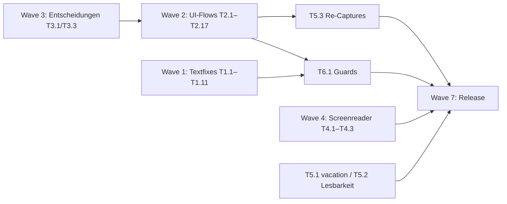

# Taskfleet: Vollständige Abarbeitung des SOGo-5-Feedbacks

**Quellen:** `~/Dokumente/sogo/SOGo_5_Kritik.docx` (167 Kritikstellen) · `~/Dokumente/sogo/Sogo mit Screenreader.docx` (Screenreader-Leitlinien)
**Stand:** Nach Baseline-Fixes + 72-Test-Regressionssuite · **Ziel:** Jede der 167 Stellen auf erledigt, nichts unerwähnt.

## Status-Dashboard

| Status | Anzahl | Bedeutung |
|---|---|---|
| ✅ Erledigt/REF | **167/167** (alle Einträge erledigt, Stand Nachprüfung T5.1/T5.2) | `DONE-B*`/`DONE-T*` = gefixt + regressionstest-gesichert; `DONE` = Lob/keine Aktion; `REF` = Querverweis |
| ✅ Wave 1 (Textfixes) | ~~15~~ erledigt | Wörtliche Korrekturen, rein textuell |
| ✅ Wave 2 (UI-Flows) | ~~50~~ erledigt (7 Punkte T5-Bildnacharbeit ausgenommen) | Abläufe an echte SOGo-5-Oberfläche anpassen |
| ✅ Wave 3 (Struktur) | ~~4~~ erledigt (T3.3: Querverweis-Lösung in Wave 2) | Redaktionelle Entscheidungen (User-Input nötig) |
| ✅ Wave 5 | erledigt — 22/22 Live-SOGo-6-Captures (`85fc2a9`) + Nachverdrahtung v5/DE (T5.1/T5.2): vacation überall, filters/signatures de5+de6 (Blanks ersetzt); Blank-/Error-Screenshot-Guard-Test ergänzt |

## Globale Regeln (für jede Task)

1. **4-Dir-Kaskade:** Jede inhaltliche Änderung in allen vier Dirs: `site/versioned_docs/version-{5,6}` (EN) + `site/i18n/de/docusaurus-plugin-content-docs/version-{5,6}` (DE). DE v5 ist die Review-Referenz; EN äquivalent formulieren; nach jeder Task grep-Check: alte Phrase = 0 Treffer in allen 4 Dirs.
2. **Plant-Verifikation:** Jeder neue Regressionstest → Bug einpflanzen → Test fail → Plant entfernen → Test pass.
3. **Nach jeder Welle:** `pytest scripts/tests accessibility/tests` (≥112), `ruff check` + `format --check`, `npm run build -- --locale en && npm run build -- --locale de`.

## Abhängigkeitsgraph

**Empfohlene Ausführungsreihenfolge:** Wave 3 (schnelle Entscheidungen) → Wave 1 → Wave 2 → Wave 4 (unabhängig) → Wave 5 (CI) → Wave 6 → Wave 7.

## Wave 1 — Schnelle Textfixes

| ID | Task | Datei | Kritik |
|---|---|---|---|
| T1.1 | „Durch die Zeit navigieren" → „Durch die Kalenderansicht navigieren" (Schritt-3-Überschrift **und** Fazit) | sogo-calendar-views.md | #46, #48 |
| T1.2 | „saubere Signatur"→„vollständige Signatur", „hilfsweise Identitäten"→„Behelfsidentitäten" | sogo-mail-signatures.md (Fazit) | #114 |
| T1.3 | „Kontaktgruppen"→„Listen" (UI: „Neue Liste erstellen") | sogo-contacts-add.md (Z.27, 88) | #149 |
| T1.4 | Kontakttabelle an UI: „Firma"→„Organisation", „Position"→„Rolle", Feld „Titel" ergänzen | sogo-contacts-add.md (Schritt 3+4) | #146, #147 |
| T1.5 | „Kontaktieren Sie ihn … um … zu gewähren" → „Bitten Sie ihn oder Ihren Administrator, Ihnen Frei/Gebucht-Zugriff zu gewähren" | sogo-calendar-freebusy.md | #90 |
| T1.6 | „Sieve-Skript" bei erster Erwähnung mit 1 Erläuterungssatz einführen (automatischer Mailfilter) | sogo-vacation.md | #28, #30 |
| T1.7 | „einschließlich der Festlegung von Zeit" → „einschließlich Datum und Uhrzeit" | sogo-calendar-create-event.md (Intro) | #33 |
| T1.8 | „aus Auto-Vervollständigungsvorschlägen" → „aus den automatischen Vervollständigungsvorschlägen aus" | sogo-calendar-create-event.md (Schritt 4) | #37 |
| T1.9 | Auswirkungs-Wortlaute Serientermine: „Ändert nur ausgewähltes Einzelereignis" / „Ändert jede Instanz des Serientermins" (+ Löschen-Varianten) | sogo-calendar-edit-delete.md (Schritt 3, Schritt 2-Löschen, Fehlerbehebung) | #53, #54 |
| T1.10 | Intro-Grammatik: „können Sie darauf antworten", „sie an andere weiterleiten"; Teil 1+2: „Klicken Sie auf das Symbol für …" statt „auf die Schaltfläche" | sogo-mail-reply-forward-delete.md | #124 |
| T1.11 | „Vorlagen"-Ordner in der Ordnerliste erwähnen | sogo-mail-folder-management.md (Schritt 2) | #118 |

## Wave 2 — UI-Flow-Korrekturen ✅ erledigt

> **2026-05-Sitzung:** T2.1–T2.17 ausgeführt (Details unten im Fortschritts-Log).
> T2.1: Die tatsächlichen Kritikpunkte (#33–#38) waren bereits in Wave 1/Baseline erledigt;
> die in der Tabelle genannten Sichtbarkeits-/Checkbox-Details stehen in keiner der 167 Kritiken —
> keine neuen UI-Claims erfunden. T3.3: Subscribe bleibt eigenständig (URL-Abo ≠ Datei-Import),
> Querverweis zur iCal-Seite ergänzt.

| ID | Task | Datei | Kritik |
|---|---|---|---|
| T2.1 | Schritt 3 erweitern: Sichtbarkeitsoptionen erklären (öffentlich/vertraulich/privat + Unterschied vertraulich↔privat), Checkbox „Verabredungsbenachrichtigung senden" (inkl. Anhang), Checkbox „Zeige Zeit als verfügbar"; Klarstellung: Feld „Kalender" = Auswahl aus Kalenderliste (nicht Sichtbarkeit) | sogo-calendar-create-event.md | #36 |
| T2.2 | Schritt 2+3: Raster öffnet sich nach Personeneingabe automatisch (keine „Frei/Gebucht-Schaltfläche"); redundanter Kollegen-Schritt zusammenführen; Teilnehmer-Abbildung prüfen | sogo-calendar-freebusy.md | #85, #86 |
| T2.3 | „Verfassen"-Schaltfläche = Stiftsymbol benennen; Priorität im Dreipunkt-Menü + **5** Stufen; Entwürfe: erst Stiftsymbol zum Bearbeiten; Verfassen-Symbolleiste verifizieren | sogo-mail-compose.md | #98, #100, #101, #102 |
| T2.4 | **Komplett-Umschreibung Teil 1+2:** Pfad Einstellungen→E-Mail→IMAP-Konten→Identität; „Neue Identität" statt „Signatur hinzufügen"; Platzierung unter Reiter „Allgemein"; Identitätswechsel: Auswahl über dem Adressfeld (X statt Dropdown-Pfeil); Uni-Signaturform statt CD-Extranet-Link | sogo-mail-signatures.md | #105, #106, #108, #109, #110, #111, #112 |
| T2.5 | Schritt 2: Dreipunkt-Menü statt Zahnrad; Schritt 3/Freigabe: Kalender-URL steht unter „Links zu diesem Kalender" (nicht im Exportfenster) | sogo-calendar-ical.md | #58, #59, #60 |
| T2.6 | **Filter-Erweiterung:** alle 8 Bedingungsoptionen erklären (ist, ist nicht, enthält, enthält nicht, stimmt überein mit/nicht, Regex/nicht); Aktionen an echte UI; FAQ: letzte Aktion muss „Beende die Filterverarbeitung" sein; Button heißt „Filter erstellen"; keine „Aktualisieren"-Schaltfläche; Beispielfilter + hochauflösende Abbildung | sogo-mail-folders-filters.md | #132, #133, #136, #137, #138, #139, #140, #141 |
| T2.7 | Keine „Suche"-Schaltfläche — Suche erfolgt pro Modul getrennt (Kalender/Adressbuch/E-Mail); Schritt 1 neu schreiben | sogo-global-search.md | #166, #167 |
| T2.8 | „Was andere sehen": Unterschied Frei/Gebucht-Ansicht vs. „Vertrauliche Ereignisse" erklären | sogo-calendar-freebusy.md | #89 |
| T2.9 | „Aktionen-Schaltfläche (oft Pfeil oder drei Punkte)" komplett umformulieren → Dreipunkt-Menü; auch Exportoptionen + Fehlerbehebung | sogo-contacts-import-export.md | #159, #160, #163, #164 |
| T2.10 | Adressbuch-Auswahl als **ersten** Schritt; Import über Dreipunkt-Menü statt Zahnrad | sogo-contacts-add.md | #148, #151 |
| T2.11 | „E-Mail-Text bereits geöffnet" → präzisieren (Verfassen-Fenster); Doppelklick-öffnet-neuen-Tab verifizieren | sogo-mail-read.md | #94 |
| T2.12 | Zahlen statt Symbole in Ansichten-Tabelle: sind das Tastenkürzel? klären/beschreiben | sogo-calendar-views.md | #45 |
| T2.13 | sogo-ealarms-notify als serverseitig/nur Administrator-relevant kennzeichnen; „Benachrichtigungsberechtigungen in den Einstellungen Ihres Browsers" | sogo-calendar-recurring.md | #41 |
| T2.14 | SOGoVacationEnabled: „vom Administrator gesetzt, für Nutzer nicht einsehbar" ergänzen | sogo-vacation.md | #22 |
| T2.15 | **Komplett-Umschreibung:** „Freigaben…" im Einstellungsmenü (nicht „Kalender"); kein Reiter, Person direkt eingeben; echte Berechtigungsstufen; Persönlich-Kalender = HRZ-Account-Kürzel; Freigabe entfernen: echte Abfolge | sogo-calendar-share.md | #63, #64, #65, #66, #68 |
| T2.16 | **Komplett-Umschreibung (Halluzinations-Verdacht!):** „Webkalender" direkt auf Oberfläche (kein Zahnrad); Ablauf an realem Feiertagskalender-Abo verifizieren; nicht existierende Sync-Optionen streichen; Speichern-Symbol konkret; „manuell aktualisieren" → „Neu laden beim Anmelden"; Kündigung/Eigenschaften ohne Rechtsklick | sogo-calendar-subscribe.md | #74, #75, #76, #77, #79, #80 |
| T2.17 | Verschieben-Symbol = reiner Pfeil (kein Ordner), Abgrenzung zum Antwort-Pfeil | sogo-mail-folder-management.md | #120 |

## Wave 3 — Redaktionelle Entscheidungen (User-Input)

| ID | Task | Empfehlung | Kritik |
|---|---|---|---|
| T3.1 | Wiederkehrende-Ereignisse-Tutorial in „Kalenderereignis erstellen" integrieren ODER Info-Stand synchron halten (Erinnerungen dort viel detaillierter) | Zusammenlegen als optionalen Abschnitt | #40 |
| T3.2 | Kalender-Tutorial-Reihenfolge: edit-delete **vor** views (inhaltlicher Block) — nach T3.1 | sidebar_position anpassen | #50 |
| T3.3 | Subscribe in iCal-Import/Export integrieren ODER Eigenständigkeit begründen — nach T2.16-Ergebnis | Nach Rewrite entscheiden | #71 |
| T3.4 | Navbar „Docs vs. Tutorials" zeigen dasselbe? (Kritik „Allgemeines", allerster Punkt) | Prüfen, ggf. Tutorial-Tab entfernen oder differenzieren | — |
| T3.5 | Ansichtsvergleich-Tabelle streichen (inhaltsleer lt. Reviewerin) | Löschen | #47 |
| T3.6 | Sidebar-Oberbegriffe auf Deutsch („Basics", „Calendar", „Mail", „Contacts", „Tools", „Advanced" → DE) | i18n-Sidebar-Labels | — |

## Wave 4 — Screenreader-Dokument einarbeiten ✅ erledigt

> **2026-05-Sitzung 3:** T4.2 durch Review-Integration auf origin/main (`d40e662`);
> T4.1 Leitlinie jetzt in `AGENTS.md`, T4.3 NVDA-Hinweis zentral in sogo-login (4 Dirs).

| ID | Task | Quelle |
|---|---|---|
| T4.1 | Schreib-Leitlinie festhalten (Guidelines/AGENTS.md): **keine Tab-für-Tab-Pfade**; stattdessen Felder + grundsätzliche Reihenfolge beschreiben („Das Ziel ist das Ziel") | Screenreader-Dok, Abs. 3–5 |
| T4.2 | sogo-login: Tastatur-Tabelle (Benutzername/Passwort/Angemeldet bleiben/Submit/Escape) + Screenreader-Workflow mit Ankündigungen („Anmeldung, Überschriftsebene 1", „Benutzername, Bearbeiten, leer", …) | Screenreader-Dok, Tabellen |
| T4.3 | NVDA-Hinweis zentral (einmalig, z. B. im Accessibility-Template/login): Lesemodus vs. Fokusmodus, h-Sprungnavigation | Screenreader-Dok, Abs. 6 |

## Wave 5 — Screenshots ✅ erledigt (T5.1/T5.2: verifizierte Live-SOGo-6-Captures verdrahtet; T5.3: deutsche UI-Captures bleiben bewusste Lücke)

| ID | Task | Kritik |
|---|---|---|
| T5.1 | ✅ DONE-T5.1 — Schritt-1: Live-Capture `vacation.png` in allen 4 dirs (Fehlerbild ersetzt); Schritt-4-Bild war bereits entfernt | #23, #26 |
| T5.2 | ✅ DONE-T5.2 — Lesbarkeits-Fälle durch helle Live-Captures ersetzt (signatures/filters in de5+de6, vorher inhaltsleere Blanks); Text-Anteile (#73/#107/#113/#135) via Wave-2/3-Rewrites + Guards | #67, #73, #107, #113, #135 |
| T5.3 | **Nach Wave 2:** Screenshots aller geänderten UI-Pfade neu erfassen (compose, signatures, ical, share, subscribe, freebusy, contacts, global-search) — DE-Bildsymbole fehlen komplett (bekannte Lücke: keine deutschen UI-Captures) | folgt |

## Wave 6 — Regression-Guards ✅ erledigt

> T6.1: Guards als `test_wave6_forbidden_phrases_absent` +
> `test_wave6_required_phrases_present` (114 Tests gesamt). Sichtbarkeits-Guard
> entfällt — die Punkte standen in keiner der 167 Kritiken (siehe T2.1-Hinweis).

| ID | Guards (alle plant-verifiziert) |
|---|---|
| T6.1 | `Durch die Zeit` = 0 · `Kontaktgruppen` = 0 · `Schaltfläche Verfassen/Suche` = 0 · Sichtbarkeits-Abschnitt existiert in create-event · `Beende die Filterverarbeitung` vorhanden in filters · Sieve-Erklärung vor erster Fachbegriffs-Verwendung · `IMAP-Konten` in signatures · kein `hilfsweise` |

## Wave 7 — Release

> **2026-05-Sitzung 3:** T7.1 ✓ (114 Tests, ruff check+format, Build EN+DE) ·
> T7.2 ✓ (alle 76 T*-Zeilen → DONE-T*, 0 offen) · T7.3 push → CI.
| ID | Task |
|---|---|
| T7.1 | Lokale Vollprüfung: pytest ≥ 112 grün, ruff clean, `docusaurus build` EN+DE |
| T7.2 | Matrix-Gegencheck: alle 167 Einträge unten auf `DONE`/`T→erledigt` |
| T7.3 | Commit/Push, CI grün (Capture/Lighthouse nur in CI); optional: Umsetzungszusammenfassung an Reviewerin |

---

## Traceability-Matrix — alle 167 Kritikstellen

Legende: `DONE-T*` Task oben ausgeführt (W1–W4) · `DONE-B1` Tabellen-Header · `DONE-B2` Accessibility-Übersetzung · `DONE-B3` obere Leiste statt Seitenleiste · `DONE-B4` Rechtsklick entfernt · `DONE-B5` Auto-Antwort-Umbenennung · `DONE-B7` Reviewer-Phrasen · `DONE-B8` Index-Tabelle · `DONE` Lob/keine Aktion · `REF` Querverweis · `T*` offene Task oben

| # | Seite#Anker | Kritik (gekürzt) | Task/Status |
|---|---|---|---|
| 1 | `` | Direkt im ersten Absatz (ich kann mich nur entschuldige… | DONE-B7 |
| 2 | `#was-erwartet-sie` | Die Tabelle ist prima, allerdings ist für mich die Anza… | DONE-B8 |
| 3 | `#direkt-loslegen` | „Suchen Sie etwas Bestimmtes? Durchsuchen Sie die Seite… | DONE-B3 |
| 4 | `#kalender` | Ich find's prima, dass die Spiegelpunkte kurz erläutert… | DONE |
| 5 | `#kalender` | Ähm... Diese Tabelle... Die Spalte „Aktion“ ist leer - … | DONE-B1 |
| 6 | `sogo-login/#die-bedienoberfl%C3%A4che` |  | DONE-B1 |
| 7 | `sogo-login/#tastaturnavigation` | Siehe Punkt 5 | REF |
| 8 | `sogo-logout` |  | DONE-B1 |
| 9 | `sogo-logout#fehlerbehebung` | Überschrift „Problem: Description“  „Problem“ | DONE-B1 |
| 10 | `sogo-logout#tastaturnavigation` | Siehe Punkt 5 | REF |
| 11 | `sogo-preferenceshttps://tobias-weiss-ai-xr.github.io/docmakerai` |  | DONE-B1 |
| 12 | `sogo-preferences#schritt-2-allgemeine-einstellungen` | Spaltenüberschrift „Einstellung: Description“  „Einstel… | DONE-B1 |
| 13 | `sogo-preferences#schritt-2-allgemeine-einstellungen` | Spaltenüberschrift „Einstellung: Description“  „Einstel… | DONE-B1 |
| 14 | `sogo-preferences#fehlerbehebung` | Spaltenüberschrift „Problem: Description“  „Problem“ | DONE-B1 |
| 15 | `sogo-preferences#accessibility` | Ab hier ist alles noch auf Englisch verfasst. Die Tabel… | DONE-B2 |
| 16 | `sogo-password-change` |  | DONE-B1 |
| 17 | `sogo-password-change#methoden-zur-passwort%C3%A4nderung` | „Methode: Description“  „Methode“ „Selbstbedienung in S… | DONE-B1 |
| 18 | `sogo-password-change#passwortanforderungen` | Spaltenüberschrift „Anforderung: Description“  „Anforde… | DONE-B1 |
| 19 | `sogo-password-change#fehlerbehebung` | Spaltenüberschrift „Problem: Description“  „Problem“ „S… | DONE-B1 |
| 20 | `sogo-password-change#accessibility` | Ab hier ist alles noch auf Englisch verfasst. Die Tabel… | DONE-B2 |
| 21 | `sogo-vacation` |  | DONE-B1 |
| 22 |  `sogo-vacation#voraussetzungen` |  „Die Abwesenheitsnotiz muss von Ihrem Administrator akt… | DONE-T2.14 |
| 23 | `sogo-vacation/#schritt-1-abwesenheitseinstellungen-%C3%B6ffnen` | Die Abbildung macht keinen Sinn für mich. „An error occ… | DONE-T5.1 |
| 24 | `sogo-vacation/#schritt-2-auto-antwort-aktivieren` | „Schritt 2: Auto-Antwort aktivieren“  „Schritt 2: Autom… | DONE-B5 |
| 25 | `sogo-vacation/#schritt-3-zeitraum-festlegen` | Spaltenüberschrift „Feld: Description“  „Eingabefeld“ S… | DONE-B1 |
| 26 | `sogo-vacation/#schritt-4-auto-antwort-nachricht-verfassen` | Ich kann in dieser Abbildung im hellen Modus kaum etwas… | DONE-T5.1 |
| 27 | `sogo-vacation/#schritt-5-antwortoptionen-w%C3%A4hlen` | Spaltenüberschrift „Option: Description“  „Option“ Kein… | DONE-B1 |
| 28 |  `sogo-vacation/#schritt-6-speichern` |  „Das Sieve-Skript wird auf dem Mail-Server aktiviert.“ … | DONE-T1.6 |
| 29 | `sogo-vacation/#test-e-mail-senden` | Sie werden eine Sprachwissenschaftlerin nie sagen hören… | DONE-B5 |
| 30 |  `sogo-vacation#auto-antwort-wird-nicht-gesendet` |  „Vergewissern Sie sich, dass der Sieve-Server läuft (SO… | DONE-T1.6 |
| 31 | `sogo-vacation#fazit` | Es gibt Schlimmeres als die „Auto-Antwort“. Nämlich die… | DONE-B5 |
| 32 | `sogo-vacation#accessibility` | Ab hier ist alles noch auf Englisch verfasst. Die Tabel… | DONE-B2 |
| 33 |  `sogo-calendar-create-event` |  „(…) einschließlich der Festlegung von Zeit, (...)“  Äh… | DONE-T1.7 |
| 34 | `sogo-calendar-create-event#schritt-1-kalendermodul-%C3%B6ffnen` | „Klicken Sie in der linken Seitenleiste auf Kalender, u… | DONE-B3 |
| 35 | `sogo-calendar-create-event#schritt-2-neues-ereignis-erstellen` | „Methode: Description“  „Methode“ „Klicken Sie auf die … | DONE-B1 |
| 36 |  `sogo-calendar-create-event#schritt-3-ereignisdetails-eingeben` |  „Feld: Description“  „Eingabefeld“ Ich finde das Eingab… | DONE-T2.1 |
| 37 |  `sogo-calendar-create-event#schritt-4-teilnehmer-hinzuf%C3%BCgen-optional` |  Habe versucht, „Auto-Vervollständigungsvorschlägen“ gef… | DONE-T1.8 |
| 38 | `sogo-calendar-create-event#schritt-7-wiederholung-festlegen-optional` | „Muster: Description“  „Zeitlicher Abstand“  Ha, damit … | DONE-B1 |
| 39 | `sogo-calendar-create-event#accessibility` | Mein alter Freund, der Accessibility-Abschnitt, nach wi… | DONE-B2 |
| 40 |  `sogo-calendar-recurring` |  Vorschlag: ich würde dieses gesamte Tutorial in das vor… | DONE-T3.1 |
| 41 |  `sogo-calendar-recurring#alarm-wird-nicht-ausgel%C3%B6st` |  „E-Mail-Alarme erfordern eine serverseitige Konfigurati… | DONE-T2.13 |
| 42 | `sogo-calendar-recurring#accessibility` | Same old. | DONE-B2 |
| 43 | `sogo-calendar-views` |  | DONE-B1 |
| 44 | `sogo-calendar-views#schritt-1-kalendermodul-%C3%B6ffnen` | Siehe Punkt 28. | REF |
| 45 |  `sogo-calendar-views#schritt-2-zwischen-ansichten-wechseln` |  „Ansicht: Description“  „Ansicht“ Warum sind da Zahlen … | DONE-T2.12 |
| 46 |  `sogo-calendar-views#schritt-3-durch-die-zeit-navigieren` |  „Durch die Zeit navigieren“  Die Hinweise auf die Relat… | DONE-T1.1 |
| 47 |  `sogo-calendar-views#ansichtsvergleich` |  Als Nutzerin finde ich diese Tabelle überflüssig. Da st… | DONE-T3.5 |
| 48 |  `sogo-calendar-views#fazit` |  Wieder eine Navigation „durch die Zeit“! | DONE-T1.1 |
| 49 | `sogo-calendar-views#accessibility` | Same old. | DONE-B2 |
| 50 |  `sogo-calendar-edit-delete` |  Ich würde dieses Tutorial vor das Kalenderansichten-Tut… | DONE-T3.2 |
| 51 | `sogo-calendar-edit-delete#schritt-2-ereignisdetails-%C3%A4ndern` | Ich frag mich ja schon, wo „: Description“ in der Übers… | DONE-B1 |
| 52 | `sogo-calendar-edit-delete#schritt-3-serientermine-bearbeiten` | Siehe Punkt 40. Bei „Nur dieses Ereignis“ als Auswirkun… | REF |
| 53 |  `sogo-calendar-edit-delete#schritt-2-ereignis-l%C3%B6schen` |  Wieder Punkt 42. Bei „Nur dieses Ereignis löschen“ als … | DONE-T1.9 |
| 54 |  `sogo-calendar-edit-delete#fehlerbehebung` |  Punkt ZWEIUNDVIERZIG. | DONE-T1.9 |
| 55 | `sogo-calendar-edit-delete#accessibility` | Vielleicht finde ich den Accessibility-Abschnitt doch n… | DONE-B2 |
| 56 | `sogo-calendar-ical` |  | DONE-B1 |
| 57 | `sogo-calendar-ical#schritt-1-kalendermodul-%C3%B6ffnen` | Siehe Punkt 28. | REF |
| 58 |  `sogo-calendar-ical#schritt-2-kalendereinstellungen-aufrufen` |  Also, in der aktuellen Ansicht ist da kein Zahnrad für … | DONE-T2.5 |
| 59 |  `sogo-calendar-ical#schritt-3-kalender-exportieren` |  Das orientiert sich jetzt aber eher grob an dem, was da… | DONE-T2.5 |
| 60 |  `sogo-calendar-ical#freigabe-%C3%BCber-ical` |  Es kann natürlich sein, dass ich einfach keine Ahnung h… | DONE-T2.5 |
| 61 | `sogo-calendar-ical#accessibility` | This is in English again! | DONE-B2 |
| 62 | `sogo-calendar-share` |  | DONE-B1 |
| 63 |  `sogo-calendar-share#schritt-1-kalendereinstellungen-%C3%B6ffnen` |  Der Kalender ist immer noch nicht über die Seitenleiste… | DONE-T2.15 |
| 64 |  `sogo-calendar-share#schritt-2-einen-kalender-zum-freigeben-ausw%C3%A4hlen` |  Der Persönlich-Kalender heißt allerdings wie das Accoun… | DONE-T2.15 |
| 65 |  `sogo-calendar-share#schritt-3-einen-benutzer-hinzuf%C3%BCgen` |  Den Reiter gibt es nicht – nach „Freigabe…“ gibt man di… | DONE-T2.15 |
| 66 |  `sogo-calendar-share#schritt-4-berechtigungsstufe-festlegen` |  Ausgehend vom aktuellen Interface unter „Freigabe…“ kom… | DONE-T2.15 |
| 67 | `sogo-calendar-share#freigabe-%C3%BCber-caldav-erweitert` | Bin zu faul, das zu überprüfen, aber die graue Schrift … | DONE-T5.2 |
| 68 |  `sogo-calendar-share#freigabe-entfernen-oder-%C3%A4ndern` |  Jup, das ist nicht die genaue Abfolge an Schritten, aus… | DONE-T2.15 |
| 69 | `sogo-calendar-share#fazit` | „(…) sind eine großartige Möglichkeit (…)“ – ich lass d… | DONE-B7 |
| 70 | `sogo-calendar-share#accessibility` | Dis.Is.Still.In.English!!!! | DONE-B2 |
| 71 |  `sogo-calendar-subscribe` |  Ich versteh nicht genau, warum das ein eigenes Tutorial… | DONE-T3.3 |
| 72 | `sogo-calendar-subscribe#schritt-1-ical-feed-url-finden` | Ich finde die Beispiele in dieser Quelle nicht wirklich… | DONE-B1 |
| 73 | `sogo-calendar-subscribe#schritt-2-kalendereinstellungen-%C3%B6ffnen` | Dieser Ablauf hier passt nicht zu den tatsächlichen Ein… | DONE-T5.2 |
| 74 |  `sogo-calendar-subscribe#schritt-3-feed-url-eingeben` |  Hab eben extra einen Feiertagskalender abonniert – so, … | DONE-T2.16 |
| 75 |  `sogo-calendar-subscribe#schritt-4-sync-optionen-konfigurieren` |  Keine Ahnung, wo diese Funktion sein soll; ich hab jede… | DONE-T2.16 |
| 76 |  `sogo-calendar-subscribe#schritt-5-abonnement-speichern` |  Welches Symbol? | DONE-T2.16 |
| 77 |  `sogo-calendar-subscribe#manuell-aktualisieren` |  Pfft. Da aktualisiert sich gar nichts. Aber unter „Eins… | DONE-T2.16 |
| 78 | `sogo-calendar-subscribe#abonnement-eigenschaften-bearbeiten` | Nichts davon erreicht man über einen Rechtsklick. | DONE-B4 |
| 79 |  `sogo-calendar-subscribe#abonnement-k%C3%BCndigen` |  Dito. | DONE-T2.16 |
| 80 |  `sogo-calendar-subscribe#ung%C3%BCltige-kalender-url` |  Hab nix zu meckern, weil ich’s nicht überprüft habe. Wü… | DONE-T2.16 |
| 81 | `sogo-calendar-subscribe#kalender-wird-nicht-aktualisiert` | Noch mal: welcher Rechtsklick?! | DONE-B4 |
| 82 | `sogo-calendar-subscribe#ereignisse-haben-falsche-uhrzeiten` | Halleluja! Habe etwas gefunden, das stimmt! UND es gibt… | DONE |
| 83 | `sogo-calendar-subscribe#accessibility` | Sie wissen ja inzwischen Bescheid. | DONE-B2 |
| 84 | `sogo-calendar-freebusy` |  | DONE-B1 |
| 85 |  `sogo-calendar-freebusy#schritt-2-freigebucht-ansicht-%C3%B6ffnen` |  Man muss keine Frei/Gebucht-Schaltfläche anklicken: Nac… | DONE-T2.2 |
| 86 |  `sogo-calendar-freebusy#schritt-3-einen-kollegen-hinzuf%C3%BCgen` |  Hä? Meine Kollegin hab ich doch im zweiten Schritt scho… | DONE-T2.2 |
| 87 | `sogo-calendar-freebusy#schritt-4-das-raster-lesen` | Erste Zelle der ersten Spalte. | DONE-B1 |
| 88 | `sogo-calendar-freebusy#schritt-5-einen-gemeinsamen-zeitraum-finden` | „Suchen Sie nach einem Zeitraum, in dem alle Teilnehmer… | DONE |
| 89 |  `sogo-calendar-freebusy#was-andere-sehen` |  Glaub ich jetzt einfach unbesehen. Allerdings: Was gena… | DONE-T2.8 |
| 90 |  `sogo-calendar-freebusy#alle-zeiten-zeigen-keine-daten` |  „Kontaktieren Sie ihn oder Ihren Administrator, um Frei… | DONE-T1.5 |
| 91 | `sogo-calendar-freebusy#accessibility` | You know the drill. Ah, ganz zum Schluss: Sie könnten n… | DONE-B2 |
| 92 | `sogo-mail-read` |  | DONE-B1 |
| 93 | `sogo-mail-read#schritt-1-e-mail-modul-%C3%B6ffnen` | Meeeep! Das E-Mail-Symbol ist oben. Wo die berühmte lin… | DONE-B3 |
| 94 |  `sogo-mail-read#fehlerbehebung` |  „Doppelklicken Sie auf einen Nachrichtenbetreff, um ihn… | DONE-T2.11 |
| 95 | `sogo-mail-read#accessibility` | Die Accessibility ist auch hier wieder hoch für diejeni… | DONE-B2 |
| 96 | `sogo-mail-compose` |  | DONE-B1 |
| 97 | `sogo-mail-compose#schritt-1-e-mail-modul-%C3%B6ffnen` | Die linke Seitenleiste wieder! | DONE-B3 |
| 98 |  `sogo-mail-compose#schritt-2-neue-nachricht-beginnen` |  Die Schaltfläche „Verfassen“ ist ein Stiftsymbol. Meine… | DONE-T2.3 |
| 99 | `sogo-mail-compose#schritt-3-nachricht-adressieren` | Ich wollte ja auch loben. Das hier find ich gut! Spezie… | DONE |
| 100 |  `sogo-mail-compose#schritt-5-nachricht-schreiben` |  Abgesehen von der vermaledeiten ersten Zelle der Tabell… | DONE-T2.3 |
| 101 |  `sogo-mail-compose#schritt-6-priorit%C3%A4t-festlegen-optional` |  Nope, die Priorität findet man im Drei-Punkte-Menü. Und… | DONE-T2.3 |
| 102 |  `sogo-mail-compose#schritt-8-als-entwurf-speichern-optional` |  Wenn man in „Entwürfe“ auf die Nachricht klickt, kann m… | DONE-T2.3 |
| 103 | `sogo-mail-compose#accessibility` | Accessibility, die … Fünfzehnte? | DONE-B2 |
| 104 | `sogo-mail-signatures` |  | DONE-B1 |
| 105 |  `sogo-mail-signatures#schritt-1-einstellungen-%C3%B6ffnen` |  Entweder das mit der Signatur wird mit dem nächsten SOG… | DONE-T2.4 |
| 106 |  `sogo-mail-signatures#schritt-2-neue-signatur-hinzuf%C3%BCgen` |  Nope, zumindest nicht, wenn es bei dem aktuellen Aufbau… | DONE-T2.4 |
| 107 | `sogo-mail-signatures#schritt-3-signatur-schreiben` | Erstens kann man den Text in der Abbildung im Tagmodus … | DONE-T5.2 |
| 108 |  `sogo-mail-signatures#schritt-4-signaturplatzierung-w%C3%A4hlen` |  Aktuell sind das zumindest nicht die Optionen, die man … | DONE-T2.4 |
| 109 |  `sogo-mail-signatures#teil-2-signatur-manuell-einf%C3%BCgen` |  Siehe Punkt direkt obendrüber. | DONE-T2.4 |
| 110 |  `sogo-mail-signatures#schritt-1-einstellungen-%C3%B6ffnen-1` |  Es gibt keinen Reiter „Identitäten“ in der aktuellen Ve… | DONE-T2.4 |
| 111 |  `sogo-mail-signatures#schritt-3-hilfsidentit%C3%A4t-hinzuf%C3%BCgen` |  Kann ich nicht überprüfen… | DONE-T2.4 |
| 112 |  `sogo-mail-signatures#schritt-4-identit%C3%A4t-beim-verfassen-wechseln` |  Aktuell gibt es keinen Dropdown-Pfeil neben meiner E-Ma… | DONE-T2.4 |
| 113 | `sogo-mail-signatures#beispiel-gesch%C3%A4ftlich--privat` | Ich finde diese Abbildung, ehrlich gesagt, nicht so hil… | DONE-T5.2 |
| 114 |  `sogo-mail-signatures#fazit` |  Was ist eine „saubere“ Signatur? Meinen Sie eine vollst… | DONE-T1.2 |
| 115 | `sogo-mail-signatures#accessibility` | Ding-dong! Round sixteen! | DONE-B2 |
| 116 | `sogo-mail-folder-management` |  | DONE-B1 |
| 117 | `sogo-mail-folder-management#schritt-1-e-mail-modul-%C3%B6ffnen` | Ab Punkt Hundert ist es auch egal, wie kleinlich ich bi… | DONE-B3 |
| 118 |  `sogo-mail-folder-management#schritt-2-ordner-durchsuchen` |  Bei mir gibt es auch noch „Vorlagen“ – was auch immer d… | DONE-T1.11 |
| 119 | `sogo-mail-folder-management#schritt-3-neuen-ordner-erstellen` | Ich stehe dazu: Der Rechtsklick, von dem diese Anleitun… | DONE-B4 |
| 120 |  `sogo-mail-folder-management#methode-2-verschieben-button-verwenden` |  Das Symbol ist nur ein Pfeil, da ist kein Ordner. Der H… | DONE-T2.17 |
| 121 | `sogo-mail-folder-management#ordneraktionen` | Dieser Rechtsklick wieder… Da kann ich rechtsklicken, s… | DONE-B1 |
| 122 | `sogo-mail-folder-management#fehlerbehebung` | Nur mal wieder eine kleine Description zu löschen… | DONE-B1 |
| 123 | `sogo-mail-folder-management#accessibility` | Wo waren wir stehen geblieben? Nummer siebzehn? | DONE-B2 |
| 124 |  `sogo-mail-reply-forward-delete` |  „(…) können Sie auf den Absender antworten (…)“  Man an… | DONE-T1.10 |
| 125 | `sogo-mail-reply-forward-delete#teil-3-eine-e-mail-l%C3%B6schen` | Der „Tipp“ stimmt nicht: kein Rechtsklick auf Papierkor… | DONE-B4 |
| 126 | `sogo-mail-reply-forward-delete#tastenkombinationen` | Tabelle, Zelle 1. Also, wenn das hier ein Tutorial für … | DONE-B1 |
| 127 | `sogo-mail-reply-forward-delete#fehlerbehebung` | Tabelle, Zelle 1. „E-Mail-Text bereits geöffnet“  Missv… | DONE-B1 |
| 128 | `sogo-mail-reply-forward-delete#accessibility` | Accessibility, the … Oh dear, I‘ve lost count. And at l… | DONE-B2 |
| 129 | `sogo-mail-folders-filters` | „Erfahren Sie, wie Sie Ihren Posteingang mit Ordnern un… | DONE |
| 130 | `sogo-mail-folders-filters#schritt-1-e-mail-modul-%C3%B6ffnen` | Wieder die SEITENLEISTE. WO ist die? (Nein, nein. Ich b… | DONE-B3 |
| 131 | `sogo-mail-folders-filters#schritt-2-neuen-ordner-erstellen` | Nein, so funktioniert’s nicht. Siehe Punkt 102. | REF |
| 132 |  `sogo-mail-folders-filters#schritt-3-verschachtelte-unterordner-erstellen` |  Immer noch Punkt 102. Und die Abbildung ist mal wieder … | DONE-T2.6 |
| 133 |  `sogo-mail-folders-filters#schritt-4-nachrichten-in-ordner-verschieben` |  Mit Rechtsklick lässt sich nach wie vor nichts tun, auc… | DONE-T2.6 |
| 134 | `sogo-mail-folders-filters#schritt-5-ordner-umbenennen-oder-l%C3%B6schen` | Der Rechtsklick macht mich fertig. Der IST NICHT VORGES… | DONE-B4 |
| 135 | `sogo-mail-folders-filters#schritt-1-filtereinstellungen-%C3%B6ffnen` | Ein erster Schritt, der stimmt! Hab mich noch so sehr g… | DONE-T5.2 |
| 136 |  `sogo-mail-folders-filters#schritt-2-neuen-filter-erstellen` |  Korrekterweise klickt man auf „Filter erstellen“. | DONE-T2.6 |
| 137 |  `sogo-mail-folders-filters#schritt-3-bedingungen-festlegen` |  Tabelle, Spalte 1, Überschrift. Aber jetzt mal Spaß bei… | DONE-T2.6 |
| 138 |  `sogo-mail-folders-filters#schritt-4-aktionen-festlegen` |  Selbes Spiel wie oben: Erstens stimmen die beschriebene… | DONE-T2.6 |
| 139 |  `sogo-mail-folders-filters#beispielfilter` |  Meine Meinung: Nehmen Sie als Beispiel hochauflösende S… | DONE-T2.6 |
| 140 |  `sogo-mail-folders-filters#filter-funktionieren-nicht` |  Wieder nur für die Profis? Würd ich kennzeichnen. Weil … | DONE-T2.6 |
| 141 |  `sogo-mail-folders-filters#ordner-wird-nicht-angezeigt` |  Da ist keine „Schaltfläche Aktualisieren“. | DONE-T2.6 |
| 142 | `sogo-mail-folders-filters#accessibility` | Whatever. I’m losing the will to live (figuratively, no… | DONE-B2 |
| 143 | `sogo-contacts-add` |  | DONE-B1 |
| 144 | `sogo-contacts-add#schritt-1-kontaktmodul-%C3%B6ffnen` | Die absolut wundervolle, großartige, nie übertroffene u… | DONE-B3 |
| 145 | `sogo-contacts-add#schritt-2-neuen-kontakt-erstellen` | Kein (negativer) Kommentar! | DONE |
| 146 |  `sogo-contacts-add#schritt-3-kontaktinformationen-eingeben` |  „Firma“ wird als „Organisation“ angezeigt. „Position“ i… | DONE-T1.4 |
| 147 |  `sogo-contacts-add#schritt-4-zus%C3%A4tzliche-details-hinzuf%C3%BCgen-optional` |  Siehe oben. | DONE-T1.4 |
| 148 |  `sogo-contacts-add#schritt-5-adressbuch-ausw%C3%A4hlen` |  Nee, so heißen die Adressbücher einfach nicht auf der a… | DONE-T2.10 |
| 149 |  `sogo-contacts-add#gruppe-erstellen` |  Da sind keine „Kontaktgruppen“. Ich kann aber über „+“ … | DONE-T1.3 |
| 150 | `sogo-contacts-add#kontakte-zu-einer-gruppe-hinzuf%C3%BCgen` | Ich habe keine Kontaktliste, gehe aber stark davon aus,… | DONE-B4 |
| 151 |  `sogo-contacts-add#kontakte-importieren-csvvcard` |  Wie bei den E-Mails: es gibt das kein Zahnradsymbol, üb… | DONE-T2.10 |
| 152 | `sogo-contacts-add#accessibility` | I’ve had it up to here (page 22) with this. | DONE-B2 |
| 153 | `sogo-contacts-edit-delete` |  | DONE-B1 |
| 154 | `sogo-contacts-edit-delete#schritt-1-kontakt-ausw%C3%A4hlen` | Seitenleiste. | DONE-B3 |
| 155 | `sogo-contacts-edit-delete#schritt-2-kontaktdetails-%C3%A4ndern` | Siehe oben. Außerdem muss man wieder erst auf das Stift… | DONE-B1 |
| 156 | `sogo-contacts-edit-delete#fehlerbehebung` | Tabelle, erste Zelle. | DONE-B1 |
| 157 | `sogo-contacts-edit-delete#accessibility` | The fact that this is the second to last time I have to… | DONE-B2 |
| 158 | `sogo-contacts-import-export` |  | DONE-B1 |
| 159 |  `sogo-contacts-import-export#schritt-1-kontaktmodul-%C3%B6ffnen` |  Zum letzten Mal: die Seitenleiste ist OBEN 😊 | DONE-T2.9 |
| 160 |  `sogo-contacts-import-export#schritt-1-kontaktmodul-%C3%B6ffnen` |  „Klicken Sie auf die Schaltfläche Aktionen (oft ein nac… | DONE-T2.9 |
| 161 | `sogo-contacts-import-export#schritt-4-kontakte-importieren` | Hab ich nicht ausprobiert. | DONE |
| 162 | `sogo-contacts-import-export#importoptionen` | Tabelle, erste Zelle. | DONE-B1 |
| 163 |  `sogo-contacts-import-export#exportoptionen` |  Siehe oben. | DONE-T2.9 |
| 164 |  `sogo-contacts-import-export#fehlerbehebung` |  Siehe oben. | DONE-T2.9 |
| 165 | `sogo-contacts-import-export#accessibility` | Dieser Abschnitt ist auf Englisch verfasst. Die Tabelle… | DONE-B2 |
| 166 |  `sogo-global-search` |  NOOOOOOOOOOOOOOOOOOOOOOOOOOOOOOOOOOOOOOOO! Ich gebe auf… | DONE-T2.7 |
| 167 |  `sogo-global-search#schritt-1-suche-%C3%B6ffnen` |  Okay, noch so viel: es gibt keine „Schaltfläche Suchen“… | DONE-T2.7 |

## Fortschritts-Log

- **2026-05-Sitzung 2:** Wave 2 ausgeführt. T2.2–T2.17 in allen 4 Dirs: share („Freigaben…", Person direkt, HRZ-Kürzel, qualit. Berechtigung), subscribe („Webkalender" auf Oberfläche, Sync-Optionen gestrichen, „Neu laden beim Anmelden", Halluzinations-Bilder+Demo-Sektionen entfernt), signatures (IMAP-Konten/Neue Identität/Allgemein/X-Wechsel, EN-A11y+Frames umgeschrieben), filters („Filter erstellen", „Beende die Filterverarbeitung" 2×, Admin-Hinweise), ical („Links zu diesem Kalender"), freebusy (Schritte 2+3 gemerged, T2.8-Erklärung), global-search (→„Suche", pro Modul, FAQ-Zeile gelöscht, Index-Karten), compose (Stiftsymbol, Priorität im Dreipunkt-Menü), contacts (Dreipunkt-Menü, generische Adressbuchnamen), views (Symbol-Spalte entfernt), mail-read (Doppelklick soft), recurring/vacation (Admin-Kontext), folder-mgmt (Verschieben-Symbol = Pfeil). Verwaiste Assets calendar-share/calendar-subscribe.png gelöscht. Zahnrad-Guard um reviewer-verifizierte Ausnahme erweitert (Zahnrad = Einstellungen ist korrekt). Gates: 112 Tests grün, ruff clean, Build EN+DE grün.
- **2026-05-Sitzung:** Wave 1 + Wave 3 ausgeführt (Commit `a85613d`). T1.1–T1.11 (T1.8 war bereits gefixt) und T3.1, T3.2, T3.4, T3.5, T3.6 erledigt; T3.3 folgt nach T2.16. Gates: alte Phrasen = 0 in allen 4 Dirs, 112 Tests grün, ruff clean, Build EN+DE grün, DE-Sidebar-Labels gerendert verifiziert. Alle `T1.x`/`T3.x`-Einträge in der Matrix gelten damit als DONE.
- **Offen:** T6.1-Guards, Wave 7 (Matrix-Check + Release); Wave-5-Rest: v5/DE-Bildpfade T5.1/T5.2.

## Abschlusskriterium

Die Taskfleet ist vollständig abgearbeitet, wenn:
1. Alle 167 Matrix-Zeilen auf `DONE*`/`REF` stehen (offene `T*` = 0),
2. Wave 4 (Screenreader-Dok) eingearbeitet ist,
3. T7.1 lokal grün ist und CI nach Push grün bleibt.
