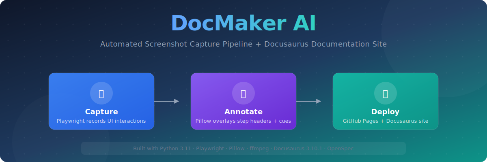
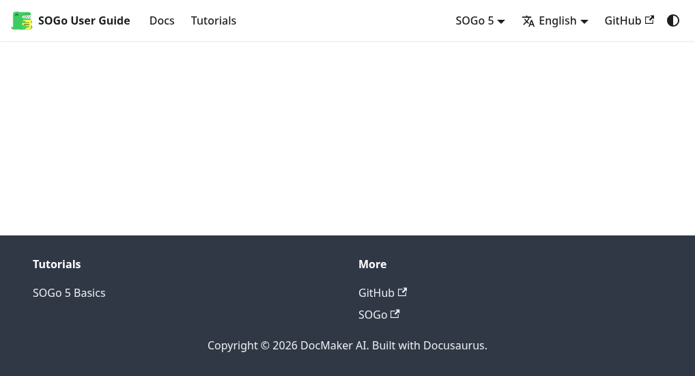

<p align="center">
  
</p>

# DocMaker AI

> **Live documentation:** [tobias-weiss-ai-xr.github.io/docmakerai/](https://tobias-weiss-ai-xr.github.io/docmakerai/)



**Automated screenshot capture pipeline + Docusaurus documentation site for web applications.**

[](https://github.com/tobias-weiss-ai-xr/docmakerai/actions/workflows/ci.yml)
[](https://github.com/tobias-weiss-ai-xr/docmakerai/actions/workflows/deploy.yml)

DocMaker AI captures UI workflows as annotated WebP animations and generates multi-version Docusaurus documentation sites. Built for the [SOGo Groupware](https://www.sogo.nu) user guide but works for any web application.

## What DocMaker AI Does

1. **Capture workflows** — Playwright records UI interactions (clicks, typing, navigation)
2. **Annotate frames** — Pillow overlays step headers, UI highlights, and visual cues
3. **Generate animations** — ffmpeg assembles frames into optimized WebP sequences
4. **Validate quality** — Blank capture detection, retry logic, quality reports
5. **Build docs site** — Docusaurus multi-version site with embedded animations
6. **Auto-optimize** — WebP/PNG optimization (54% size reduction achieved)
7. **CI/CD pipeline** — GitHub Actions for lint, test, build, deploy

## Key Features

- **Spec-driven development** — OpenSpec specs define capture behavior and track changes
- **Parallel execution** — Run multiple workflows concurrently with `--workers=N`
- **Retry on failure** — Automatic retry with exponential backoff for transient issues
- **Multi-language** — German + English locales with translation support
- **Multi-version** — Docusaurus versioning (SOGo 5 + SOGo 6 demos)
- **Accessibility-aware** — WCAG 2.1 Level A validation with auto-fix hooks
- **Asset optimization** — 54% size reduction via Pillow frame skip + quantization

## Quick Start

### Prerequisites

```bash
# Node.js 20+ (for Docusaurus)
--version  # >=20.0.0)

# Python 3.11+ (for capture pipeline)
python3 --version  # >=3.11

# Playwright browsers
python -m playwright install chromium
```

### Capture Workflows

```bash
# Set SOGo demo credentials (or your own app)
export SOGO_URL=https://demo.sogo.nu/SOGo/
export SOGO_USERNAME=demo
export SOGO_PASSWORD=demo

# Run all 22 workflows (sequential)
python capture/run_captures.py

# Run with 4 parallel workers (3-5x speedup)
python capture/run_captures.py --workers=4
```

### Build Documentation Site

```bash
# Install Docusaurus dependencies
cd site
npm install

# Start dev server
npm run start
# → http://localhost:3000

# Build static site
npm run build
# → site/build/
```

### Optimize Assets

```bash
# Reduce WebP/PNG sizes (50%+ reduction)
python capture/optimize.py

# Dry run preview
python capture/optimize.py --dry-run
```

## Project Structure

```
docmakerai/
├── capture/                     # Capture pipeline
│   ├── run_captures.py        # Main orchestrator (22 workflows)
│   ├── video_pipeline.py      # WorkflowRecorder, frame extraction, WebP assembly
│   ├── annotate.py            # Pillow annotation engine (step headers, UI highlights)
│   ├── optimize.py            # Asset optimizer (WebP frame skip, PNG quantization)
│   ├── retry.py               # Retry decorator with exponential backoff
│   ├── capture_report.py      # Quality report generator
│   ├── parallel_runner.py     # Concurrent workflow execution
│   └── tests/                 # pytest test suite (140+ tests)
├── site/                       # Docusaurus documentation site
│   ├── docs/                 # Tutorial markdown sources (27 SOGo tutorials)
│   ├── versioned_docs/       # Multi-version docs (SOGo 5 + SOGo 6)
│   ├── docusaurus.config.ts   # Site configuration (baseUrl: /docmakerai/)
│   ├── src/                  # Custom CSS
│   └── package.json          # Dependencies
├── openspec/                  # Spec-driven development
│   ├── specs/                # Living specs (auth-login, calendar, mail, contacts, etc.)
│   ├── config.yaml           # Spec schema
│   └── changes/              # Delta specs for changes in progress
├── .github/workflows/         # CI/CD
│   ├── ci.yml                # Lint, test, accessibility, build
│   └── deploy.yml            # Auto-deploy to GitHub Pages
├── Makefile                    # Development commands
└── pyproject.toml             # Python config (ruff, pytest, coverage)
```

## Workflows

The capture pipeline supports 22 pre-configured SOGo workflows:

### Calendar (7)
- `calendar-create-event` — Create new event via double-click
- `calendar-recurring` — Recurring weekly event
- `calendar-views` — Switch between day/week/month views
- `calendar-edit-delete` — Edit and delete events
- `calendar-share` — Share calendar with users
- `calendar-subscribe` — Subscribe to iCal feed
- `calendar-ical` — Import/export via iCal

### Mail (6)
- `mail-compose` — Write and send email
- `mail-read` — View inbox and read messages
- `mail-reply-forward-delete` — Reply, forward, delete
- `mail-folder-management` — Create/delete folders
- `mail-filters` — Email filter rules
- `mail-signatures` — Email signatures

### Contacts (3)
- `contacts-add` — Create new contact
- `contacts-edit-delete` — Edit and delete contacts
- `contacts-import-export` — vCard import/export

### Preferences (4)
- `preferences` — General settings
- `password-change` — Change password
- `vacation` — Auto-reply setup
- `global-search` — Search across modules

### System (2)
- `freebusy` — Free/busy scheduling grid
- `logout` — Sign out

## Deployment

The site is automatically deployed to [GitHub Pages](https://tobias-weiss-ai-xr.github.io/docmakerai/) on every push to `main`. The workflow:

1. **CI** — Runs ruff lint, pytest + coverage, accessibility validation, Docusaurus build
2. **Deploy** — Uploads `site/build/` to `gh-pages` branch
3. **Live** — Updates at https://tobias-weiss-ai-xr.github.io/docmakerai/

## Search Engine Optimization (SEO)

The documentation site is optimized for search engines with:
- Open Graph tags for social sharing (Facebook, LinkedIn, Twitter)
- Twitter Card (summary_large_image) for rich previews
- Canonical URLs to prevent duplicate content across versions
- Schema.org structured data: SoftwareApplication, HowTo, TechArticle schemas
- Geo-targeting: DACH (German) and Global (English) audiences

See [SEO.md](site/docs/SEO.md) for complete implementation details.

---

## Development Roadmap

The project follows a 10-sprint optimization & automation plan (see [ROADMAP.md](site/docs/ROADMAP.md)):

✅ **Sprint 1:** OpenSpec spec-driven development
✅ **Sprint 2:** CI/CD pipeline (lint, test, deploy)
✅ **Sprint 3:** Asset optimization (54% size reduction)
✅ **Sprint 4:** Capture reliability (retry, blank detection, quality reports)
✅ **Sprint 5:** Parallel execution (asyncio workers)
✅ **Sprint 6:** Accessibility gates (auto-fix + CI validation)
📋 **Sprint 7:** Video/MP4 pipeline (ffmpeg conversion fallback)
📋 **Sprint 8:** SOGo change detection (auto-recapture on UI changes)
📋 **Sprint 9:** Performance benchmarks (Lighthouse CI, bundle tracking)
📋 **Sprint 10:** Spec-to-docs pipeline (auto-generate docs from specs)

## Doc Quality Voting

Every documentation page has a **voting widget** that lets readers mark pages as "Hot" (helpful) or "Slop" (needs improvement). Votes are stored as GitHub Discussion reactions, making them permanent, transparent, and spam-resistant.

**How it works:**
1. Each doc page maps to a GitHub Discussion (created by `scripts/seed-doc-votes.sh`)
2. The widget fetches reaction counts from the public GitHub API
3. Clicking "Hot" or "Slop" opens the discussion where you react with 👍 or 👎
4. Vote counts update on every page load (5-minute cache)

**To set up voting for new pages:**
```bash
./scripts/seed-doc-votes.sh
# This creates GitHub Discussions and updates site/src/data/vote-topics.json
```

## Contributing

Contributions are welcome! The project uses:

- **Python linting:** ruff (line-length 100, type hints preferred)
- **Python testing:** pytest + coverage (fail_under 55%)
- **Accessibility:** WCAG 2.1 Level A validation (runs in CI)
- **Docs:** `<picture>` tags with WebP sources, alt text required

Run `make test` to verify all tests pass.

## License

MIT

---

**Built with** — Python 3.11, Playwright, Pillow, ffmpeg, Docusaurus 3.10.1, OpenSpec
