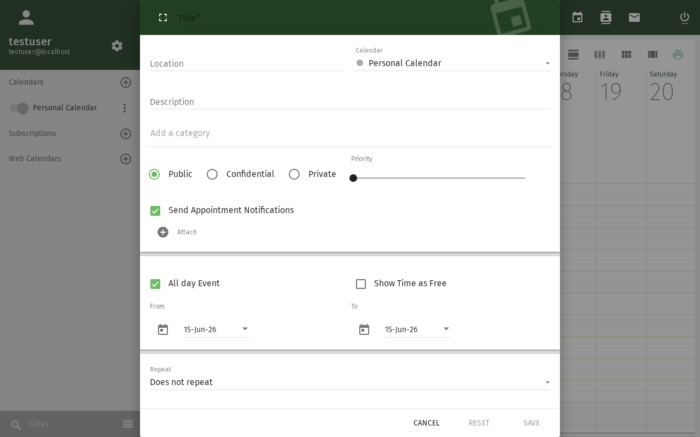
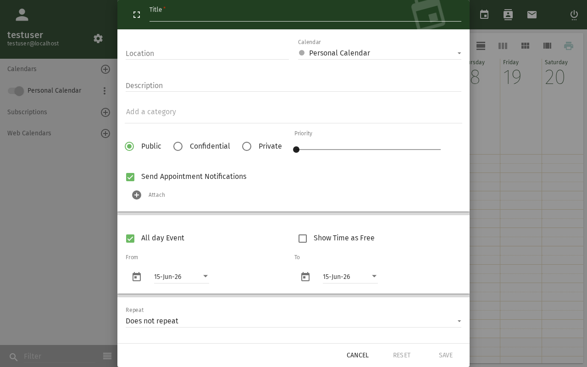
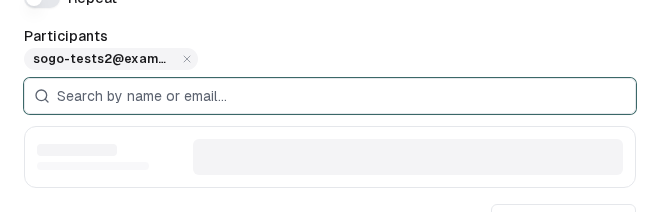

import PageSEO from '@site/src/components/PageSEO';

<PageSEO title="Free/Busy Lookup" description="Check colleagues' availability before scheduling meetings in SOGo 5. Step-by-step tutorial covers free/busy lookup from the event creation dialog." keywords="SOGo 5, free busy, availability, scheduling, calendar" />

# Free/Busy Lookup

Check when your colleagues are available before scheduling a
meeting — directly from the event creation dialog.

## Prerequisites

- A SOGo 5 account with valid credentials
- You are logged into SOGo 5
- The colleague has a SOGo 5 account and has shared their free/busy info

## Step-by-Step Instructions

### Step 1: Start Creating an Event

1. Open the **Calendar** module
2. Click **+** to create a new event, or click an existing event to edit

### Step 2: Open Free/Busy View

1. In the event dialog, click the **Attendees** section
2. Click **Free/Busy** or **Availability** button
3. A time grid opens showing your calendar

### Step 3: Add a Colleague

1. In the free/busy grid, click **Add Person** or **Check Availability**

2. Start typing a colleague's name
3. Select them from the auto-complete list
4. Repeat for each person you want to check

### Step 4: Read the Grid

The grid shows time slots for each person. Don't rely on color names —
the exact colors depend on your SOGo skin and theme; read the status
labels instead:

| Status | Meaning |
|:-------|:---------|
| **Busy** | The colleague has an event |
| **Tentative** | Maybe attending |
| **Available** | Free at that time |
| No entry / no data | Calendar not shared with you, or outside working hours |

### Step 5: Find a Common Slot

Look for a time when all attendees are green.
SOGo 5 may suggest the next available slot automatically.

### Step 6: Confirm the Time

Click on the desired time slot in the grid.
The event's start/end time updates to match.

## What Others See

By default, SOGo 5 is configured so that other users can see:

| Permission | What's Visible: What others can see |
|:-----------|:----------------|
| **Free/Busy** | Only whether you're available or busy (no details) |
| **View (read-only)** | Event titles and times |
| **Confidential events** | Marked as "Busy" only, even to viewers |

## Troubleshooting

### Colleague not showing up

- Check they have a SOGo 5 account
- They may not have free/busy sharing enabled
- They might be in a different address book — try typing their full email

### All times show "No data"

- The colleague hasn't shared their calendar with you
- Contact them or your administrator to grant free/busy access

## Conclusion

Free/busy lookup helps you find meeting times without the
back-and-forth of "Are you free at...?" emails. It works for
anyone in your organization who shares calendar availability.

## Accessibility

### Keyboard Navigation

SOGo 5 supports full keyboard navigation for free/busy lookup features.

| Action | Keyboard Shortcut | Notes |
|--------|-------------------|-------|
| Open Calendar module | `Alt+C` | From any module |
| Create new event | `Ctrl+N` or `Tab` then `Enter` on + button | Opens event creation dialog |
| Open Attendees section | `Tab` to Attendees field | Section within event dialog |
| Add a colleague | `Tab` to the attendee field, type the name | Activates autocomplete |
| Read availability | `Tab` through attendee rows | Availability shows per person |
| Select available time slot | `Enter` on an available slot | Locks the meeting time |
| Confirm event | `Tab` to Save, then `Enter` | Creates the event |

### Screen Reader Workflow

**Free/Busy Lookup: Checking Colleague Availability for a Meeting**

**Step 1: Open Calendar Module**
- Press `Alt+C` to navigate to the Calendar module
- Screen reader announces: "Calendar, module heading"

**Step 2: Create a New Event**
- Press `Ctrl+N` to create a new event, or tab to the + button and press `Enter`
- Screen reader announces: "New event dialog"
- The event dialog opens with fields for title, date, time, and attendees

**Step 3: Open Attendees Section**
- Press `Tab` repeatedly to navigate through event fields (title, date, time)
- Stop when you reach the Attendees section
- Screen reader announces: "Attendees, section"

**Step 4: Open Free/Busy View**
- Press `Tab` to reach the Free/Busy or Availability button
- Press `Enter` to open the availability grid
- Screen reader announces: "Free busy grid, your calendar shown"

**Step 5: Add a Colleague**
- Press `Tab` to reach the Add Person field
- Type the colleague's name or email
- Screen reader announces: "Edit, autocomplete, suggestions available"
- Use `Down` arrow to navigate through suggested names
- Press `Enter` to select the correct colleague
- Screen reader announces: "Person added to grid"

**Step 6: Navigate and Read the Grid**
- Use `Tab` to move between colleague rows in the grid
- Use `Left`/`Right` arrow keys to move across time slots
- Screen reader announces each slot: "10:00 AM, available" or "11:00 AM, busy"
- Color meanings are conveyed as text: "Available (green)", "Busy (red)", "Tentative (yellow)", "No data (white)"
- Repeat for each colleague added

**Step 7: Select a Common Available Slot**
- Navigate to a time slot where all colleagues show as available
- Press `Enter` to select the time
- Screen reader announces: "Time selected: 2:00 PM to 3:00 PM"
- The event's start and end time update automatically

**Step 8: Save the Event**
- Press `Tab` to reach the Save button
- Press `Enter` to confirm and create the event
- Screen reader announces: "Event saved" or similar confirmation
- The event appears in your calendar with the selected time

**Common Screen Reader Announcements:**

| Announcement: What screen reader says | Meaning: What it means | Action: What to do |
|-------------------------------|----------------------|-----------------|
| "New event dialog" | Event creation form is open | Begin filling in event details |
| "Free busy grid, your calendar shown" | Availability view is active | Proceed to add colleagues |
| "Edit, autocomplete, suggestions available" | Person search field is active | Type colleague's name and select from list |
| "Person added to grid" | Colleague's schedule is loaded | Continue adding more or find a slot |
| "10:00 AM, available" | Time slot is free | Select this slot for the meeting |
| "2:00 PM, busy" | Time slot is occupied | Move to a different time slot |
| "No data, white" | Free/busy not shared | Ask colleague to enable sharing or contact admin |
| "Event saved" | Meeting is created | Event is on your calendar |

### Visual Content Descriptions

**[freebusy.png]:** Screenshot of checking colleague availability in the event dialog.

### High Contrast Mode

SOGo 5's dark mode and high contrast mode work with all sections described above. Toggle via: Settings button (gear icon) → General → Theme → Dark/High Contrast.
