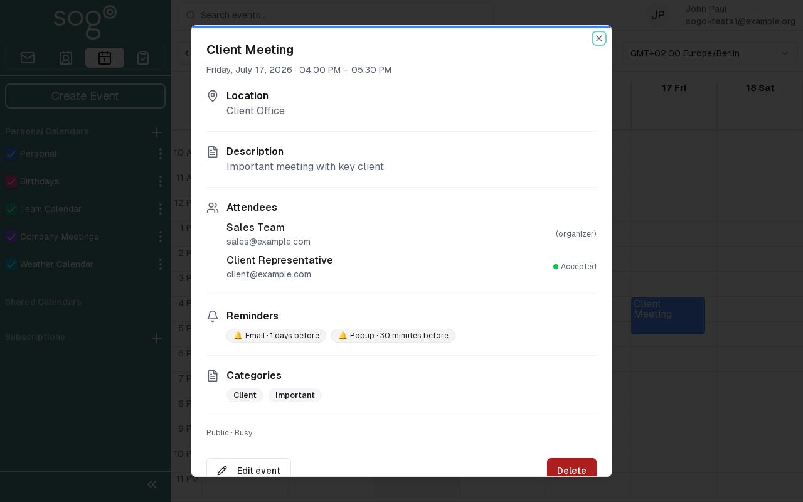

import PageSEO from '@site/src/components/PageSEO';

<PageSEO title="Calendar — Import & Export (iCal)" description="Import and export calendars using iCal (.ics) format in SOGo 5. Step-by-step tutorial covers calendar sharing and migration between applications." keywords="SOGo 5, iCal, import, export, calendar, ics" />

# Calendar — Import & Export (iCal)

Share your calendar with others by exporting it as an iCal file, or import calendars from other applications into SOGo.

## Prerequisites

- A SOGo 5 account with valid credentials
- You are logged into SOGo 5

## Step-by-Step Instructions

### Step 1: Open the Calendar Module

In the sidebar navigation on the left, click **Calendar** to open the calendar view.

### Step 2: Access Calendar Settings

Click the **Settings** gear icon in the calendar toolbar.

### Step 3: Export Your Calendar

The calendar settings panel displays export options:

1. Find the **Export** or **Share** section
2. Click the download link or copy the calendar URL
3. The calendar is exported as an `.ics` (iCal) file

### Step 4: Import a Calendar

1. Click the **Import** button in the calendar settings
2. Select the `.ics` file you want to import
3. Choose the target calendar for the import
4. Click **Import** to begin

:::info
iCal (`.ics`) is a standard calendar file format supported by most calendar applications including Google Calendar, Microsoft Outlook, and Apple Calendar.
:::

## Import Options

| Option: Description | Description | Use When |
|--------|--------------|---------|
| **Add all events** | Imports all events from the file | First-time import |
| **Merge duplicates** | Skips events with same date and title | Update existing calendar |
| **Update existing** | Replaces events with matching times | Refreshing a shared calendar |

:::warning
Importing a calendar with hundreds of events may take several minutes. Do not close the page while the import is processing.
:::

## Sharing via iCal

You can share your calendar by providing the iCal URL:

1. Copy the **Calendar URL** from the Export settings
2. Share the URL with others
3. They can subscribe to your calendar in their own application

## Troubleshooting

| Issue: Description | Possible Cause | Solution |
|-------|---------------|----------|
| Import button not visible | Calendar sharing not enabled | Contact your administrator to enable sharing |
 | Import fails | Invalid `.ics` file format | Verify the file opens in a calendar application first |
| Export file is empty | Calendar has no events | Add events to the calendar before exporting |
## Accessibility

### Keyboard Navigation

This application supports keyboard navigation. No mouse required for completing this task.

| Action | Keyboard Shortcut: What key to press | Notes: Additional information |
|--------|--------------------------------------|------------------------------|
| | Navigate modules | `Tab` / `Shift+Tab` | Cycles through sections |
| | Select/activate | `Enter` or `Space` | Activate button or link |
| | Cancel/close | `Escape` | Cancel current action |
| | Navigate lists | `Arrow keys` | Move through items |

**Screen Reader Navigation Order:**
1. Sidebar navigation → `Tab` to enter
2. Module content → `Arrow keys` to navigate
3. Action buttons → `Space` or `Enter` to activate
4. Forms → `Tab` between fields, arrows for dropdowns

### High Contrast Mode

SOGo supports high contrast and dark mode. Toggle via user preferences or use browser/OS-level accessibility settings:
- **Windows:** `Win+Ctrl+C` toggles high contrast
- **macOS:** System Preferences → Accessibility → Display → Increase contrast
- **Browser Extensions:** Dark Reader, High Contrast (Chrome)

