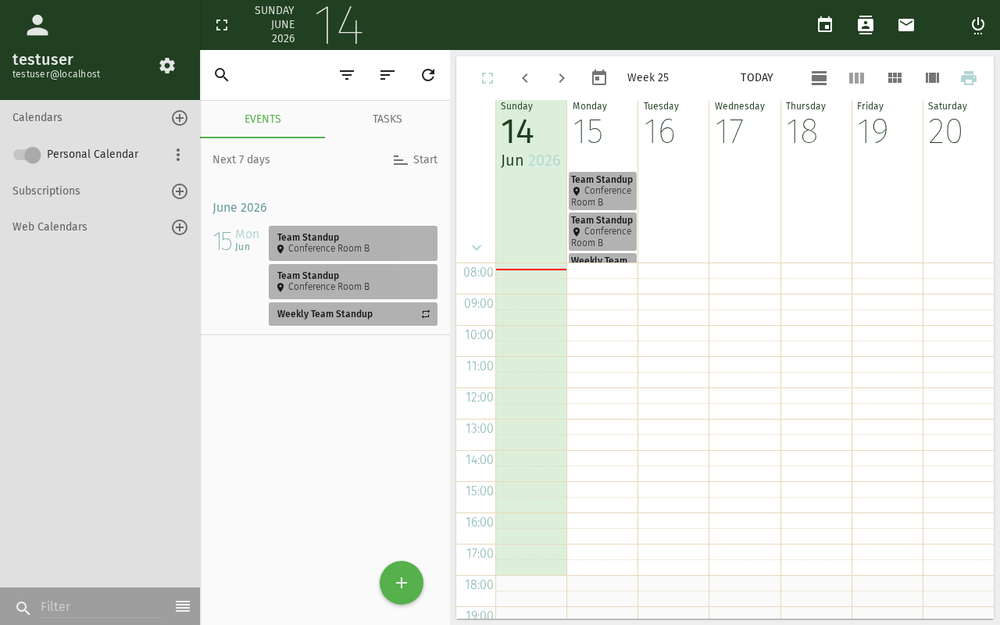
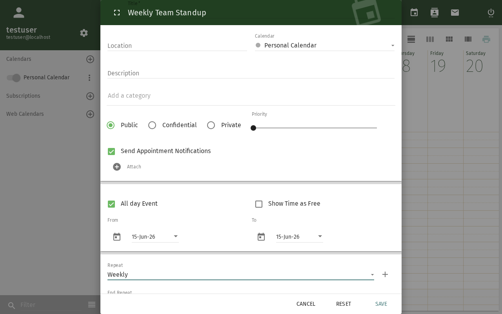

import Tabs from '@theme/Tabs';
import TabItem from '@theme/TabItem';

# Recurring Events & Alarms

This tutorial covers creating events that repeat on a schedule and
configuring reminders so you never miss them.

## Prerequisites

- A SOGo account with valid credentials
- You are logged into SOGo

## Part 1: Creating a Recurring Event

### Step 1: Start a New Event

1. Open the **Calendar** module
2. Click the **+** (plus) button or double-click a time slot

3. The new event dialog appears

### Step 2: Set Basic Details

Fill in:
- **Title:** e.g., "Weekly Team Standup"
- **Start / End:** First occurrence date and time
- **Calendar:** Choose which calendar to save to

### Step 3: Configure Recurrence

Click the **Repeat** or **Recurrence** section to expand it:

| Option | Description | Example Use |
|--------|-------------|-------------|
| **Daily** | Repeats every N days | Morning check-in |
| **Weekly** | Repeats on selected weekdays | Standup every Mon/Wed/Fri |
| **Bi-weekly** | Repeats every 2 weeks | Sprint planning |
| **Monthly** | Repeats on a day of the month | Department meeting on 1st |
| **Yearly** | Repeats on a date each year | Birthday, anniversary |

:::tip
For **weekly** recurrence, you can select multiple days
(e.g., Monday, Wednesday, Friday) by checking the boxes.
:::

### Step 4: Set an End Date (Recommended)

Always set an end date for recurring events to prevent infinite
repetition:

- **End by date:** Choose a specific date (e.g., end of semester)
- **End after N occurrences:** Limit the number of repetitions
- **No end date:** Use sparingly — only for permanent events

### Step 5: Save the Recurring Event

Click **Save**. The event is created with a recurrence icon 🔄
indicating it repeats.

## Part 2: Adding Alarms (Reminders)

### Step 1: Open the Alarm Settings

In the event dialog, click the **Alarm** or **Reminder** section.

### Step 2: Choose Reminder Type

<Tabs>
  <TabItem value="display" label="Display (Popup)" default>

A popup notification appears in your browser when the reminder fires.

1. Select **Display** as the alarm type
2. Choose when: **15 minutes before** (default), **1 hour before**,
   **1 day before**, or **Custom**
3. The reminder will appear as a browser notification

  </TabItem>
  <TabItem value="email" label="Email">

An email is sent to your SOGo email address.

1. Select **Email** as the alarm type
2. Choose the timing
3. Check your email when the reminder fires

:::info
**Server-side requirement:** Email alarms require the
`sogo-ealarms-notify` daemon to be running on the server.
Contact your administrator if email reminders don't arrive.
:::

  </TabItem>
</Tabs>

### Step 3: Add Multiple Alarms

You can add more than one alarm per event:
- **15 minutes before** — popup reminder
- **1 day before** — email reminder with preparation notes
- **At time of event** — final notification

Click **Add Alarm** to add additional reminders.

## Part 3: Editing or Stopping Recurrence

### Edit a Single Occurrence

1. Click on the specific event instance in the calendar
2. Choose **Edit this occurrence only**
3. Make changes — they apply only to that date

### Edit the Entire Series

1. Click on any occurrence
2. Choose **Edit the series**
3. Changes apply to all events in the recurrence

### Stop Recurrence

1. Open the event dialog
2. Set **Repeat** to **None**
3. Save — SOGo asks if you want to keep existing future events
4. Choose **Delete all future events** or **Keep them as individual events**

## Troubleshooting

### Recurrence options not showing

- Make sure you're editing a new or existing event in the **Calendar**
  module, not an invitation received via email
- Some SOGo themes hide the Repeat section behind a "More options" button

### Alarm not firing

- **Display alarms** require the browser tab to be open
- **Email alarms** require server-side configuration (`sogo-ealarms-notify`)
- Check your browser's notification permissions

## Conclusion

You have learned to create recurring events and set up alarms in SOGo.
These features are essential for regular meetings, deadlines, and
important dates.
