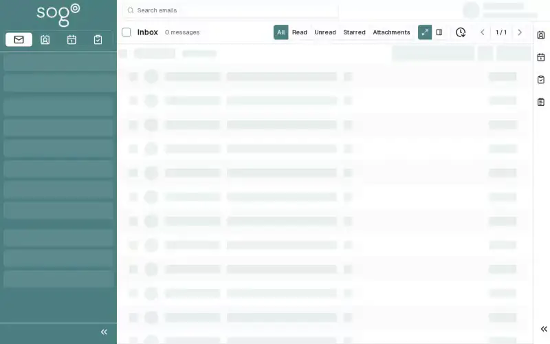

# Subscribe to an iCal Feed

Import external calendars into your SOGo 5 calendar — public holidays,
team calendars, or any `.ics` feed available online.

## Prerequisites

- A SOGo 5 account with valid credentials
- You are logged into SOGo 5
- A URL to an iCal feed (`.ics` file or CalDAV endpoint)

## Step-by-Step Instructions

### Step 1: Find an iCal Feed URL

You need the web address (URL) of an iCal feed. Common examples:

| Source | Example URL: Calendar address example |
|:-------|:------------|
| Public holidays | `https://calendar.google.com/calendar/ical/.../basic.ics` |
| Team calendar | `https://teamup.com/.../events.ics` |
| Shared SOGo 5 calendar | `https://sogo.example.com/SOGo/dav/username/calendar/shared/` |

### Step 2: Open Calendar Settings

1. Click **Calendar** in the sidebar
2. Locate the calendar list on the left side
3. Click the **gear icon** ⚙ next to the calendar section header
4. Select **Subscribe to URL**

### Step 3: Enter the Feed URL

In the subscription dialog:

1. **URL:** Paste the iCal feed URL
2. **Name:** Enter a display name (e.g., "German Holidays")
3. **Color:** Choose a calendar color for visibility

### Step 4: Configure Sync Options

| Option | Description: What this option does |
|:-------|:------------|
| **Refresh interval** | How often to check for updates (every hour, daily, etc.) |
| **Remove reminders** | Strip alarm information from external events |
| **Remove attachments** | Don't download external file attachments |

Recommended defaults: Refresh **daily**, remove reminders (external
calendars often have irrelevant alarms).

### Step 5: Save the Subscription

Click **Subscribe** or **OK**. The calendar appears in your calendar
list with a subscription icon 📡.

## Managing Subscriptions

### View Subscribed Events

Subscribed calendars work like your own — events appear in the
calendar view. You can toggle visibility by checking/unchecking
the calendar in the list.

### Refresh Manually

Right-click the subscribed calendar → **Refresh** to fetch the
latest data immediately.

### Edit Subscription Properties

Right-click the calendar → **Properties**:
- Change the display name or color
- Update the feed URL
- Adjust refresh interval

### Unsubscribe

Right-click the calendar → **Unsubscribe** or **Delete**.
The calendar is removed from your view. The source is unaffected.

## Troubleshooting

### "Invalid calendar URL"

- Verify the URL is accessible (try opening it in a browser)
- The URL must return valid iCalendar (`.ics`) data
- Some public feeds require authentication

### Calendar not updating

- Check the refresh interval setting
- Manually refresh: right-click → **Refresh**
- The feed provider may have changed the URL

### Events have wrong times

- SOGo 5 converts all dates to your configured timezone
- Check your timezone in **Settings** → **General** → **Timezone**
- Some iCal feeds don't include timezone info — these default to UTC

## Conclusion

iCal subscriptions let you overlay external calendars onto your
SOGo 5 view — perfect for public holidays, team schedules, and
third-party calendar feeds.

## Accessibility

### Keyboard Navigation

SOGo 5 supports full keyboard navigation for subscribing to calendars.

| Action | Keyboard Shortcut: What key to press | Notes: Additional information |
|--------|--------------------------------------|------------------------------|
| | Navigate to Calendar | `Alt+M`, `Tab` to Calendar |
| | Open subscription dialog | `Ctrl+Shift+S` or gear icon |
| | Select calendar type | Arrow keys in dropdown |
| | Enter calendar URL | Tab to URL field, type |
| | Display name field | Tab, type name |
| | Refresh frequency | Arrow key to select |
| | Subscribe or save | `Ctrl+S` or `Enter` |

### Screen Reader Workflow

**Subscribing to External Calendar**

**Step 1: Navigate to Calendar Module**
1. `Alt+M` to focus sidebar
2. Arrow keys to "Calendar"
3. `Enter` to open calendar view

**Step 2: Open Subscription Dialog**
1. Gear icon settings or press `Ctrl+Shift+S`
2. "Subscribe to Calendar" option
3. Press `Enter`

**Step 3: Select Calendar Type**
1. Tab to calendar type dropdown
2. Arrow keys to select (iCal, CalDAV, etc.)
3. Press `Enter`

**Step 4: Enter Calendar Details**
1. Tab to URL field
2. Type or paste calendar URL
3. Tab to display name field
4. Type friendly name (e.g., "Team Calendar")
5. Tab to refresh frequency
6. Select frequency with arrow keys

**Step 5: Complete Subscription**
1. Tab to "Subscribe" or "Save" button
2. Press `Enter`
3. Screen reader announces calendar added

**Common Screen Reader Announcements:**

| Announcement: What screen reader says | Meaning: What it means | Action: What to do |
|--------------------------------------|------------------------|-------------------|
| "Subscribe to calendar, dialog" | Subscription dialog open | Select calendar type |
| "Calendar type, combo box" | Calendar format selector | Arrow to select type |
| "URL, edit" | Calendar address field | Type full calendar URL |
| "Display name, edit" | Friendly calendar name | Type memorable name |
| "Refresh frequency" | How often to sync | Arrow to select interval |
| "Calendar subscribed" | Success | Calendar now visible |

### Visual Content Descriptions

**calendar-subscribe.webp:** This 3-second animated GIF shows subscribing to an external calendar.

- **Frame 1 (0-0.8s):** Calendar view with Calendars list on left
- **Frame 2 (0.8-2s):** Subscription dialog open, calendar type dropdown showing "iCal/ICS" selected, URL field populated with calendar address, display name "Team Calendar" typed
- **Frame 3 (2-3s):** Calendar list now shows "Team Calendar" with subscribed icon, refresh frequency set to "Every 30 minutes"

### High Contrast Mode

SOGo 5's dark mode and high contrast mode work with all sections described above. Toggle via: Settings button (gear icon) → General → Theme → Dark/High Contrast.
