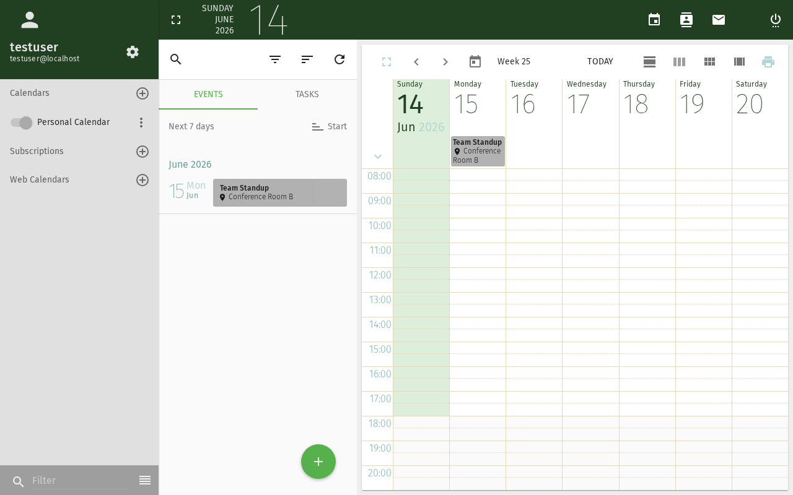

# Subscribe to an iCal Feed

Import external calendars into your SOGo calendar — public holidays,
team calendars, or any `.ics` feed available online.

## Prerequisites

- A SOGo account with valid credentials
- You are logged into SOGo
- A URL to an iCal feed (`.ics` file or CalDAV endpoint)

## Step-by-Step Instructions

### Step 1: Find an iCal Feed URL

You need the web address (URL) of an iCal feed. Common examples:

| Source | Example URL |
|--------|-------------|
| Public holidays | `https://calendar.google.com/calendar/ical/.../basic.ics` |
| Team calendar | `https://teamup.com/.../events.ics` |
| Shared SOGo calendar | `https://sogo.example.com/SOGo/dav/username/calendar/shared/` |

### Step 2: Open Calendar Settings

1. Click **Calendar** in the sidebar
2. Locate the calendar list on the left side
3. Click the **gear icon** ⚙ next to the calendar section header
4. Select **Subscribe to URL**

### Step 3: Enter the Feed URL

In the subscription dialog:

1. **URL:** Paste the iCal feed URL
2. **Name:** Enter a display name (e.g., "German Holidays")
3. **Color:** Choose a calendar color for visibility

### Step 4: Configure Sync Options

| Option | Description |
|--------|-------------|
| **Refresh interval** | How often to check for updates (every hour, daily, etc.) |
| **Remove reminders** | Strip alarm information from external events |
| **Remove attachments** | Don't download external file attachments |

Recommended defaults: Refresh **daily**, remove reminders (external
calendars often have irrelevant alarms).

### Step 5: Save the Subscription

Click **Subscribe** or **OK**. The calendar appears in your calendar
list with a subscription icon 📡.

## Managing Subscriptions

### View Subscribed Events

Subscribed calendars work like your own — events appear in the
calendar view. You can toggle visibility by checking/unchecking
the calendar in the list.

### Refresh Manually

Right-click the subscribed calendar → **Refresh** to fetch the
latest data immediately.

### Edit Subscription Properties

Right-click the calendar → **Properties**:
- Change the display name or color
- Update the feed URL
- Adjust refresh interval

### Unsubscribe

Right-click the calendar → **Unsubscribe** or **Delete**.
The calendar is removed from your view. The source is unaffected.

## Troubleshooting

### "Invalid calendar URL"

- Verify the URL is accessible (try opening it in a browser)
- The URL must return valid iCalendar (`.ics`) data
- Some public feeds require authentication

### Calendar not updating

- Check the refresh interval setting
- Manually refresh: right-click → **Refresh**
- The feed provider may have changed the URL

### Events have wrong times

- SOGo converts all dates to your configured timezone
- Check your timezone in **Settings** → **General** → **Timezone**
- Some iCal feeds don't include timezone info — these default to UTC

## Conclusion

iCal subscriptions let you overlay external calendars onto your
SOGo view — perfect for public holidays, team schedules, and
third-party calendar feeds.
