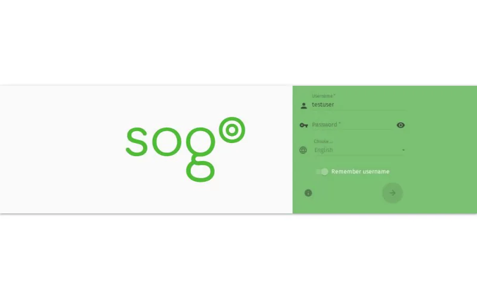

import PageSEO from '@site/src/components/PageSEO';

<PageSEO title="Calendar Views" description="Switch between Day, Week, and Month views in the SOGo 5 calendar. Tutorial covers navigating different calendar views to manage your schedule." keywords="SOGo 5, calendar, views, day, week, month" />

# Calendar Views

Switch between different calendar views to see your schedule at the right level of detail — from a focused day overview to a full month at a glance.

## Prerequisites

- A SOGo 5 account with valid credentials
- You are logged into SOGo 5

## Step-by-Step Instructions

### Step 1: Open the Calendar Module

In the sidebar navigation on the left, click **Calendar** to open the calendar view.

### Step 2: Switch Between Views

The calendar opens in **Week view** by default. Use the view switcher buttons in the top toolbar to change between available views.

Available views:

| View: Description | Icon | Description |
|------|------|-------------|
| **Day** | `1` | Detailed view of a single day's events in hourly slots |
| **Week** | `7` | Five-day work week view (default) |
| **Month** | `31` | Full month grid for a broader overview |

### Step 3: Navigate Through Time

Use the **arrow buttons** (◀ ▶) next to the date to move forward or backward:

- In **Day view**: moves one day at a time
- In **Week view**: moves one week at a time
- In **Month view**: moves one month at a time
- Click **Today** (or **Heute**) to jump back to the current date

### Step 4: Quick Date Navigation

Click the date header (e.g., "June 15–19, 2026") to open a date picker for jumping to a specific date.

:::tip
**Keyboard shortcut:** Press `T` to jump to Today from any view.
:::

## View Comparison

| Feature: Description | Day | Week | Month |
|---------|-----|------|-------|
| Hour-by-hour timeline | Yes | Yes | No |
| All-day events | Yes | Yes | Yes |
| Recurring events | Shows instances | Shows instances | Shows instances |
| Best for | Detailed planning | Weekly overview | Monthly planning |
## Accessibility

### Keyboard Navigation

This application supports keyboard navigation. No mouse required for completing this task.

| Action | Keyboard Shortcut: What key to press | Notes: Additional information |
|--------|--------------------------------------|------------------------------|
| | Navigate modules | `Tab` / `Shift+Tab` | Cycles through sections |
| | Select/activate | `Enter` or `Space` | Activate button or link |
| | Cancel/close | `Escape` | Cancel current action |
| | Navigate lists | `Arrow keys` | Move through items |

**Screen Reader Navigation Order:**
1. Sidebar navigation → `Tab` to enter
2. Module content → `Arrow keys` to navigate
3. Action buttons → `Space` or `Enter` to activate
4. Forms → `Tab` between fields, arrows for dropdowns

### High Contrast Mode

SOGo supports high contrast and dark mode. Toggle via user preferences or use browser/OS-level accessibility settings:
- **Windows:** `Win+Ctrl+C` toggles high contrast
- **macOS:** System Preferences → Accessibility → Display → Increase contrast
- **Browser Extensions:** Dark Reader, High Contrast (Chrome)

