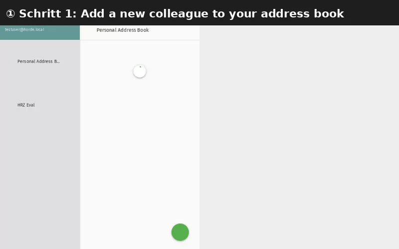

# Add a Contact

This tutorial explains how to add contacts to your SOGo 5 address book
and organize them into groups.

## Prerequisites

- A SOGo 5 account with valid credentials
- You are logged into SOGo 5

## Step-by-Step Instructions

### Step 1: Open the Contacts Module

In the sidebar navigation on the left, click **Contacts**
to open your address book.

The contacts view shows your address book with any existing contacts.
On the left, you'll see your address books and contact groups.

### Step 2: Create a New Contact

Click the **+** (plus) button to add a new contact.

A blank contact form will appear.

### Step 3: Enter Contact Information

Fill in the contact's details. The most commonly used fields are:

| Field | Description: What to enter | Recommended: Always fill? |
| :--- | :--- | :--- |
| **First Name** | Given name | ✅ Always |
| **Last Name** | Family name | ✅ Always |
| **Email** | Primary email address | ✅ Always |
| **Phone** | Telephone number | Optional |
| **Mobile** | Mobile phone number | Optional |
| **Company** | Organization or company | Optional |
| **Job Title** | Position at work | Optional |

:::tip
The **Display Name** field is auto-filled from First + Last name,
but you can customize it (e.g., "John D. (IT Support)").
:::

### Step 4: Add Additional Details (Optional)

Scroll down to access more fields:

| Section | Fields: Available details |
| :--- | :--- |
| **Address** | Street, City, ZIP, Country |
| **Other Email** | Secondary email addresses |
| **Website** | Personal or work URL |
| **IM** | Instant messaging handles (Jabber, etc.) |
| **Notes** | Free-text notes about the contact |

### Step 5: Choose an Address Book

If you have multiple address books, select which one to save to using
the dropdown at the top of the contact form.

- **Personal Address Book** — Your own contacts
- **Shared Address Books** — Team or department contacts (if available)
- **Collected Addresses** — Automatically saved from sent emails

### Step 6: Save the Contact

Click **Save** to add the contact to your address book.

The contact will now appear in your contact list. You can:

- Click on it to view or edit details
- Start typing the name when composing an email to auto-complete

## Organizing Contacts into Groups

### Create a Group

1. In the left sidebar, click **+** next to **Contact Groups**
2. Enter a name for the group (e.g., "Team", "Clients", "Family")
3. Click **OK**

### Add Contacts to a Group

1. Drag a contact from the list onto the group name, or
2. Right-click the group, select **Add Members**, and choose contacts

## Importing Contacts (CSL/vCard)

To import contacts from another service:

1. Click the **gear icon** ⚙ in the contacts toolbar
2. Select **Import**
3. Choose a file:
   - **vCard (.vcf)** — Standard format, works with most address books
   - **CSV (.csv)** — Spreadsheet export format
4. Click **Import**

:::warning
Imported contacts are added to the currently selected address book.
Make sure the correct address book is selected before importing.
:::

## Editing or Deleting a Contact

- **Edit:** Click on a contact in the list, then click **Edit**
- **Delete:** Select the contact and click **Delete** (trash icon)

## Conclusion

You have successfully added a contact to your SOGo 5 address book.
Contacts are available throughout SOGo 5 — when composing email, inviting
attendees to calendar events, or searching for colleagues.

## Accessibility

### Keyboard Navigation

SOGo 5 supports full keyboard navigation for contacts management.

| Action | Keyboard Shortcut: What key to press | Notes: Additional information |
|--------|----------------------------------|---------------------------|
| | Navigate to Contacts | `Alt+M`, `Tab` to Contacts |
| | New contact | `+` or `C` | Creates new contact |
| | Navigate contacts | `J` / `K` | Next/previous contact |
| | Search contacts | `/` | Focus search field |
| | Edit contact | `E` | Edit selected contact |
| | Delete contact | `D` | Delete selected contact |
| | Cancel | `Escape` | Close dialog |

### Screen Reader Workflow

**Step 1: Navigate to Contacts Module**
1. `Alt+M` or `Tab` to sidebar
2. Arrow keys to "Contacts"
3. `Enter` to activate Contacts module
4. Screen reader: "Contacts module, heading, level 2"

**Step 2: Create New Contact**
1. Focus on "+" button (top of contacts list)
2. Screen reader: "New contact, button"
3. `Enter` to activate

**Step 3: Complete Contact Form**

Form fields appear in this order (screen reader focus sequence):

1. **First Name** - recommended
   - Type first name
   - `Tab` to next field

2. **Last Name** - recommended
   - Type last name
   - `Tab` to next field

3. **Email** - recommended
   - Type primary email address
   - Screen reader: "Email, edit, text@domain.com, editable combobox"

**Optional fields (tab through or skip with `Shift+Tab`):**

4. **Phone** - main phone number
5. **Mobile** - mobile phone number
6. **Company** - organization or company
7. **Job Title** - position at work

**Additional sections (scroll or `Tab` further):**

8. **Address** section
   - Street, City, ZIP, Country fields
9. **Other Email** - secondary email addresses
10. **Website** - personal or work URL
11. **IM** - IM handles
12. **Notes** - free-text notes

**Step 4: Choose Address Book (if applicable)**
- `Tab` to Address Book dropdown
- `Arrow` keys to select from "Personal", "Shared", etc.
- `Enter` to confirm

**Step 5: Save Contact**
- `Tab` to Save button
- `Enter` to activate
- Screen reader announces: "Contact saved"
- Contact appears in contact list

**Common Screen Reader Announcements:**

| Announcement: What screen reader says | Meaning: What it means | Action: What to do |
|-------------------------------|----------------------|-----------------|
| "Email, editable combobox" | Email field with suggestions | Type email to see suggestions |
| "Select address book, combo box" | Choose where to save contact | `Arrow` to select, `Enter` to confirm |
| "Contact saved" | Success | Contact now in address book |
| "Please enter a valid email" | Invalid email format | Fix email address |

**Keyboard Shortcuts in Contact Form:**
- `Ctrl+S` or `Cmd+S` → Save (alias for Enter on Save button)
- `Escape` → Cancel/discard
- `Tab` → Next field
- `Shift+Tab` → Previous field

### Visual Content Descriptions

**contacts-add.webp:** This 3.5-second animated GIF shows adding a contact in SOGo 5's address book interface.

- **Frame 1 (0-1.7s):** Contacts module view showing existing contacts (address book list on left, contact items in main view)
- **Frame 2 (1.7-3.5s):** "+" button clicked (highlighted), blank contact form appears with fields for First Name, Last Name, Email, Phone, Company, Job Title

**Screen Reader Alternative:** If you cannot view this GIF, please use the **Screen Reader Workflow** section above.

**Duration:** 3.5 seconds, 2 frames  
**File size:** 18 KB

### High Contrast Mode

SOGo 5 currently does not have built-in high contrast mode. Workarounds for low-vision users:

**Browser/OS-Level High Contrast:**
1. **Windows:** `Win+Ctrl+C` toggles high contrast → Settings → Ease of Access → High Contrast
2. **macOS:** `System Preferences → Accessibility → Display → Increase contrast`
3. **Browser Extensions:** Dark Reader, High Contrast (Chrome)

**Contact Form Accessibility:** All form fields have associated labels. Use `Tab` to navigate between fields. Screen readers will announce field labels and current values.
