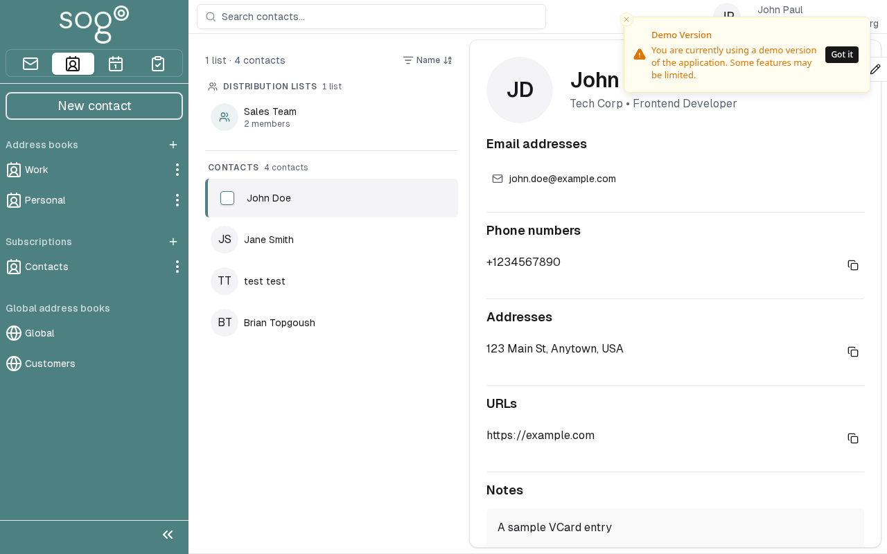

import PageSEO from '@site/src/components/PageSEO';

<PageSEO title="Edit and Delete Contacts" description="Modify or remove contacts from your SOGo 5 address book. Step-by-step tutorial covers editing contact information and deleting contacts." keywords="SOGo 5, contacts, address book, edit contact, delete contact, manage contacts" />

# Edit & Delete Contacts

Learn how to update contact information or remove contacts from your SOGo 5 address book.

## Prerequisites

- A SOGo 5 account with valid credentials
- You are logged into SOGo 5
- At least one existing contact in your address book

## Part 1: Edit a Contact

### Step 1: Select a Contact

In the sidebar navigation on the left, click **Contacts** to open the address book.

Find the contact you want to edit and click on their name or entry.

### Step 2: Modify Contact Details

The contact editor allows you to change:

| Field: Description | Description |
|-------|-------------|
| **First Name** | Given name |
| **Last Name** | Surname / family name |
| **Email** | Primary email address |
| **Phone** | Telephone number |
| **Mobile** | Mobile/cell phone number |
| **Company** | Organization or employer |
| **Notes** | Free-text notes about the contact |

To edit a field:

1. Click inside the field you want to change
2. Update the text as needed
3. Click **Save** to apply all changes at once

### Step 3: Save Changes

Click the **Save** button to persist your changes. The contact details will update immediately.

## Part 2: Delete a Contact

### Step 1: Open the Contact

Click the contact you want to remove from your address book.

### Step 2: Delete

1. Click the **Delete** button in the contact editor
2. Confirm the deletion when prompted

:::warning
Deletion is permanent. Once deleted, the contact cannot be recovered.
:::

## Troubleshooting

| Issue: Description | Possible Cause | Solution |
|-------|---------------|----------|
| Cannot edit contact | Read-only address book (shared by another user) | You can only view contacts in shared address books |
| Changes not saving | Session timeout | Refresh the page and try again |
| Wrong contact shown | Search filter active | Clear any search terms in the contact list |
## Accessibility

### Keyboard Navigation

This application supports keyboard navigation. No mouse required for completing this task.

| Action | Keyboard Shortcut: What key to press | Notes: Additional information |
|--------|--------------------------------------|------------------------------|
| | Navigate modules | `Tab` / `Shift+Tab` | Cycles through sections |
| | Select/activate | `Enter` or `Space` | Activate button or link |
| | Cancel/close | `Escape` | Cancel current action |
| | Navigate lists | `Arrow keys` | Move through items |

**Screen Reader Navigation Order:**
1. Sidebar navigation → `Tab` to enter
2. Module content → `Arrow keys` to navigate
3. Action buttons → `Space` or `Enter` to activate
4. Forms → `Tab` between fields, arrows for dropdowns

### High Contrast Mode

SOGo supports high contrast and dark mode. Toggle via user preferences or use browser/OS-level accessibility settings:
- **Windows:** `Win+Ctrl+C` toggles high contrast
- **macOS:** System Preferences → Accessibility → Display → Increase contrast
- **Browser Extensions:** Dark Reader, High Contrast (Chrome)

