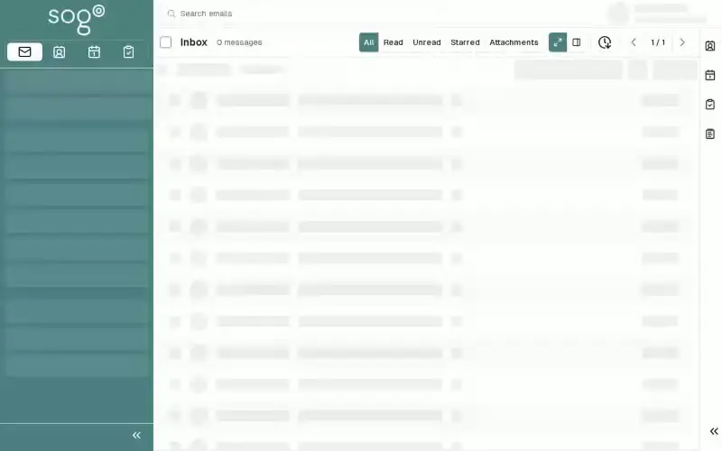

import PageSEO from '@site/src/components/PageSEO';

<PageSEO title="Contacts — Import & Export" description="Transfer contacts using vCard format in SOGo 5. Step-by-step tutorial covers importing and exporting contacts between applications." keywords="SOGo 5, contacts, import, export, vCard, address book" />

# Contacts — Import & Export

Migrate contacts between applications using vCard import/export.

## Prerequisites

- A SOGo 5 account with valid credentials
- You are logged into SOGo 5

## Step-by-Step Instructions

### Step 1: Open the Contacts Module

In the sidebar, click **Contacts** to open the address book.

### Step 2: Access Actions Menu

Click the **Actions** menu button (often a downward arrow or three dots) near the top of the contact list.

### Step 3: Export Contacts

1. Select **Export** from the Actions menu
2. Choose the address book to export
3. The contacts download as a `.vcf` (vCard) file

### Step 4: Import Contacts

1. Click **Import** from the Actions menu
2. Select the `.vcf` file you want to import
3. Choose the target address book
4. Select how to handle duplicates:
   - **Skip** — Do not import duplicates
   - **Update** — Replace existing contacts with imported data
   - **Add as new** — Import as separate contact
5. Click **Import** to begin

:::info
vCard (`.vcf`) is the standard format for sharing contacts across applications like Microsoft Outlook, Apple Contacts, Gmail, and more.
:::

## Import Options

| Duplicate Handling | Description |
|--------------------|-------------|
| **Skip duplicates** | Ignores contacts with the same email address |
| **Update existing** | Overwrites existing contact data with imported information |
| **Add all** | Imports all contacts, creating duplicates if necessary |

## Export Options

| Format | Description | Typical Size (100 contacts) |
|--------|--------------|-----------------------------|
| **vCard 3.0** | Standard vCard format | ~25 KB |
| **vCard 4.0** | Newer format with extended fields | ~30 KB |
| **CSV** | Comma-separated values for spreadsheet apps | ~15 KB |

:::tip
To back up your entire address book, periodically export all contacts to a vCard file and store it in a safe location.
:::

## Troubleshooting

| Issue | Possible Cause | Solution |
|-------|---------------|----------|
| Import/Export actions not visible | Feature not enabled | Contact your administrator |
| Import fails | Corrupted vCard file | Open the file in a text editor and verify format |
| Contacts appear twice | Duplicate handling not selected | Choose "Skip duplicates" during import |
| Specific fields missing | Format incompatibility | Convert the vCard to vCard 3.0 format and retry |
