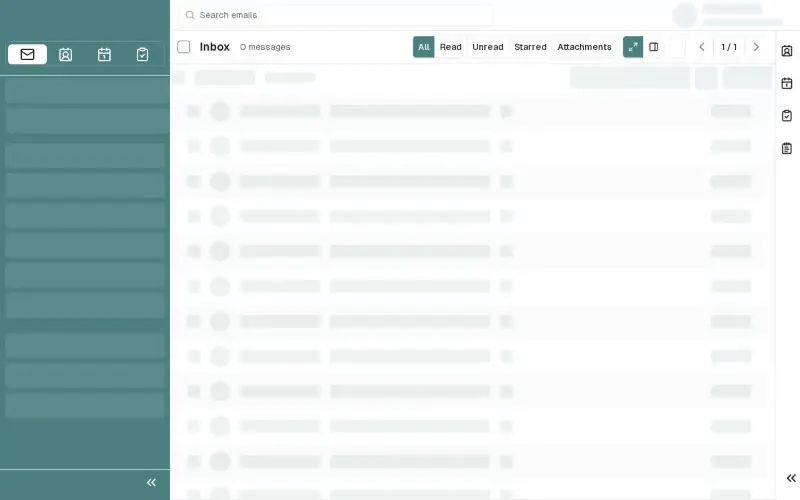

# Logout

Safely end your SOGo 5 session by logging out when you're done working.

## Prerequisites

- You are logged into SOGo 5

## Step-by-Step Instructions

### Step 1: Locate the Logout Button

In the top-right toolbar, find the **power icon** ⏻ (Logout).

### Step 2: Click to Log Out

Click the power icon to end your session. You will be redirected to the login page.

### Step 3: Confirm You Are Logged Out

Once redirected, you will see the SOGo login screen confirming that your session has ended safely.

:::tip
If you are using a shared or public computer, always log out when you are done. Do not just close the browser tab.
:::

## Troubleshooting

| Issue | Possible Cause | Solution |
|-------|---------------|----------|
| Logout button not visible | Screen resolution too narrow | Try widening the browser window or clicking the menu button (☰) first |
| Session still active after logout | Browser cached the page | Clear browser cache and close all SOGo tabs |
