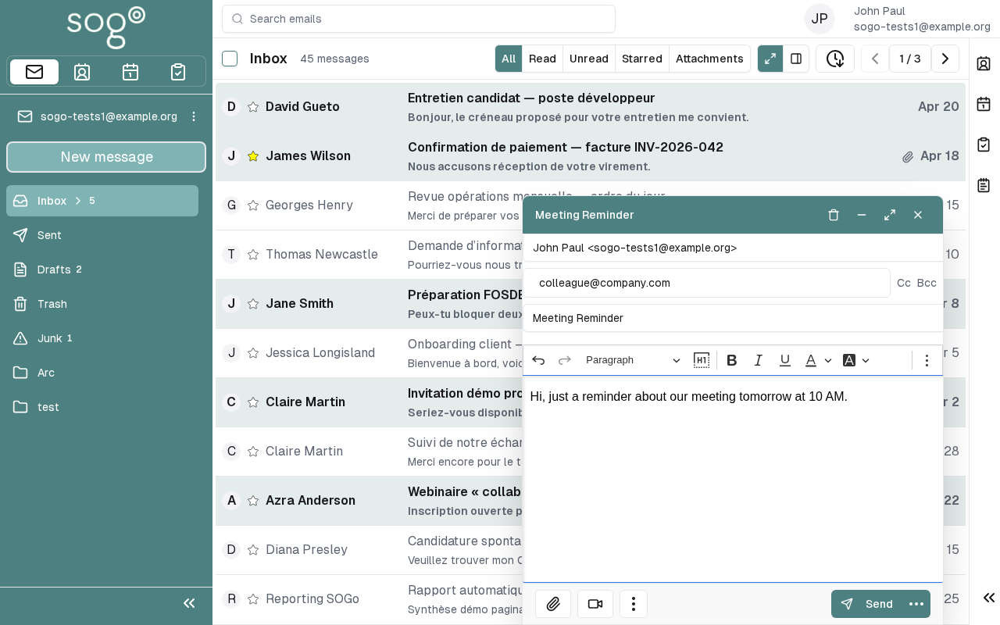

import PageSEO from '@site/src/components/PageSEO';

<PageSEO title="Compose and Send an Email" description="Learn how to write, format, and send emails in SOGo 5 webmail. Step-by-step tutorial covers email composition, attachments, and sending." keywords="SOGo 5, email, compose, send, webmail, attachments" />

# Compose and Send an Email

This tutorial covers the basics of composing and sending emails
using SOGo 5's webmail interface.

## Prerequisites

- A SOGo 5 account with valid credentials
- You are logged into SOGo 5

## Step-by-Step Instructions

### Step 1: Open the Mail Module

In the sidebar navigation on the left, click **Mail**
to open your inbox.

Your inbox shows received messages in the main view, with folders
(Inbox, Sent, Drafts, Trash) listed in the left panel.

### Step 2: Start a New Message

Click the **Compose** button in the toolbar above your message list.

A new message composition window will open.

### Step 3: Address Your Message

Fill in the recipient fields:

| Field | Description: What this field is for |
|-------|-------------|
| **To** | Primary recipient(s). Separate multiple addresses with commas or semicolons |
| **Cc** | Carbon copy — recipients receive a copy, visible to others |
| **Bcc** | Blind carbon copy — recipients receive a copy, hidden from other recipients |

**Tips:**
- Start typing a name — SOGo 5 will suggest matching contacts from your address book
- You can also enter full email addresses directly
- Use **Cc** for people who need to be informed but are not directly responsible
- Use **Bcc** for mailing lists or when recipients should not see each other

### Step 4: Write a Subject

Enter a clear, concise subject line in the **Subject** field.

:::tip
Good subject lines help recipients understand the purpose of your email.
Examples:
- ❌ "Meeting"
- ✅ "Sprint Planning — Tuesday 10:00"
- ❌ "Question"
- ✅ "Question about calendar sharing permissions"
:::

### Step 5: Write Your Message

Type your message in the large text area. The toolbar above provides
formatting options:

| Button | Action: What this button does |
|--------|--------|
| **B** | Bold |
| *I* | Italic |
| **U** | Underline |
| **Link** | Insert a hyperlink |
| **List** | Create a bullet or numbered list |
| **Attachment** 📎 | Attach a file |

To attach a file:

1. Click the **Attach** button (paperclip icon)
2. Select a file from your computer
3. The file will upload and appear as an attachment in your message

### Step 6: Set Priority (Optional)

If your message is time-sensitive, you can set a priority level:

- Click the **Priority** button in the toolbar
- Choose **Low**, **Normal**, or **High**

High-priority messages will show a red exclamation mark ❗ in the
recipient's inbox.

### Step 7: Send the Message

Once your message is complete:

1. Review the recipient, subject, and content
2. Click **Send**

SOGo 5 will deliver the message. A copy is saved in your **Sent** folder.

### Step 8: Save as Draft (Optional)

If you are not ready to send:

- Click **Save as Draft** instead of Send
- The message is saved in your **Drafts** folder
- To continue later, open the Drafts folder and click the message

## Troubleshooting

### Message won't send

- Check that **To** field has at least one valid recipient
- Large attachments may exceed server size limits (typically 25 MB)
- Check your internet connection

### Recipient not found

- Verify the email address is correct
- The auto-complete searches your contacts, not the global directory
- Enter the full email address manually

## Conclusion

You have successfully composed and sent an email in SOGo 5. You can now
manage your inbox, organize messages into folders, and set up email
filters for automatic sorting.

## Accessibility

### Keyboard Navigation

SOGo 5 supports full keyboard navigation for composing and sending emails.

| Action | Keyboard Shortcut: What key to press | Notes: Additional information |
|--------|----------------------------------|---------------------------|
| | Navigate to Mail | `Alt+M`, `Tab` to sidebar, select Mail |
| | New message / Compose | `c` | Opens compose window |
| | Focus To field | `Tab` | First field in compose |
| | Focus Cc field | `Tab` or `Ctrl+Shift+C` | Carbon copy |
| | Focus Bcc field | `Tab` or `Ctrl+Shift+B` | Blind carbon copy |
| | Focus Subject field | `Tab` | After recipient fields |
| | Focus message body | `Tab` | Large text area |
| | Send message | `Ctrl+Enter` or `Tab` to Send button |
| | Save as Draft | `Ctrl+S` | Saves to Drafts folder |
| | Attach file | `Ctrl+Shift+A` | Opens file picker |
| | Bold | `Ctrl+B` | Formatting toolbar |
| | Italic | `Ctrl+I` | Formatting toolbar |
| | Underline | `Ctrl+U` | Formatting toolbar |
| | Cancel / Close | `Escape` | Discard message |

### Screen Reader Workflow

**Step 1: Navigate to Mail Module**
1. `Alt+M` or `Tab` to sidebar navigation
2. Arrow keys to "Mail" - `Enter` to activate
3. Screen reader: "Mail module, inbox view"

**Step 2: Open Compose Window**
1. `c` to open new message compose window
2. Screen reader: "Compose, new message window"
3. Alternatively: `Tab` to "Compose" button, `Enter` to activate

**Step 3: Address the Message**

Form fields in focus order:

1. **To field** - required
   - Type recipient email address or start typing a contact name
   - Screen reader: "To, edit, editable combobox"
   - `Tab` to next field

2. **Cc field** - optional
   - Type carbon copy recipients
   - `Tab` to next field

3. **Bcc field** - optional
   - Type blind carbon copy recipients
   - `Tab` to next field

**Step 4: Write Subject**
1. Type a clear subject line
2. `Tab` to next field
3. Screen reader: "Subject, edit"

**Step 5: Write Message Body**
1. Type your message in the large text area
2. For formatting: `Ctrl+B` (bold), `Ctrl+I` (italic), `Ctrl+U` (underline)
3. Screen reader: "Message body, content editable"

**Step 6: Attach Files (Optional)**
1. `Ctrl+Shift+A` to open file picker
2. Navigate to file using standard file dialog
3. Select file and confirm
4. Screen reader: "Attachment, filename.ext"

**Step 7: Send or Save as Draft**
- **Send:** `Ctrl+Enter` or `Tab` to Send button, `Enter` to activate
- **Save as Draft:** `Ctrl+S`
- Screen reader: "Message sent" or "Message saved to drafts"

**Common Screen Reader Announcements:**

| Announcement: What screen reader says | Meaning: What it means | Action: What to do |
|-------------------------------|----------------------|-----------------|
| "To, editable combobox" | Recipient field ready | Type email or contact name |
| "Subject, edit" | Subject line ready | Type subject |
| "Message body, content editable" | Email body ready | Type your message |
| "Attachment, button" | File attached | File is ready to send |
| "Message sent" | Success | Email delivered |
| "Message saved to drafts" | Draft saved | Can continue later from Drafts |

**Keyboard Shortcuts in Compose Window:**
- `Ctrl+Enter` → Send message
- `Ctrl+S` → Save as Draft
- `Ctrl+Shift+A` → Attach file
- `Escape` → Cancel / discard
- `Tab` → Next field
- `Shift+Tab` → Previous field

### Visual Content Descriptions

**mail-compose.png:** Screenshot of composing and sending an email in SOGo 5.

- **Frame 1 (0-1s):** Inbox view with Compose button highlighted in the toolbar
- **Frame 2 (1-2s):** Compose window opens with cursor in To field, user types recipient email
- **Frame 3 (2-3s):** Subject line entered, message body being typed
- **Frame 4 (3-4s):** Send button clicked, message sent confirmation, email appears in Sent folder

**Screen Reader Alternative:** If you cannot view this GIF, please use the **Screen Reader Workflow** section above. It provides the same information in text format suitable for screen readers.

**Duration:** 4 seconds, 4 frames  
**File size:** 28 KB (approximate)

### High Contrast Mode

SOGo 5 currently does not have built-in high contrast mode. Workarounds for low-vision users:

**Browser/OS-Level High Contrast:**
1. **Windows:** `Win+Ctrl+C` toggles high contrast → Settings → Ease of Access → High Contrast
2. **macOS:** `System Preferences → Accessibility → Display → Increase contrast`
3. **Browser Extensions:** Dark Reader, High Contrast (Chrome)

**Compose Window Accessibility:** All form fields (To, Cc, Bcc, Subject, Body) have associated labels. Use `Tab` to navigate between fields. Screen readers announce field labels and current values. The formatting toolbar buttons are labeled for screen reader use.
