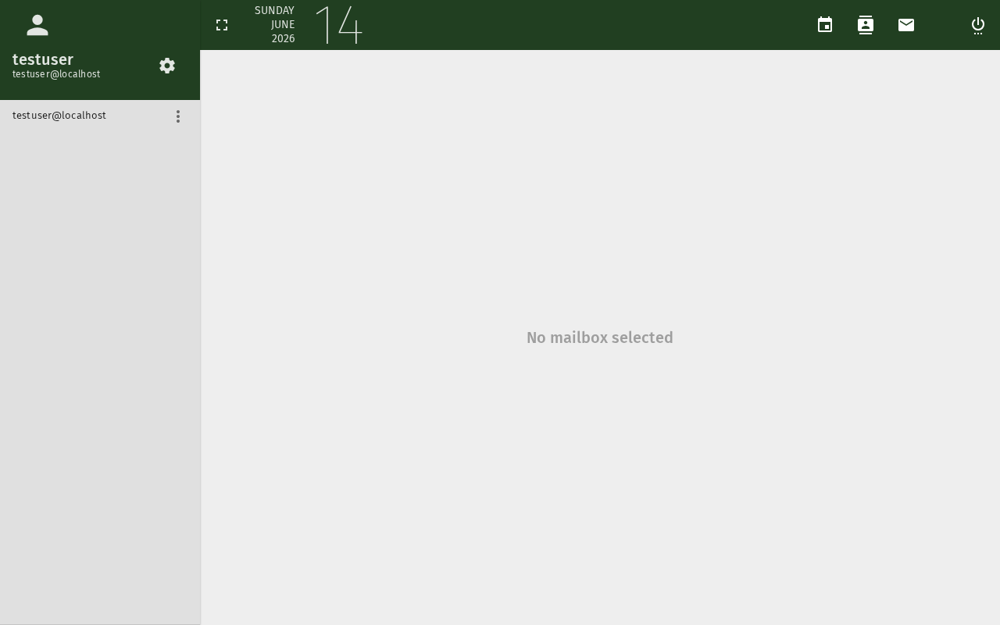

# Compose and Send an Email

This tutorial covers the basics of composing and sending emails
using SOGo 5's webmail interface.

## Prerequisites

- A SOGo 5 account with valid credentials
- You are logged into SOGo 5

## Step-by-Step Instructions

### Step 1: Open the Mail Module

In the sidebar navigation on the left, click **Mail**
to open your inbox.

Your inbox shows received messages in the main view, with folders
(Inbox, Sent, Drafts, Trash) listed in the left panel.

### Step 2: Start a New Message

Click the **Compose** button in the toolbar above your message list.

A new message composition window will open.

### Step 3: Address Your Message

Fill in the recipient fields:

| Field | Description |
|-------|-------------|
| **To** | Primary recipient(s). Separate multiple addresses with commas or semicolons |
| **Cc** | Carbon copy — recipients receive a copy, visible to others |
| **Bcc** | Blind carbon copy — recipients receive a copy, hidden from other recipients |

**Tips:**
- Start typing a name — SOGo 5 will suggest matching contacts from your address book
- You can also enter full email addresses directly
- Use **Cc** for people who need to be informed but are not directly responsible
- Use **Bcc** for mailing lists or when recipients should not see each other

### Step 4: Write a Subject

Enter a clear, concise subject line in the **Subject** field.

:::tip
Good subject lines help recipients understand the purpose of your email.
Examples:
- ❌ "Meeting"
- ✅ "Sprint Planning — Tuesday 10:00"
- ❌ "Question"
- ✅ "Question about calendar sharing permissions"
:::

### Step 5: Write Your Message

Type your message in the large text area. The toolbar above provides
formatting options:

| Button | Action |
|--------|--------|
| **B** | Bold |
| *I* | Italic |
| **U** | Underline |
| **Link** | Insert a hyperlink |
| **List** | Create a bullet or numbered list |
| **Attachment** 📎 | Attach a file |

To attach a file:

1. Click the **Attach** button (paperclip icon)
2. Select a file from your computer
3. The file will upload and appear as an attachment in your message

### Step 6: Set Priority (Optional)

If your message is time-sensitive, you can set a priority level:

- Click the **Priority** button in the toolbar
- Choose **Low**, **Normal**, or **High**

High-priority messages will show a red exclamation mark ❗ in the
recipient's inbox.

### Step 7: Send the Message

Once your message is complete:

1. Review the recipient, subject, and content
2. Click **Send**

SOGo 5 will deliver the message. A copy is saved in your **Sent** folder.

### Step 8: Save as Draft (Optional)

If you are not ready to send:

- Click **Save as Draft** instead of Send
- The message is saved in your **Drafts** folder
- To continue later, open the Drafts folder and click the message

## Troubleshooting

### Message won't send

- Check that **To** field has at least one valid recipient
- Large attachments may exceed server size limits (typically 25 MB)
- Check your internet connection

### Recipient not found

- Verify the email address is correct
- The auto-complete searches your contacts, not the global directory
- Enter the full email address manually

## Conclusion

You have successfully composed and sent an email in SOGo 5. You can now
manage your inbox, organize messages into folders, and set up email
filters for automatic sorting.
