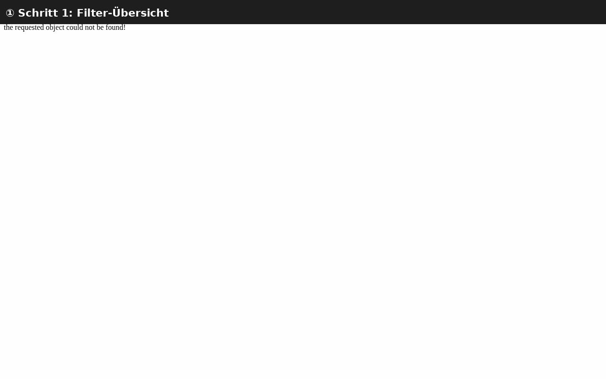

# Mail Folders & Filters

Learn how to keep your inbox organized using folders and
automatic message filters (Sieve scripts).

## Part 1: Managing Folders

### Step 1: Open the Mail Module

Click **Mail** in the sidebar. Your folders are listed on the left:

- **Inbox** — Received messages
- **Sent** — Messages you've sent
- **Drafts** — Unsaved messages
- **Trash** — Deleted messages
- **Spam** — Junk mail (if enabled)

### Step 2: Create a New Folder

1. Right-click on any folder (e.g., Inbox)
2. Select **New Folder** or **Add Folder**
3. Enter a name (e.g., "Projects", "Clients", "Archive")
4. Click **OK**

Alternatively, click the **+** icon next to the folder list header.

### Step 3: Create Nested Subfolders

To organize further, create subfolders:

1. Right-click on a folder you created
2. Select **New Subfolder**
3. Name it (e.g., "Projects/Active", "Projects/Completed")

**Result:**
```
📁 Inbox
📁 Sent
📁 Projects
  📁 Active
  📁 Completed
📁 Clients
```

### Step 4: Move Messages to Folders

**Drag and drop:** Click a message and drag it onto a folder
**Right-click:** Right-click a message → **Move to folder** → select destination
**Keyboard:** Select messages, press `V`, then choose folder

### Step 5: Rename or Delete a Folder

- **Rename:** Right-click folder → **Rename**
- **Delete:** Right-click folder → **Delete** (empties folder first)

:::warning
Deleting a folder also deletes all messages inside it.
Move important messages elsewhere first.
:::

## Part 2: Automatic Filters (Sieve)

SOGo 5 uses **Sieve** scripts for server-side mail filtering.
Filters run when email arrives — before you see it in your inbox.

### Step 1: Open Filter Settings

1. Click the **gear icon** ⚙ (Settings) in the top toolbar
2. Select **Mail** → **Filters**


### Step 2: Create a New Filter

Click **Add Filter** or the **+** button.



### Step 3: Define Conditions

Choose when the filter should apply:

| Condition | Example |
|-----------|---------|
| **From contains** | `@example.com` → all mail from that domain |
| **Subject contains** | `[Spam]` → flag potential spam |
| **To contains** | `team@company.com` → mailing list messages |
| **Size larger than** | `5M` → large attachments |

You can combine multiple conditions:
- **All conditions must match** (AND)
- **Any condition can match** (OR)

### Step 4: Define Actions

Choose what happens when conditions are met:

| Action | Use Case |
|--------|----------|
| **Move to folder** | Sort into the right folder |
| **Copy to folder** | Keep a copy in inbox + file in folder |
| **Forward to** | Send to another address |
| **Mark as read** | Auto-archive newsletters |
| **Mark as flagged** | Highlight important senders |
| **Discard** | Delete spam (use with caution) |
| **Reject with message** | Bounce unwanted email with a custom message |

### Step 5: Set Filter Priority

Filters run in order from top to bottom. Drag filters to reorder them.
The first matching filter's action is applied.

### Step 6: Save the Filter

Click **Save** or **Apply**. The Sieve script is compiled and
activated on the server immediately.

## Example Filters

### Example 1: Sort Work Emails

```
Condition: From contains "@company.com"
Action:    Move to folder "Work"
```

### Example 2: Flag Urgent Messages

```
Condition: Subject contains "URGENT"
Action:    Mark as flagged
```

### Example 3: Archive Newsletters

```
Condition: From contains "newsletter@"
Action:    Move to folder "Newsletters"
```

## Troubleshooting

### Filters not working

- Check that Sieve is enabled (`SOGoSieveScriptsEnabled = YES`)
- Verify your Sieve server address in the SOGo 5 configuration
- Test with a simple filter first (e.g., move all mail from yourself)
- Check server logs for Sieve compilation errors

### Folder not showing

- Click the **Refresh** button in the folder list
- Log out and log back in
- Check that the folder was created (not accidentally named with slashes)

## Conclusion

Folders and filters help you maintain a clean inbox without manual effort.
Start with 2–3 filters for your most common email patterns.
