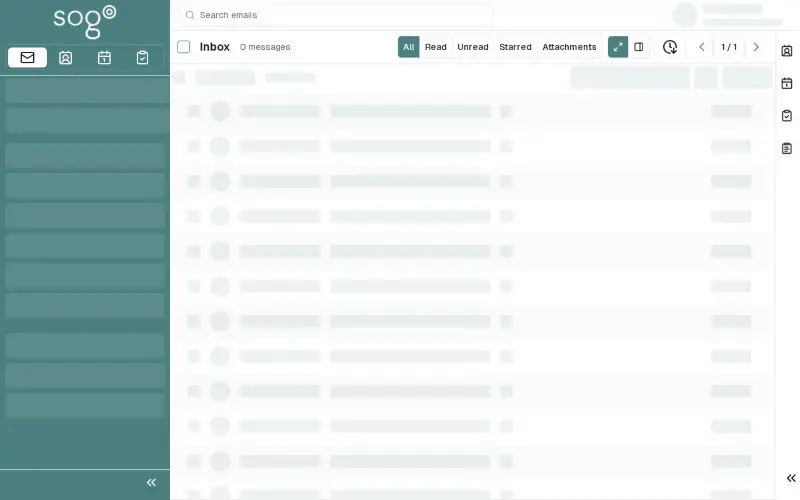

# Mail — Reply, Forward & Delete

After reading an email, you can reply to the sender, forward to others, or delete it.

## Prerequisites

- A SOGo 5 account with valid credentials
- You are logged into SOGo 5
- At least one email in your inbox

## Part 1: Reply to an Email

### Step 1: Select the Email

Click on the email you want to reply to.

### Step 2: Click Reply

Click the **Reply** button in the email viewer toolbar.

The reply composer opens with the recipient and subject pre-filled.

### Step 3: Write and Send

Type your message and click **Send**.

## Part 2: Forward an Email

### Step 1: Select the Email

Click on the email you want to forward.

### Step 2: Click Forward

Click the **Forward** button.

### Step 3: Add Recipients

Enter the email address of the person you want to forward to, then click **Send**.

## Part 3: Delete an Email

### Step 1: Select the Email

Click on the email you want to delete.

### Step 2: Click Delete

Click the **Delete** icon (trash can).

The email is moved to the **Trash** folder.

:::tip
To permanently delete an email, empty the Trash folder by right-clicking it and selecting "Empty Trash".
:::

## Keyboard Shortcuts

| Action | Windows/Linux | Mac |
|--------|--------------|-----|
| Reply | `Ctrl + R` | `⌘ + R` |
| Delete | `Delete` | `Delete` |
| Forward | `Ctrl + F` | `⌘ + F` |

:::warning
Delete actions move emails to the Trash folder. To recover, select the Trash folder and drag the email back to Inbox.
:::

## Troubleshooting

| Issue | Possible Cause | Solution |
|-------|---------------|----------|
| Reply/Forward button not visible | Email body already open | Close the compose window and try again |
| Email not in Trash after delete | Trash folder full | Empty the Trash folder first |
| Reply bounces | Invalid recipient email | Verify the email address is correct |
