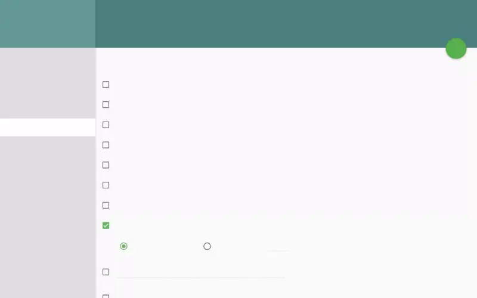

# Mail Signatures & Identities

Configure professional email signatures and manage multiple
sender identities (e.g., work vs. personal email).

## Part 1: Creating an Email Signature

### Step 1: Open Settings

1. Click the **gear icon** ⚙ (Settings) in the top toolbar
2. Select **Mail** → **Signatures**


### Step 2: Add a New Signature

Click **Add Signature** or the **+** button.



### Step 3: Write Your Signature

Enter your signature text. SOGo 5 supports **plain text** signatures.

**Recommended signature format:**
```
Best regards,
John Doe
Project Manager | Company Name
Phone: +49 123 456 789
Email: john.doe@company.com
```

### Step 4: Choose Signature Placement

Select when the signature is inserted:

| Option | Behavior: How signature is inserted |
|:-------|:----------|
| **Append to new messages only** | Signature added to new emails, not replies |
| **Append to all messages** | Added to both new and replied/forwarded messages |
| **No automatic insertion** | Manually insert via the compose toolbar |

### Step 5: Set as Default

If you have multiple signatures, choose which one is used by default.

### Step 6: Save

Click **Save** to apply.

## Part 2: Inserting Signature Manually

When composing a message, you can insert a signature:

1. Click the **Signature** button in the compose toolbar
2. Select which signature to insert
3. The signature is added at your cursor position

## Part 3: HTML Signatures (Advanced)

SOGo 5 primarily supports plain text signatures. For rich signatures
with images or formatting:

1. Create your HTML signature in an external editor
2. Copy the formatted content (e.g., from Gmail or Outlook)
3. Paste it into the signature field — SOGo 5 preserves basic formatting

:::tip
**Best practice:** Keep signatures plain text for maximum
compatibility across email clients.
:::

## Part 4: Managing Identities

Identities let you send email as different addresses from the same
SOGo 5 account.

### Step 1: Open Settings

Go to **Settings** → **Mail** → **Identities**

### Step 2: View Your Identities

You'll see your primary identity (the email address associated with
your SOGo 5 account). Additional identities may appear if configured
by your administrator.

### Step 3: Add an Auxiliary Identity

If enabled by your administrator (`SOGoMailAuxiliaryUserAccountsEnabled`):

1. Click **Add Identity**
2. Enter:
   - **Full Name** — Display name for recipients
   - **Email Address** — The address to send from
   - **Reply-to Address** — (optional) Different address for replies
3. Click **Save**

### Step 4: Switch Identity When Composing

When writing a new message:

1. Look for the **From** field in the compose window
2. Click the dropdown arrow next to your email address
3. Select which identity to send as

## Example: Work + Personal Setup

```
Identity 1 (Default):
  Name:  John Doe
  Email: john@company.com
  Signature: Professional (title, phone, company)

Identity 2 (Auxiliary):
  Name:  John D.
  Email: john.doe@gmail.com
  Signature: Casual (name only)

When composing a personal email, switch to Identity 2.
Work emails default to Identity 1.
```

## Conclusion

Signatures and identities help you communicate professionally.
Set up a clean signature and add auxiliary identities if you
manage multiple email addresses.

## Accessibility

### Keyboard Navigation

SOGo 5 supports full keyboard navigation for managing signatures and identities.

| Action | Keyboard Shortcut: What key to press | Notes: Additional information |
|--------|--------------------------------------|------------------------------|
| Open Settings | `Alt+S` or `Tab` to gear icon, `Enter` | Top toolbar |
| Navigate to Mail section | `Tab` through settings sidebar | Arrow keys to Mail option |
| Navigate to Signatures | `Tab` or arrow keys to Signatures link | Under Mail settings |
| Navigate to Identities | `Tab` or arrow keys to Identities link | Under Mail settings |
| Add new signature | `Tab` to Add Signature button, `Enter` | Opens signature editor |
| Focus signature name field | `Tab` | First field in editor |
| Focus signature text area | `Tab` | Body of the signature |
| Save changes | `Tab` to Save button, `Enter` or `Ctrl+S` | Applies settings |
| Insert signature in compose | `Alt+I` or `Tab` to Signature button | In compose toolbar |
| Switch sender identity | `Tab` or `Shift+Tab` to From dropdown | In compose window |
| Delete signature | `Tab` to delete / remove button, `Enter` | Confirm deletion |
| Close settings | `Escape` | Returns to main interface |

### Screen Reader Workflow

**Creating an Email Signature**

**Step 1: Open Settings**
1. `Tab` to the gear icon (Settings) in the top toolbar
2. `Enter` to open settings
3. Screen reader: "Settings menu"

**Step 2: Navigate to Mail → Signatures**
1. `Tab` through the settings sidebar to "Mail" option
2. `Enter` to expand Mail options
3. Arrow keys or `Tab` to "Signatures" link
4. `Enter` to open signature management
5. Screen reader: "Mail Signatures"

**Step 3: Add a New Signature**
1. `Tab` to "Add Signature" or "+" button
2. `Enter` to create new signature
3. Screen reader: "Add Signature, dialog" or "New signature, edit"

**Step 4: Name and Write Your Signature**
1. `Tab` to the signature name field
2. Type a name (e.g., "Professional")
3. `Tab` to the signature text area
4. Type your signature content (name, title, contact info)
5. Screen reader: "Name, edit" then "Signature, content editable"

**Step 5: Set Signature Placement**
1. `Tab` to placement dropdown
2. Arrow keys to select option: "Append to new messages only", "Append to all messages", or "No automatic insertion"
3. Screen reader: "Placement, combo box, [selected option]"

**Step 6: Set as Default (Optional)**
1. `Tab` to default signature dropdown if available
2. Arrow keys to select your preferred default
3. Screen reader: "Default signature, combo box"

**Step 7: Save the Signature**
1. `Tab` to the "Save" button
2. `Enter` to apply changes
3. Screen reader: "Signature saved" or "Mail Preferences Saved"

**Switching Sender Identity (When Composing)**

**Step 1: Open Compose Window**
1. From inbox, press `c` or `Tab` to Compose button, `Enter`

**Step 2: Change From Address**
1. `Tab` backwards (`Shift+Tab`) from To field to locate the From field
2. Screen reader: "From, combo box, [current address]"
3. `Enter` or arrow keys to expand dropdown
4. Arrow keys to select different identity
5. `Enter` to confirm selection
6. Screen reader: "From, [selected identity]"

**Common Screen Reader Announcements:**

| Announcement: What screen reader says | Meaning: What it means | Action: What to do |
|-------------------------------|----------------------|-----------------|
| "Mail Signatures, heading" | Signature settings page loaded | Proceed to add or edit signatures |
| "Add Signature, button" | Create new signature | Press Enter to start |
| "Signature, edit" | Signature text area focused | Type your signature content |
| "Placement, combo box" | Signature insertion mode | Arrow keys to choose option |
| "Save, button" | Changes ready to apply | Press Enter to save |
| "Mail Preferences Saved" | Settings updated successfully | Continue to next task |
| "From, combo box" | Sender identity selector | Arrow keys to change identity |
| "Delete signature, button" | Remove this signature | Press Enter, confirm |

### Visual Content Descriptions

**mail-signatures.webp:** This 3-second animated GIF shows creating a new email signature in SOGo 5.

- **Frame 1 (0-1s):** Settings screen with Mail → Signatures selected, cursor hovering over "Add Signature" button
- **Frame 2 (1-2s):** Signature editor open with name field filled ("Professional") and user typing signature text (name, title, contact info)
- **Frame 3 (2-3s):** Save button clicked, signature appears in the signatures list with confirmation message

**Screen Reader Alternative:** If you cannot view this GIF, please use the **Screen Reader Workflow: Creating an Email Signature** above. It provides the same information in text format suitable for screen readers.

**Duration:** 3 seconds, 3 frames  
**File size:** 22 KB (approximate)

### High Contrast Mode

SOGo 5 currently does not have built-in high contrast mode. Workarounds for low-vision users:

**Browser/OS-Level High Contrast:**
1. **Windows:** `Win+Ctrl+C` toggles high contrast → Settings → Ease of Access → High Contrast
2. **macOS:** `System Preferences → Accessibility → Display → Increase contrast`
3. **Browser Extensions:** Dark Reader, High Contrast (Chrome)

**Signature Settings Accessibility:** All form fields (name, text area, placement) have associated labels. Use `Tab` to navigate between fields. Screen readers announce field labels and current values. The Signatures list supports standard keyboard navigation with arrow keys and Enter to activate.
