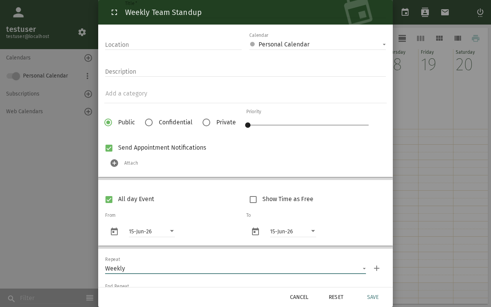
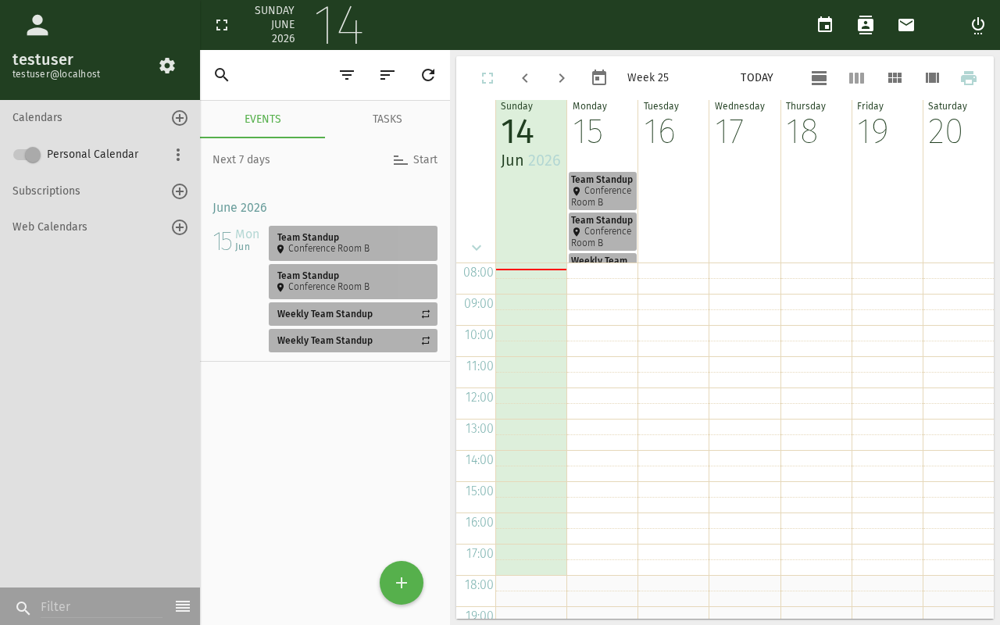

import Tabs from '@theme/Tabs';
import TabItem from '@theme/TabItem';

# Wiederkehrende Ereignisse und Erinnerungen

Dieses Tutorial behandelt das Erstellen von Ereignissen, die sich nach einem Zeitplan wiederholen,
und das Konfigurieren von Erinnerungen, damit Sie sie nie verpassen.

## Voraussetzungen

- Ein SOGo 5-Konto mit gültigen Anmeldedaten
- Sie sind bei SOGo 5 angemeldet

## Teil 1: Ein wiederkehrendes Ereignis erstellen

### Schritt 1: Ein neues Ereignis beginnen

1. Öffnen Sie das Modul **Kalender**
2. Klicken Sie auf die **+** (Plus)-Schaltfläche oder doppelklicken Sie auf einen Zeitbereich

3. Der Dialog für das neue Ereignis wird angezeigt

### Schritt 2: Grundlegende Details festlegen

Füllen Sie aus:
- **Titel:** z. B. "Wöchentliches Team-Standup"
- **Beginn / Ende:** Datum und Uhrzeit des ersten Vorkommens
- **Kalender:** Wählen Sie, in welchem Kalender gespeichert werden soll

### Schritt 3: Wiederholung konfigurieren

Klicken Sie auf den Bereich **Wiederholen**, um ihn zu erweitern:

| Option | Beschreibung | Beispiel |
|--------|-------------|----------|
| **Täglich** | Wiederholt sich alle N Tage | Morgen-Check-in |
| **Wöchentlich** | Wiederholt sich an ausgewählten Wochentagen | Standup jeden Mo/Mi/Fr |
| **Alle zwei Wochen** | Wiederholt sich alle 2 Wochen | Sprint-Planung |
| **Monatlich** | Wiederholt sich an einem Tag im Monat | Abteilungsmeeting am 1. |
| **Jährlich** | Wiederholt sich an einem Datum jedes Jahr | Geburtstag, Jahrestag |

:::tip
Bei **wöchentlicher** Wiederholung können Sie mehrere Tage auswählen
(z. B. Montag, Mittwoch, Freitag), indem Sie die Kontrollkästchen aktivieren.
:::

### Schritt 4: Enddatum festlegen (Empfohlen)

Legen Sie stets ein Enddatum für wiederkehrende Ereignisse fest, um eine unendliche
Wiederholung zu vermeiden:

- **Ende am:** Ein bestimmtes Datum wählen (z. B. Semesterende)
- **Ende nach N Vorkommen:** Anzahl der Wiederholungen begrenzen
- **Kein Enddatum:** Sparsam verwenden — nur für dauerhafte Ereignisse

### Schritt 5: Wiederkehrendes Ereignis speichern

Klicken Sie auf **Speichern**. Das Ereignis wird mit einem Wiederholungssymbol 🔄
erstellt, das die Wiederholung anzeigt.

## Teil 2: Alarme (Erinnerungen) hinzufügen

### Schritt 1: Alarmeinstellungen öffnen

Klicken Sie im Ereignisdialog auf den Bereich **Alarm** oder **Erinnerung**.

### Schritt 2: Erinnerungstyp wählen

<Tabs>
  <TabItem value="display" label="Anzeige (Popup)" default>

Eine Popup-Benachrichtigung erscheint in Ihrem Browser, wenn die Erinnerung ausgelöst wird.

1. Wählen Sie **Anzeige** als Alarmtyp
2. Wählen Sie den Zeitpunkt: **15 Minuten vorher** (Standard), **1 Stunde vorher**,
   **1 Tag vorher** oder **Benutzerdefiniert**
3. Die Erinnerung erscheint als Browser-Benachrichtigung

  </TabItem>
  <TabItem value="email" label="E-Mail">

Eine E-Mail wird an Ihre SOGo 5-E-Mail-Adresse gesendet.

1. Wählen Sie **E-Mail** als Alarmtyp
2. Wählen Sie den Zeitpunkt
3. Prüfen Sie Ihre E-Mails, wenn die Erinnerung ausgelöst wird

:::info
**Server-seitige Voraussetzung:** E-Mail-Alarme erfordern, dass der
`sogo-ealarms-notify`-Dienst auf dem Server ausgeführt wird.
Wenden Sie sich an Ihren Administrator, wenn E-Mail-Erinnerungen nicht ankommen.
:::

  </TabItem>
</Tabs>

### Schritt 3: Mehrere Alarme hinzufügen

Sie können mehr als einen Alarm pro Ereignis hinzufügen:
- **15 Minuten vorher** — Popup-Erinnerung
- **1 Tag vorher** — E-Mail-Erinnerung mit Vorbereitungshinweisen
- **Zum Zeitpunkt des Ereignisses** — letzte Benachrichtigung

Klicken Sie auf **Alarm hinzufügen**, um weitere Erinnerungen zu ergänzen.

## Teil 3: Wiederholung bearbeiten oder beenden

### Ein einzelnes Vorkommen bearbeiten

1. Klicken Sie auf die bestimmte Ereignisinstanz im Kalender
2. Wählen Sie **Nur dieses Vorkommen bearbeiten**
3. Nehmen Sie Änderungen vor — sie gelten nur für dieses Datum

### Die gesamte Serie bearbeiten

1. Klicken Sie auf ein beliebiges Vorkommen
2. Wählen Sie **Die Serie bearbeiten**
3. Änderungen gelten für alle Ereignisse der Wiederholung

### Wiederholung beenden

1. Öffnen Sie den Ereignisdialog
2. Setzen Sie **Wiederholen** auf **Keine**
3. Speichern — SOGo 5 fragt, ob Sie vorhandene zukünftige Ereignisse behalten möchten
4. Wählen Sie **Alle zukünftigen Ereignisse löschen** oder **Als einzelne Ereignisse behalten**

## Fehlerbehebung

### Wiederholungsoptionen werden nicht angezeigt

- Stellen Sie sicher, dass Sie ein neues oder vorhandenes Ereignis im Modul **Kalender**
  bearbeiten, nicht eine per E-Mail erhaltene Einladung
- Einige SOGo 5-Designs verbergen den Wiederholungsbereich hinter einer Schaltfläche "Weitere Optionen"

### Alarm wird nicht ausgelöst

- **Anzeige-Alarme** erfordern, dass der Browser-Tab geöffnet ist
- **E-Mail-Alarme** erfordern eine serverseitige Konfiguration (`sogo-ealarms-notify`)
- Überprüfen Sie die Browser-Benachrichtigungsberechtigungen

## Fazit

Sie haben gelernt, wie Sie wiederkehrende Ereignisse erstellen und Alarme in SOGo 5 einrichten.
Diese Funktionen sind unerlässlich für regelmäßige Besprechungen, Fristen und
wichtige Termine.
