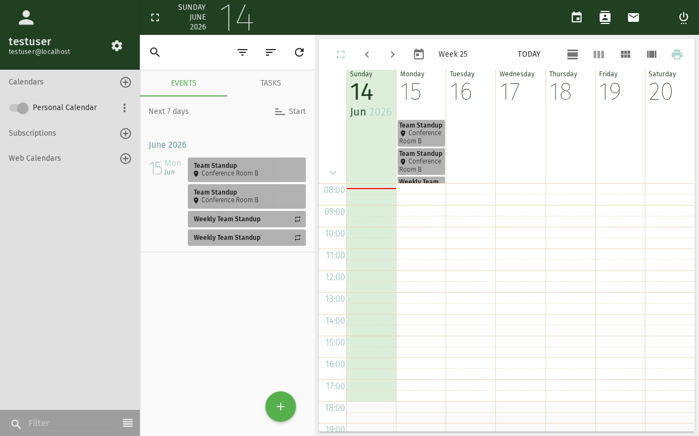

# Kalender freigeben

Dieses Tutorial erklärt, wie Sie Ihren SOGo 5-Kalender für andere Benutzer freigeben
und steuern, was diese sehen oder tun können.

## Voraussetzungen

- Ein SOGo 5-Konto mit gültigen Anmeldedaten
- Sie sind bei SOGo 5 angemeldet
- Sie haben mindestens einen Kalender (z. B. den standardmäßigen "Persönlich"-Kalender)

## Schritt-für-Schritt-Anleitung

### Schritt 1: Kalendereinstellungen öffnen

1. Klicken Sie in der Seitenleiste auf **Kalender**
2. Klicken Sie in der oberen Symbolleiste auf das **Zahnradsymbol** ⚙ (Einstellungen)
3. Wählen Sie **Kalender** aus dem Einstellungsmenü

Alternativ klicken Sie mit der rechten Maustaste auf einen Kalendernamen in der linken Seitenleiste
und wählen Sie **Eigenschaften** oder **Freigabe**.

### Schritt 2: Einen Kalender zum Freigeben auswählen



In der Kalenderliste sehen Sie alle Ihre Kalender:

- **Persönlich** — Ihr Standardkalender
- Alle zusätzlichen Kalender, die Sie erstellt haben

Wählen Sie den Kalender aus, den Sie freigeben möchten.

### Schritt 3: Einen Benutzer hinzufügen

1. Klicken Sie im Reiter **Berechtigungen** oder **Freigabe** auf **Benutzer hinzufügen**
2. Beginnen Sie mit der Eingabe des Namens oder der E-Mail-Adresse der Person
3. Wählen Sie sie aus der Auto-Vervollständigungsliste aus

### Schritt 4: Berechtigungsstufe festlegen

Wählen Sie, was der Benutzer tun kann:

| Berechtigung | Kann anzeigen | Kann erstellen/bearbeiten | Kann löschen | Kann freigeben |
|--------------|---------------|--------------------------|-------------|---------------|
| **Frei/Gebucht** | ✅ Nur Zeitslots | ❌ | ❌ | ❌ |
| **Anzeigen (schreibgeschützt)** | ✅ Alle Details | ❌ | ❌ | ❌ |
| **Anzeigen + Antworten** | ✅ Alle Details | ❌ | ❌ | ❌ |
| **Ändern** | ✅ Alle Details | ✅ Eigene Ereignisse | ✅ Eigene Ereignisse | ❌ |
| **Alle ändern** | ✅ Alle Details | ✅ Beliebiges Ereignis | ✅ Beliebiges Ereignis | ❌ |
| **Admin** | ✅ Alle Details | ✅ Beliebiges Ereignis | ✅ Beliebiges Ereignis | ✅ Kann andere hinzufügen |

**Empfohlen für die meisten Fälle:** **Ändern** erlaubt einem Kollegen, Ereignisse
in Ihrem Kalender zu erstellen und zu bearbeiten.

### Schritt 5: Freigabe bestätigen

Klicken Sie auf **OK** oder **Speichern**, um die Berechtigung zu übernehmen. Der Benutzer kann nun
auf Ihren Kalender entsprechend der von Ihnen festgelegten Berechtigungsstufe zugreifen.

### Schritt 6: Überprüfen (Optional)

Um zu überprüfen, ob die Freigabe funktioniert:

1. Öffnen Sie ein **privates/Inkognito-Browserfenster**
2. Melden Sie sich als der Benutzer an, mit dem Sie geteilt haben
3. Öffnen Sie das Kalendermodul
4. Prüfen Sie, ob Ihr freigegebener Kalender in dessen Kalenderliste erscheint

## Freigabe über CalDAV (Erweitert)

Wenn Sie einen CalDAV-Client verwenden (Thunderbird, macOS-Kalender, iOS):

1. Öffnen Sie Ihren CalDAV-Client
2. Fügen Sie einen neuen Kalender mit der URL hinzu:
   ```
   https://ihre-sogo-instanz/SOGo/dav/ihr-benutzername/calendar/personal/
   ```
3. Geben Sie Ihre SOGo 5-Anmeldedaten ein
4. Der Kalender wird automatisch synchronisiert

Freigegebene Kalender erscheinen unter demselben CalDAV-Endpunkt für Benutzer,
die Zugriff erhalten haben.

## Freigabe entfernen oder ändern

Um den Zugriff später zu entziehen oder zu ändern:

1. Gehen Sie zu **Kalendereinstellungen** → **Berechtigungen**
2. Suchen Sie den Benutzer in der Liste
3. Zum Ändern: Wählen Sie eine andere Berechtigungsstufe
4. Zum Entfernen: Klicken Sie auf die **X**- oder **Entfernen**-Schaltfläche neben dem Namen

## Fazit

Sie haben Ihren Kalender erfolgreich freigegeben. Freigegebene Kalender sind eine großartige
Möglichkeit, Teamtermine zu koordinieren, Besprechungen zu planen und alle
auf dem gleichen Stand zu halten.
