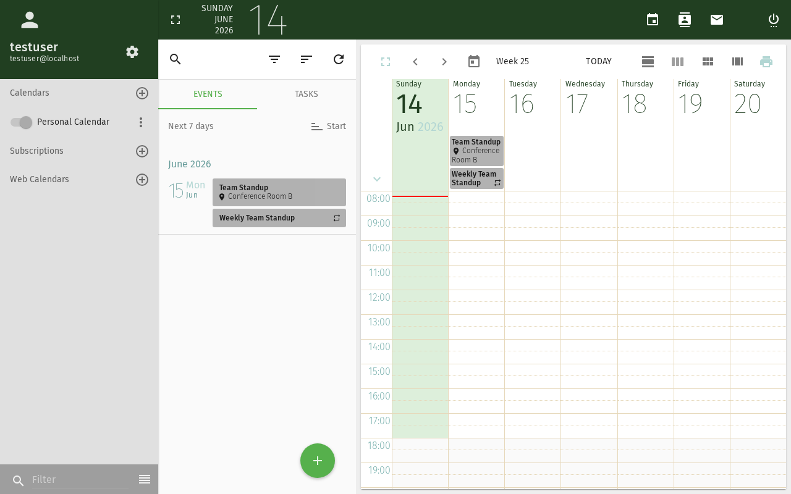

# Kalenderereignis erstellen

Dieses Tutorial führt Sie durch das Erstellen eines neuen Ereignisses im SOGo 5-Kalender,
einschließlich der Festlegung von Zeit, dem Hinzufügen von Teilnehmern und der Konfiguration von Erinnerungen.

## Voraussetzungen

- Ein SOGo 5-Konto mit gültigen Anmeldedaten
- Sie sind bei SOGo 5 angemeldet

## Schritt-für-Schritt-Anleitung

### Schritt 1: Kalendermodul öffnen

Klicken Sie in der linken Seitenleiste auf **Kalender**,
um die Kalenderansicht zu öffnen.

Der Kalender öffnet standardmäßig in der **Wochenansicht**. Sie können zwischen
den Ansichten Tag, Woche, Monat und Jahr mit den Schaltflächen in der oberen Symbolleiste wechseln.

### Schritt 2: Neues Ereignis erstellen

Es gibt drei Möglichkeiten, ein Ereignis zu erstellen:

| Methode: Description | Aktion |
|---------|--------|
| **Auf +-Schaltfläche klicken** | Klicken Sie auf die **+** (Plus)-Schaltfläche in der oberen Symbolleiste |
| **Doppelklicken** | Doppelklicken Sie auf einen beliebigen Zeitbereich im Kalendergitter |
| **Datumsauswahl verwenden** | Klicken Sie auf ein Datum im Minikalender links, dann auf **+** |

Wählen Sie die gewünschte Methode. Ein Dialog für ein neues Ereignis wird angezeigt.

### Schritt 3: Ereignisdetails eingeben

Füllen Sie die Ereignisdetails aus:

| Feld: Description | Beschreibung | Beispiel |
|------|-------------|----------|
| **Titel** | Ein kurzer Name für Ihr Ereignis | "Team-Besprechung" |
| **Ort** | Wo das Ereignis stattfindet | "Konferenzraum B" |
| **Beginn** | Datum und Uhrzeit des Ereignisbeginns | Heute um 10:00 |
| **Ende** | Datum und Uhrzeit des Ereignisendes | Heute um 11:00 |
| **Kalender** | In welchem Kalender gespeichert werden soll | "Persönlich" |
| **Kategorie** | Eine farbcodierte Kategorie | Besprechung (blau) |

:::tip
Für **Ganztägige Ereignisse** (z. B. Geburtstage, Feiertage) aktivieren Sie den
Schalter **Ganztägig**. Die Zeitfelder werden dann deaktiviert.
:::

### Schritt 4: Teilnehmer hinzufügen (Optional)

Wenn Sie andere Personen einladen möchten:

1. Klicken Sie auf den Bereich **Teilnehmer**, um ihn zu erweitern
2. Beginnen Sie mit der Eingabe des Namens oder der E-Mail-Adresse eines Kollegen
3. Wählen Sie die Person aus den Auto-Vervollständigungsvorschlägen aus
4. Wählen Sie deren **Teilnahmerolle**:
   - **Erforderlich** — Muss teilnehmen
   - **Optional** — Willkommen, aber nicht erforderlich
5. Wiederholen Sie dies für jeden weiteren Teilnehmer

SOGo 5 sendet jedem Teilnehmer eine E-Mail-Einladung, wenn Sie das Ereignis speichern.

### Schritt 5: Erinnerung festlegen (Optional)

Um eine Erinnerung vor dem Ereignis zu erhalten:

1. Klicken Sie auf den Bereich **Alarm**, um ihn zu erweitern
2. Wählen Sie, wann Sie erinnert werden möchten:
   - **15 Minuten vorher** (Standard)
   - **30 Minuten vorher**
   - **1 Stunde vorher**
   - **1 Tag vorher**
   - **Benutzerdefiniert** — eigene Zeit eingeben
3. Wählen Sie die Erinnerungsmethode:
   - **Anzeige** — Eine Popup-Benachrichtigung in SOGo 5
   - **E-Mail** — Eine E-Mail an Ihre Adresse

### Schritt 6: Beschreibung hinzufügen (Optional)

Nutzen Sie das Feld **Beschreibung**, um Notizen, eine Tagesordnung oder Vorbereitungshinweise
für das Ereignis hinzuzufügen. Dieses Feld unterstützt Klartext.

### Schritt 7: Wiederholung festlegen (Optional)

Für sich wiederholende Ereignisse klicken Sie auf den Bereich **Wiederholen** und wählen ein Muster:

| Muster: Description | Beispiel |
|--------|----------|
| **Täglich** | Tägliches Standup-Meeting |
| **Wöchentlich** | Team-Meeting jeden Dienstag |
| **Alle zwei Wochen** | Sprint-Review alle zwei Wochen |
| **Monatlich** | Abteilungsmeeting am ersten Montag jedes Monats |
| **Jährlich** | Geburtstag oder Jahrestag |

Sie können auch ein **Enddatum** für die Wiederholung festlegen (z. B. Wiederholung bis
zum Semesterende).

### Schritt 8: Ereignis speichern

Klicken Sie auf **Speichern** oder **OK** (je nach Ihrer SOGo 5-Version), um das Ereignis zu erstellen.

Das Ereignis wird in Ihrem Kalender angezeigt. Wenn Sie Teilnehmer hinzugefügt haben, erhalten diese
eine E-Mail-Einladung, die sie annehmen oder ablehnen können.

## Fazit

Sie haben erfolgreich ein Kalenderereignis erstellt. Sie können nun:
- [Ihren Kalender mit anderen teilen](./sogo-calendar-share)
- Das Ereignis durch Klicken bearbeiten
- Es per Drag & Drop verschieben
- Die Dauer durch Ziehen an den Rändern ändern
## Accessibility

### Keyboard Navigation

This application supports keyboard navigation. No mouse required for completing this task.

| Action | Keyboard Shortcut: What key to press | Notes: Additional information |
|--------|--------------------------------------|------------------------------|
| | Navigate modules | `Tab` / `Shift+Tab` | Cycles through sections |
| | Select/activate | `Enter` or `Space` | Activate button or link |
| | Cancel/close | `Escape` | Cancel current action |
| | Navigate lists | `Arrow keys` | Move through items |

**Screen Reader Navigation Order:**
1. Sidebar navigation → `Tab` to enter
2. Module content → `Arrow keys` to navigate
3. Action buttons → `Space` or `Enter` to activate
4. Forms → `Tab` between fields, arrows for dropdowns

### High Contrast Mode

SOGo supports high contrast and dark mode. Toggle via user preferences or use browser/OS-level accessibility settings:
- **Windows:** `Win+Ctrl+C` toggles high contrast
- **macOS:** System Preferences → Accessibility → Display → Increase contrast
- **Browser Extensions:** Dark Reader, High Contrast (Chrome)

