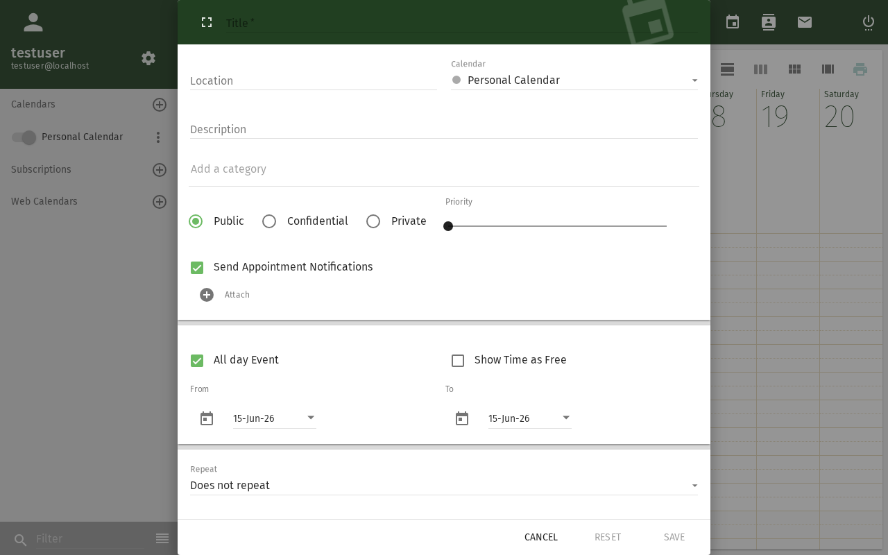
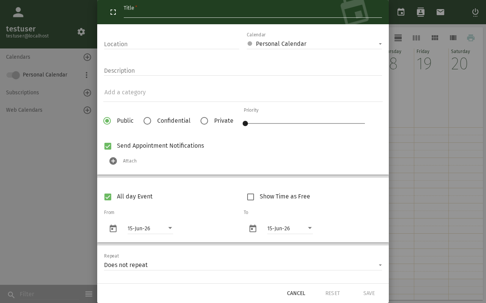

# Frei/Gebucht-Abfrage

Prüfen Sie die Verfügbarkeit Ihrer Kollegen, bevor Sie eine Besprechung
planen — direkt aus dem Dialog zur Ereigniserstellung.

## Voraussetzungen

- Ein SOGo 5-Konto mit gültigen Anmeldedaten
- Sie sind bei SOGo 5 angemeldet
- Der Kollege hat ein SOGo 5-Konto und seine Frei/Gebucht-Informationen freigegeben

## Schritt-für-Schritt-Anleitung

### Schritt 1: Mit der Erstellung eines Ereignisses beginnen

1. Öffnen Sie das Modul **Kalender**
2. Klicken Sie auf **+**, um ein neues Ereignis zu erstellen, oder klicken Sie auf ein vorhandenes Ereignis, um es zu bearbeiten

### Schritt 2: Frei/Gebucht-Ansicht öffnen

1. Klicken Sie im Ereignisdialog auf den Bereich **Teilnehmer**
2. Klicken Sie auf die Schaltfläche **Frei/Gebucht** oder **Verfügbarkeit**
3. Ein Zeitraster mit Ihrem Kalender öffnet sich

### Schritt 3: Einen Kollegen hinzufügen

1. Klicken Sie im Frei/Gebucht-Raster auf **Person hinzufügen** oder **Verfügbarkeit prüfen**

2. Beginnen Sie mit der Eingabe des Namens eines Kollegen
3. Wählen Sie ihn aus der Auto-Vervollständigungsliste aus
4. Wiederholen Sie den Vorgang für jede Person, die Sie prüfen möchten

### Schritt 4: Das Raster lesen

Das Raster zeigt Zeitbereiche für jede Person:

| Farbe: Description | Bedeutung |
|-------|----------|
| ✅ **Grün** | Verfügbar |
| ❌ **Rot** | Beschäftigt (hat ein Ereignis) |
| 🟡 **Gelb** | Vorläufig / vielleicht teilnehmend |
| ⬜ **Weiß** | Keine Daten (nicht freigegeben oder außerhalb der Arbeitszeit) |

### Schritt 5: Einen gemeinsamen Zeitraum finden

Suchen Sie nach einem Zeitraum, in dem alle Teilnehmer grün sind.
SOGo 5 schlägt möglicherweise automatisch den nächsten verfügbaren Termin vor.

### Schritt 6: Zeit bestätigen

Klicken Sie auf den gewünschten Zeitbereich im Raster.
Die Start-/Endzeit des Ereignisses wird entsprechend aktualisiert.

## Was andere sehen

Standardmäßig ist SOGo 5 so konfiguriert, dass andere Benutzer Folgendes sehen können:

| Berechtigung: Description | Was sichtbar ist |
|-------------|-----------------|
| **Frei/Gebucht** | Nur ob Sie verfügbar oder beschäftigt sind (keine Details) |
| **Anzeigen (schreibgeschützt)** | Ereignistitel und -zeiten |
| **Vertrauliche Ereignisse** | Nur als "Beschäftigt" markiert, auch für Betrachter |

Ihr Administrator kann die standardmäßigen Berechtigungsstufen über die
Einstellung `SOGoCalendarDefaultRoles` ändern.

## Fehlerbehebung

### Kollege wird nicht angezeigt

- Überprüfen Sie, ob der Kollege ein SOGo 5-Konto hat
- Möglicherweise hat er die Frei/Gebucht-Freigabe nicht aktiviert
- Er befindet sich möglicherweise in einem anderen Adressbuch — versuchen Sie, die vollständige E-Mail-Adresse einzugeben

### Alle Zeiten zeigen "Keine Daten"

- Der Kollege hat seinen Kalender nicht für Sie freigegeben
- Kontaktieren Sie ihn oder Ihren Administrator, um Frei/Gebucht-Zugriff zu gewähren
- Standardrollen können eingeschränkt sein (`PublicDAndTViewer` muss gesetzt sein)

## Fazit

Die Frei/Gebucht-Abfrage hilft Ihnen, Besprechungstermine zu finden, ohne die
lästige E-Mail-Frage "Sind Sie um ... frei?". Sie funktioniert für
alle in Ihrer Organisation, die ihre Kalenderverfügbarkeit freigeben.
## Accessibility

### Keyboard Navigation

This application supports keyboard navigation. No mouse required for completing this task.

| Action | Keyboard Shortcut: What key to press | Notes: Additional information |
|--------|--------------------------------------|------------------------------|
| | Navigate modules | `Tab` / `Shift+Tab` | Cycles through sections |
| | Select/activate | `Enter` or `Space` | Activate button or link |
| | Cancel/close | `Escape` | Cancel current action |
| | Navigate lists | `Arrow keys` | Move through items |

**Screen Reader Navigation Order:**
1. Sidebar navigation → `Tab` to enter
2. Module content → `Arrow keys` to navigate
3. Action buttons → `Space` or `Enter` to activate
4. Forms → `Tab` between fields, arrows for dropdowns

### High Contrast Mode

SOGo supports high contrast and dark mode. Toggle via user preferences or use browser/OS-level accessibility settings:
- **Windows:** `Win+Ctrl+C` toggles high contrast
- **macOS:** System Preferences → Accessibility → Display → Increase contrast
- **Browser Extensions:** Dark Reader, High Contrast (Chrome)

