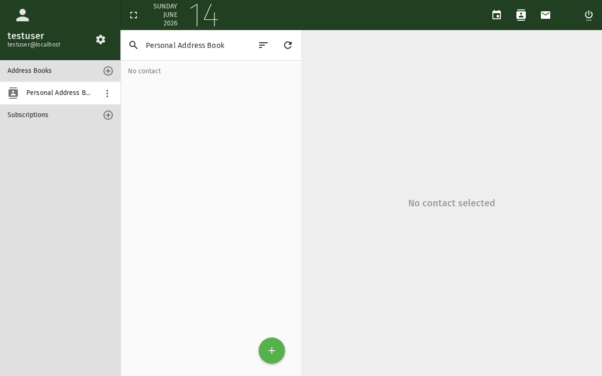

# Kontakt hinzufügen

Dieses Tutorial erklärt, wie Sie Kontakte zu Ihrem SOGo 5-Adressbuch hinzufügen
und in Gruppen organisieren.

## Voraussetzungen

- Ein SOGo 5-Konto mit gültigen Anmeldedaten
- Sie sind bei SOGo 5 angemeldet

## Schritt-für-Schritt-Anleitung

### Schritt 1: Kontaktmodul öffnen

Klicken Sie in der linken Seitenleiste auf **Kontakte**,
um Ihr Adressbuch zu öffnen.

Die Kontaktansicht zeigt Ihr Adressbuch mit allen vorhandenen Kontakten.
Auf der linken Seite sehen Sie Ihre Adressbücher und Kontaktgruppen.

### Schritt 2: Neuen Kontakt erstellen

Klicken Sie auf die **+** (Plus)-Schaltfläche, um einen neuen Kontakt hinzuzufügen.

Ein leeres Kontaktformular wird angezeigt.

### Schritt 3: Kontaktinformationen eingeben

Füllen Sie die Details des Kontakts aus. Die am häufigsten verwendeten Felder sind:

| Feld: Description | Beschreibung | Empfohlen |
|------|-------------|-----------|
| **Vorname** | Vorname | ✅ Immer |
| **Nachname** | Familienname | ✅ Immer |
| **E-Mail** | Primäre E-Mail-Adresse | ✅ Immer |
| **Telefon** | Telefonnummer | Optional |
| **Mobil** | Mobiltelefonnummer | Optional |
| **Firma** | Organisation oder Unternehmen | Optional |
| **Position** | Berufliche Tätigkeit | Optional |

:::tip
Das Feld **Anzeigename** wird automatisch aus Vor- und Nachname ausgefüllt,
aber Sie können es anpassen (z. B. "Max M. (IT-Support)").
:::

### Schritt 4: Zusätzliche Details hinzufügen (Optional)

Scrollen Sie nach unten, um auf weitere Felder zuzugreifen:

| Bereich: Description | Felder |
|---------|-------|
| **Adresse** | Straße, Stadt, PLZ, Land |
| **Weitere E-Mail** | Sekundäre E-Mail-Adressen |
| **Webseite** | Private oder geschäftliche URL |
| **IM** | Instant-Messaging-Handler (Jabber usw.) |
| **Notizen** | Freitext-Notizen zum Kontakt |

### Schritt 5: Adressbuch auswählen

Wenn Sie mehrere Adressbücher haben, wählen Sie über das Dropdown-Menü oben im
Kontaktformular aus, in welchem gespeichert werden soll.

- **Persönliches Adressbuch** — Ihre eigenen Kontakte
- **Freigegebene Adressbücher** — Team- oder Abteilungskontakte (falls verfügbar)
- **Gesammelte Adressen** — Automatisch aus gesendeten E-Mails gespeichert

### Schritt 6: Kontakt speichern

Klicken Sie auf **Speichern**, um den Kontakt zu Ihrem Adressbuch hinzuzufügen.

Der Kontakt wird nun in Ihrer Kontaktliste angezeigt. Sie können:

- Darauf klicken, um Details anzuzeigen oder zu bearbeiten
- Bei der E-Mail-Eingabe den Namen tippen, um die Auto-Vervollständigung zu nutzen

## Kontakte in Gruppen organisieren

### Gruppe erstellen

1. Klicken Sie in der linken Seitenleiste auf **+** neben **Kontaktgruppen**
2. Geben Sie einen Namen für die Gruppe ein (z. B. "Team", "Kunden", "Familie")
3. Klicken Sie auf **OK**

### Kontakte zu einer Gruppe hinzufügen

1. Ziehen Sie einen Kontakt aus der Liste auf den Gruppennamen, oder
2. Klicken Sie mit der rechten Maustaste auf die Gruppe, wählen Sie **Mitglieder hinzufügen** und wählen Sie Kontakte aus

## Kontakte importieren (CSV/vCard)

Um Kontakte aus einem anderen Dienst zu importieren:

1. Klicken Sie auf das **Zahnradsymbol** ⚙ in der Kontakt-Symbolleiste
2. Wählen Sie **Importieren**
3. Wählen Sie eine Datei aus:
   - **vCard (.vcf)** — Standardformat, funktioniert mit den meisten Adressbüchern
   - **CSV (.csv)** — Tabellenkalkulations-Exportformat
4. Klicken Sie auf **Importieren**

:::warning
Importierte Kontakte werden dem aktuell ausgewählten Adressbuch hinzugefügt.
Stellen Sie sicher, dass vor dem Import das richtige Adressbuch ausgewählt ist.
:::

## Kontakt bearbeiten oder löschen

- **Bearbeiten:** Klicken Sie auf einen Kontakt in der Liste, dann auf **Bearbeiten**
- **Löschen:** Wählen Sie den Kontakt aus und klicken Sie auf **Löschen** (Papierkorbsymbol)

## Fazit

Sie haben erfolgreich einen Kontakt zu Ihrem SOGo 5-Adressbuch hinzugefügt.
Kontakte stehen in ganz SOGo 5 zur Verfügung — beim Verfassen von E-Mails, Einladen
von Teilnehmern zu Kalenderereignissen oder Suchen nach Kollegen.
## Accessibility

### Keyboard Navigation

This application supports keyboard navigation. No mouse required for completing this task.

| Action | Keyboard Shortcut: What key to press | Notes: Additional information |
|--------|--------------------------------------|------------------------------|
| | Navigate modules | `Tab` / `Shift+Tab` | Cycles through sections |
| | Select/activate | `Enter` or `Space` | Activate button or link |
| | Cancel/close | `Escape` | Cancel current action |
| | Navigate lists | `Arrow keys` | Move through items |

**Screen Reader Navigation Order:**
1. Sidebar navigation → `Tab` to enter
2. Module content → `Arrow keys` to navigate
3. Action buttons → `Space` or `Enter` to activate
4. Forms → `Tab` between fields, arrows for dropdowns

### High Contrast Mode

SOGo supports high contrast and dark mode. Toggle via user preferences or use browser/OS-level accessibility settings:
- **Windows:** `Win+Ctrl+C` toggles high contrast
- **macOS:** System Preferences → Accessibility → Display → Increase contrast
- **Browser Extensions:** Dark Reader, High Contrast (Chrome)

