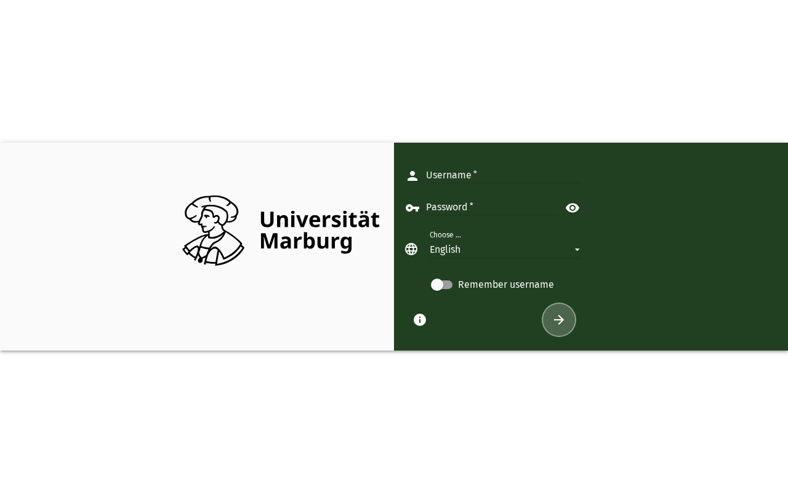

# Anmelden bei SOGo 5

Dieses Tutorial führt Sie durch die Anmeldung bei Ihrem SOGo 5-Webmail-Konto.

## Voraussetzungen

- Ein SOGo 5-Konto mit gültigen Anmeldedaten
- Zugriff auf die SOGo 5-Weboberfläche

## Schritt-für-Schritt-Anleitung

### Schritt 1: Zur Anmeldeseite navigieren

Öffnen Sie Ihren Webbrowser und navigieren Sie zur URL Ihrer SOGo 5-Instanz (z. B.
`https://demo.sogo.nu/SOGo/`). Sie sehen die SOGo 5-Anmeldeseite mit
Benutzernamen- und Passwortfeldern.

### Schritt 2: Benutzernamen eingeben

Geben Sie Ihren SOGo 5-Benutzernamen in das Feld **Benutzername** ein. Dies ist in der Regel
die E-Mail-Adresse oder der Benutzername, der Ihnen von Ihrem Systemadministrator bereitgestellt wurde.

### Schritt 3: Passwort eingeben

Geben Sie Ihr Passwort in das Feld **Passwort** ein.

### Schritt 4: Auf Anmelden klicken

Klicken Sie auf die Schaltfläche **Anmelden**, um Ihre Anmeldedaten zu übermitteln. SOGo 5
authentifiziert Sie gegen das konfigurierte Backend (LDAP, SQL usw.).

### Schritt 5: Dashboard überprüfen

Nach erfolgreicher Anmeldung sehen Sie das Haupt-Dashboard von SOGo 5 mit der
Navigationsleiste für Anwendungen. Dies bestätigt, dass Sie authentifiziert sind und
die Funktionen von SOGo 5 nutzen können.

## Fazit

Sie haben sich erfolgreich bei SOGo 5 angemeldet. Sie können nun über die Navigationsleiste
auf Ihre E-Mails, Kalender, Kontakte und andere Module zugreifen.
## Accessibility

### Keyboard Navigation

This application supports keyboard navigation. No mouse required for completing this task.

| Action | Keyboard Shortcut: What key to press | Notes: Additional information |
|--------|--------------------------------------|------------------------------|
| | Navigate modules | `Tab` / `Shift+Tab` | Cycles through sections |
| | Select/activate | `Enter` or `Space` | Activate button or link |
| | Cancel/close | `Escape` | Cancel current action |
| | Navigate lists | `Arrow keys` | Move through items |

**Screen Reader Navigation Order:**
1. Sidebar navigation → `Tab` to enter
2. Module content → `Arrow keys` to navigate
3. Action buttons → `Space` or `Enter` to activate
4. Forms → `Tab` between fields, arrows for dropdowns

### High Contrast Mode

SOGo supports high contrast and dark mode. Toggle via user preferences or use browser/OS-level accessibility settings:
- **Windows:** `Win+Ctrl+C` toggles high contrast
- **macOS:** System Preferences → Accessibility → Display → Increase contrast
- **Browser Extensions:** Dark Reader, High Contrast (Chrome)

