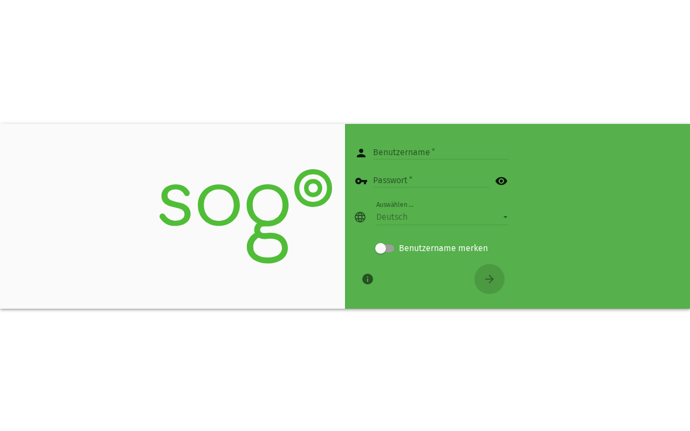

# Erste Schritte mit SOGo 5

Willkommen! Diese Seite hilft Ihnen, sich mit der SOGo 5-Oberfläche vertraut zu machen, sodass Sie sofort loslegen können.

## Anmelden

Öffnen Sie Ihren Browser, geben Sie die URL Ihrer SOGo 5-Instanz ein (z. B. `https://demo.sogo.nu/SOGo/`), tragen Sie Benutzername und Passwort ein und klicken Sie auf **Anmelden**. Nach erfolgreicher Authentifizierung sehen Sie das Haupt-Dashboard.

## Die Bedienoberfläche

Nach der Anmeldung besteht die SOGo-Oberfläche aus drei Hauptbereichen:

- **Linke Seitenleiste** — Modulnavigation: Wechseln Sie zwischen **E-Mail**, **Kalender**, **Kontakte** und **Aufgaben**.
- **Obere Symbolleiste** — Modul-Tabs, das Einstellungs-Zahnrad ⚙ und das Abmelde-Symbol ⏻.
- **Hauptbereich** — Hier wird der Inhalt des aktiven Moduls angezeigt.

## Einstellungen (Zahnrad-Symbol)

Klicken Sie auf das **Zahnrad-Symbol** ⚙ in der oberen Symbolleiste, um Ihre **Einstellungen** zu öffnen. Hier können Sie Sprache, Zeitzone, Benachrichtigungen, Standard-Kalenderansicht, E-Mail-Signaturen und mehr konfigurieren.

:::warning[Grünen Speichern-Button verwenden]

Klicken Sie immer auf den **grünen Speichern-Button**, um Ihre Änderungen zu bestätigen. Einstellungen werden **nicht** automatisch gespeichert — wenn Sie die Seite verlassen, ohne auf Speichern zu klicken, gehen Ihre Änderungen verloren.

:::

## Abmelden

Klicken Sie auf das **Ein/Aus-Symbol** ⏻ in der oberen rechten Ecke der Symbolleiste, um Ihre Sitzung zu beenden. Details finden Sie unter [Abmelden](./sogo-logout).

## Barrierefreiheit

### Tastaturnavigation

SOGo 5 unterstützt die vollständige Tastaturnavigation für die Anmeldung.

| Aktion | Tastenkombination: Welche Taste drücken | Hinweise: Zusätzliche Informationen |
|--------|----------------------------------|---------------------------|
| | Zum Benutzernamen-Feld navigieren | `Tab` aus der Adressleiste |
| | Zum Passwort-Feld wechseln | `Tab` nach dem Benutzernamen |
| | "Angemeldet bleiben" umschalten | `Tab` zum Schalter, `Leertaste` zum Umschalten |
| | Anmeldeformular absenden | `Eingabetaste` in einem beliebigen Feld |
| | Anmeldung abbrechen | `Escape` leert das Formular |

### Screenreader-Workflow

1. Nach dem Laden der Seite kündigt der Screenreader an: "Anmeldung, Überschriftsebene 1"
2. `Tab` zum Benutzernamen-Feld — "Benutzername, Bearbeiten, leer"
3. Geben Sie Ihren Benutzernamen ein
4. `Tab` zum Passwort-Feld — "Passwort, Bearbeiten, leer"
5. Geben Sie Ihr Passwort ein
6. `Tab` zum Schalter "Angemeldet bleiben" — "Angemeldet bleiben, Schalter, aus"
7. `Leertaste` zum Umschalten (falls gewünscht)
8. `Tab` zur Anmelde-Schaltfläche — "Anmelden, Schaltfläche"
9. `Eingabetaste` zum Absenden

### Hochkontrastmodus

SOGo 5 verfügt derzeit über keinen integrierten Hochkontrastmodus. Browser-/Betriebssystem-Alternativen:
- **Windows:** `Win+Strg+C` schaltet den Hochkontrast um
- **macOS:** Systemeinstellungen → Bedienungshilfen → Anzeige → Kontrast erhöhen
- **Browser-Erweiterungen:** Dark Reader, High Contrast (Chrome)
