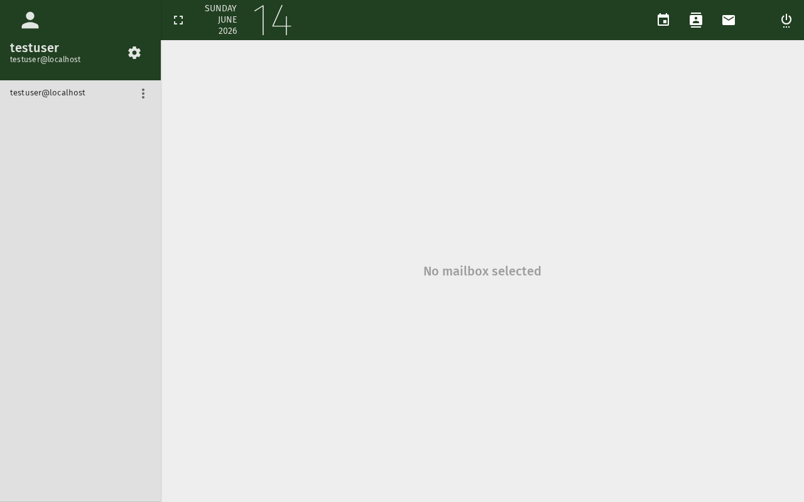

# E-Mail — Nachrichten lesen und anzeigen

Zeigen Sie E-Mails in Ihrem SOGo 5-Posteingang an und lesen Sie sie.

## Voraussetzungen

- Ein SOGo 5-Konto mit gültigen Anmeldedaten
- Sie sind bei SOGo 5 angemeldet

## Schritt-für-Schritt-Anleitung

### Schritt 1: E-Mail-Modul öffnen

Klicken Sie in der linken Seitenleiste auf **E-Mail**, um den Posteingang zu öffnen.

### Schritt 2: Eine E-Mail auswählen

Der Posteingang zeigt Nachrichten als Liste an. Klicken Sie auf eine beliebige E-Mail, um sie anzuzeigen.

Die E-Mail wird im Vorschaufenster mit folgenden Abschnitten geöffnet:

| Abschnitt | Enthält |
|-----------|---------|
| **Kopfzeile** | Von, An, Betreff, Datum |
| **Nachrichtentext** | E-Mail-Inhalt |
| **Anhänge** | Dateianhänge (falls vorhanden) |

### Schritt 3: Navigation im Posteingang

Verwenden Sie die Navigationssteuerung oben:

| Steuerung | Funktion |
|-----------|----------|
| **Aktualisieren** | Posteingang auf neue Nachrichten aktualisieren |
| **Ordner-Dropdown** | Zwischen Posteingang, Gesendet, Entwürfen, Papierkorb wechseln |
| **Suche** | E-Mails nach Stichwort finden |

## Fehlerbehebung

| Problem | Mögliche Ursache | Lösung |
|---------|-----------------|--------|
| Posteingang erscheint leer | IMAP-Server-Verbindungsproblem | Versuchen Sie, die Seite zu aktualisieren |
| E-Mail-Inhalt wird nicht angezeigt | Verbindungszeitüberschreitung | Laden Sie die Seite neu oder überprüfen Sie Ihre Netzwerkverbindung |
| Anhänge nicht sichtbar | Dateigröße zu groß | Kontaktieren Sie Ihren Administrator zu Anhangsgrößenbeschränkungen |

:::tip
Doppelklicken Sie auf einen Nachrichtenbetreff, um ihn zum einfacheren Lesen in einem neuen Tab zu öffnen.
:::

## Fazit

Sie können nun Ihren Posteingang in SOGo 5 navigieren und E-Mails lesen.
