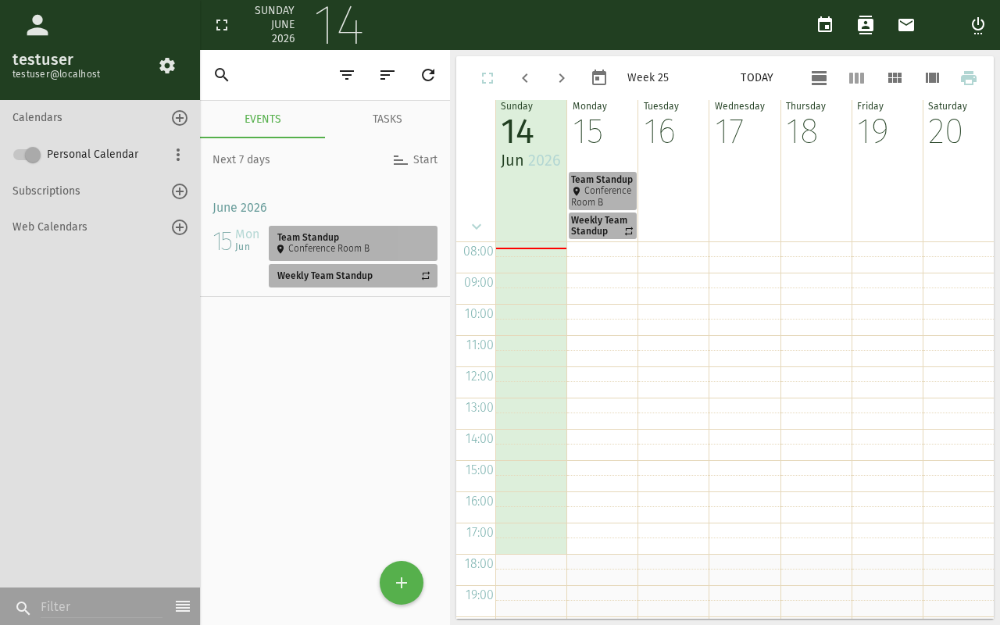

# Kalenderereignis erstellen

Dieses Tutorial führt Sie durch das Erstellen eines neuen Ereignisses im SOGo 6-Kalender,
einschließlich Datum und Uhrzeit, dem Hinzufügen von Teilnehmern und der Konfiguration von Erinnerungen.

## Voraussetzungen

- Ein SOGo 6-Konto mit gültigen Anmeldedaten
- Sie sind bei SOGo 6 angemeldet

## Schritt-für-Schritt-Anleitung

### Schritt 1: Kalendermodul öffnen

Klicken Sie oben in der Navigationsleiste auf **Kalender**,
um die Kalenderansicht zu öffnen.

Der Kalender öffnet standardmäßig in der **Wochenansicht**. Sie können zwischen
den Ansichten Tag, Woche, Monat und Jahr mit den Schaltflächen in der oberen Symbolleiste wechseln.

### Schritt 2: Neues Ereignis erstellen

Es gibt drei Möglichkeiten, ein Ereignis zu erstellen:

| Methode | Aktion |
|---------|--------|
| **Auf +-Schaltfläche klicken** | Klicken Sie auf die **+** (Plus)-Schaltfläche am unteren Rand der Kalenderansicht |
| **Doppelklicken** | Doppelklicken Sie auf einen beliebigen Zeitbereich im Kalendergitter |
| **Datumsauswahl verwenden** | Klicken Sie auf ein Datum im Minikalender links, dann auf **+** |

Wählen Sie die gewünschte Methode. Ein Dialog für ein neues Ereignis wird angezeigt.

### Schritt 3: Ereignisdetails eingeben

Füllen Sie die Ereignisdetails aus:

| Eingabefeld | Beschreibung | Beispiel |
|------|-------------|----------|
| **Titel** | Ein kurzer Name für Ihr Ereignis | "Team-Besprechung" |
| **Ort** | Wo das Ereignis stattfindet | "Konferenzraum B" |
| **Beginn** | Datum und Uhrzeit des Ereignisbeginns | Heute um 10:00 |
| **Ende** | Datum und Uhrzeit des Ereignisendes | Heute um 11:00 |
| **Kalender** | In welchem Kalender gespeichert werden soll | "Persönlich" |
| **Kategorie** | Eine farbcodierte Kategorie | Besprechung (blau) |

:::tip
Für **Ganztägige Ereignisse** (z. B. Geburtstage, Feiertage) aktivieren Sie den
Schalter **Ganztägig**. Die Zeitfelder werden dann deaktiviert.
:::

### Schritt 4: Teilnehmer hinzufügen (Optional)

Wenn Sie andere Personen einladen möchten:

1. Klicken Sie auf den Bereich **Teilnehmer**, um ihn zu erweitern
2. Beginnen Sie mit der Eingabe des Namens oder der E-Mail-Adresse eines Kollegen
3. Wählen Sie die Person aus den automatischen Vervollständigungsvorschlägen aus
4. Wählen Sie deren **Teilnahmerolle**:
   - **Erforderlich** — Muss teilnehmen
   - **Optional** — Willkommen, aber nicht erforderlich
5. Wiederholen Sie dies für jeden weiteren Teilnehmer

SOGo 6 sendet jedem Teilnehmer eine E-Mail-Einladung, wenn Sie das Ereignis speichern.

### Schritt 5: Erinnerung festlegen (Optional)

Um eine Erinnerung vor dem Ereignis zu erhalten:

1. Klicken Sie auf den Bereich **Alarm**, um ihn zu erweitern
2. Wählen Sie, wann Sie erinnert werden möchten:
   - **15 Minuten vorher** (Standard)
   - **30 Minuten vorher**
   - **1 Stunde vorher**
   - **1 Tag vorher**
   - **Benutzerdefiniert** — eigene Zeit eingeben
3. Wählen Sie die Erinnerungsmethode:
   - **Anzeige** — Eine Popup-Benachrichtigung erscheint in Ihrem Browser, wenn die Erinnerung ausgelöst wird
   - **E-Mail** — Eine E-Mail an Ihre Adresse. **Hinweis:** E-Mail-Alarme erfordern den
     serverseitigen Dienst `sogo-ealarms-notify` — wenden Sie sich an Ihren Administrator,
     wenn E-Mail-Erinnerungen nicht ankommen
4. Sie können mehrere Alarme pro Ereignis kombinieren (z. B. **15 Minuten vorher** als
   Popup-Erinnerung plus **1 Tag vorher** als E-Mail): klicken Sie dazu auf **Alarm hinzufügen**

### Schritt 6: Beschreibung hinzufügen (Optional)

Nutzen Sie das Feld **Beschreibung**, um Notizen, eine Tagesordnung oder Vorbereitungshinweise
für das Ereignis hinzuzufügen. Dieses Feld unterstützt Klartext.

### Schritt 7: Wiederholung festlegen (Optional)

Für sich wiederholende Ereignisse klicken Sie auf den Bereich **Wiederholen** und wählen ein Muster:

| Zeitlicher Abstand | Beispiel |
|--------|----------|
| **Täglich** | Tägliches Standup-Meeting |
| **Wöchentlich** | Team-Meeting jeden Dienstag |
| **Alle zwei Wochen** | Sprint-Review alle zwei Wochen |
| **Monatlich** | Abteilungsmeeting am ersten Montag jedes Monats |
| **Jährlich** | Geburtstag oder Jahrestag |

Sie können auch ein **Enddatum** für die Wiederholung festlegen (z. B. Wiederholung bis
zum Semesterende).

### Schritt 8: Ereignis speichern

Klicken Sie auf **Speichern** oder **OK** (je nach Ihrer SOGo 6-Version), um das Ereignis zu erstellen.

Das Ereignis wird in Ihrem Kalender angezeigt. Wenn Sie Teilnehmer hinzugefügt haben, erhalten diese
eine E-Mail-Einladung, die sie annehmen oder ablehnen können.

## Fazit

Sie haben erfolgreich ein Kalenderereignis erstellt. Sie können nun:
- [Ihren Kalender mit anderen teilen](./sogo-calendar-share)
- Das Ereignis durch Klicken bearbeiten
- Es per Drag & Drop verschieben
- Die Dauer durch Ziehen an den Rändern ändern
## Barrierefreiheit

### Tastaturnavigation

Diese Anwendung unterstützt die Tastaturnavigation. Keine Maus erforderlich.

| Aktion | Tastenkombination | Hinweise |
|--------|-------------------|----------|
| Module navigieren | `Tab` / `Umschalt+Tab` | Wechselt zwischen Bereichen |
| Auswählen/Aktivieren | `Eingabetaste` oder `Leertaste` | Link oder Schaltfläche aktivieren |
| Abbrechen/Schließen | `Escape` | Aktuelle Aktion abbrechen |
| Listen navigieren | `Pfeiltasten` | Durch Einträge bewegen |

**Reihenfolge der Screenreader-Navigation:**
1. Modul-Navigation → `Tab` zum Betreten
2. Modulinhalte → `Pfeiltasten` zum Navigieren
3. Aktionsschaltflächen → `Leertaste` oder `Eingabetaste` zum Aktivieren
4. Formulare → `Tab` zwischen Feldern, Pfeiltasten für Dropdowns

### Hochkontrastmodus

SOGo unterstützt den Hochkontrast- und Dunkelmodus. Aktivierung über Benutzereinstellungen oder systemweite Barrierefreiheitseinstellungen:
- **Windows:** `Win+Strg+C` schaltet den Hochkontrast um
- **macOS:** Systemeinstellungen → Bedienungshilfen → Anzeige → Kontrast erhöhen
- **Browser-Erweiterungen:** Dark Reader, High Contrast (Chrome)
