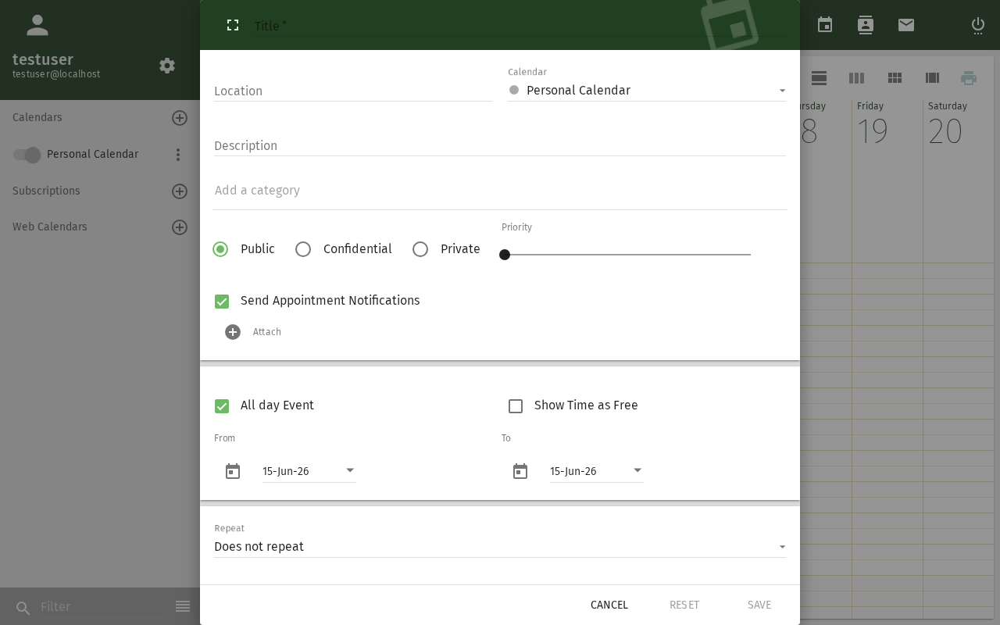
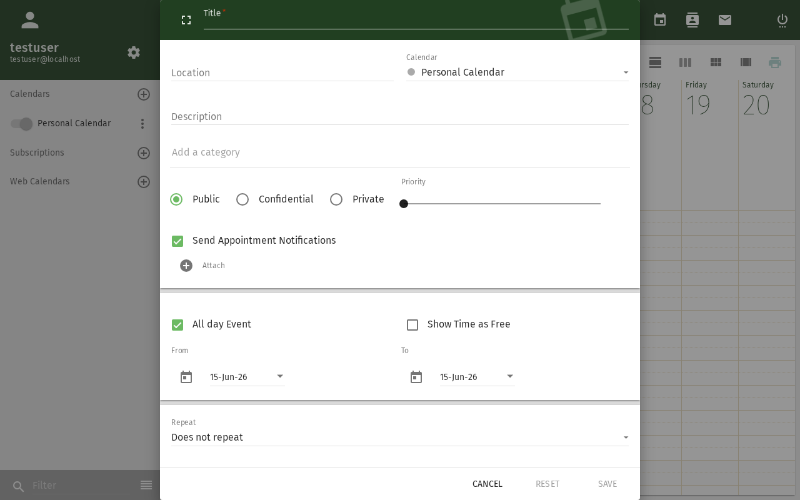

# Frei/Gebucht-Abfrage

Prüfen Sie die Verfügbarkeit Ihrer Kollegen, bevor Sie eine Besprechung
planen — direkt aus dem Dialog zur Ereigniserstellung.

## Voraussetzungen

- Ein SOGo 6-Konto mit gültigen Anmeldedaten
- Sie sind bei SOGo 6 angemeldet
- Der Kollege hat ein SOGo 6-Konto und seine Frei/Gebucht-Informationen freigegeben

## Schritt-für-Schritt-Anleitung

### Schritt 1: Mit der Erstellung eines Ereignisses beginnen

1. Öffnen Sie das Modul **Kalender**
2. Klicken Sie auf **+**, um ein neues Ereignis zu erstellen, oder klicken Sie auf ein vorhandenes Ereignis, um es zu bearbeiten

### Schritt 2: Frei/Gebucht-Ansicht öffnen

1. Klicken Sie im Ereignisdialog auf den Bereich **Teilnehmer**
2. Klicken Sie auf die Schaltfläche **Frei/Gebucht** oder **Verfügbarkeit**
3. Ein Zeitraster mit Ihrem Kalender öffnet sich

### Schritt 3: Einen Kollegen hinzufügen

1. Klicken Sie im Frei/Gebucht-Raster auf **Person hinzufügen** oder **Verfügbarkeit prüfen**

2. Beginnen Sie mit der Eingabe des Namens eines Kollegen
3. Wählen Sie ihn aus der automatischen Vervollständigungsliste aus
4. Wiederholen Sie den Vorgang für jede Person, die Sie prüfen möchten

### Schritt 4: Das Raster lesen

Das Raster zeigt Zeitbereiche für jede Person:

| Farbe | Bedeutung |
|-------|----------|
| ✅ **Grün** | Verfügbar |
| ❌ **Rot** | Beschäftigt (hat ein Ereignis) |
| 🟡 **Gelb** | Vorläufig / vielleicht teilnehmend |
| ⬜ **Weiß** | Keine Daten (nicht freigegeben oder außerhalb der Arbeitszeit) |

### Schritt 5: Einen gemeinsamen Zeitraum finden

Suchen Sie nach einem Zeitraum, in dem alle Teilnehmer grün sind.
SOGo 6 schlägt möglicherweise automatisch den nächsten verfügbaren Termin vor.

### Schritt 6: Zeit bestätigen

Klicken Sie auf den gewünschten Zeitbereich im Raster.
Die Start-/Endzeit des Ereignisses wird entsprechend aktualisiert.

## Was andere sehen

Standardmäßig ist SOGo 6 so konfiguriert, dass andere Benutzer Folgendes sehen können:

| Berechtigung | Was sichtbar ist |
|-------------|-----------------|
| **Frei/Gebucht** | Nur ob Sie verfügbar oder beschäftigt sind (keine Details) |
| **Anzeigen (schreibgeschützt)** | Ereignistitel und -zeiten |
| **Vertrauliche Ereignisse** | Nur als "Beschäftigt" markiert, auch für Betrachter |

Ihr Administrator kann die standardmäßigen Berechtigungsstufen über die
Einstellung `SOGoCalendarDefaultRoles` ändern.

## Fehlerbehebung

### Kollege wird nicht angezeigt

- Überprüfen Sie, ob der Kollege ein SOGo 6-Konto hat
- Möglicherweise hat er die Frei/Gebucht-Freigabe nicht aktiviert
- Er befindet sich möglicherweise in einem anderen Adressbuch — versuchen Sie, die vollständige E-Mail-Adresse einzugeben

### Alle Zeiten zeigen "Keine Daten"

- Der Kollege hat seinen Kalender nicht für Sie freigegeben
- Bitten Sie die Person oder Ihren Administrator, Ihnen den Frei/Gebucht-Zugriff zu gewähren
- Standardrollen können eingeschränkt sein (`PublicDAndTViewer` muss gesetzt sein)

## Fazit

Die Frei/Gebucht-Abfrage hilft Ihnen, Besprechungstermine zu finden, ohne die
lästige E-Mail-Frage "Sind Sie um ... frei?". Sie funktioniert für
alle in Ihrer Organisation, die ihre Kalenderverfügbarkeit freigeben.
## Barrierefreiheit

### Tastaturnavigation

Diese Anwendung unterstützt die Tastaturnavigation. Keine Maus erforderlich.

| Aktion | Tastenkombination | Hinweise |
|--------|-------------------|----------|
| Module navigieren | `Tab` / `Umschalt+Tab` | Wechselt zwischen Bereichen |
| Auswählen/Aktivieren | `Eingabetaste` oder `Leertaste` | Link oder Schaltfläche aktivieren |
| Abbrechen/Schließen | `Escape` | Aktuelle Aktion abbrechen |
| Listen navigieren | `Pfeiltasten` | Durch Einträge bewegen |

**Reihenfolge der Screenreader-Navigation:**
1. Modul-Navigation → `Tab` zum Betreten
2. Modulinhalte → `Pfeiltasten` zum Navigieren
3. Aktionsschaltflächen → `Leertaste` oder `Eingabetaste` zum Aktivieren
4. Formulare → `Tab` zwischen Feldern, Pfeiltasten für Dropdowns

### Hochkontrastmodus

SOGo unterstützt den Hochkontrast- und Dunkelmodus. Aktivierung über Benutzereinstellungen oder systemweite Barrierefreiheitseinstellungen:
- **Windows:** `Win+Strg+C` schaltet den Hochkontrast um
- **macOS:** Systemeinstellungen → Bedienungshilfen → Anzeige → Kontrast erhöhen
- **Browser-Erweiterungen:** Dark Reader, High Contrast (Chrome)
