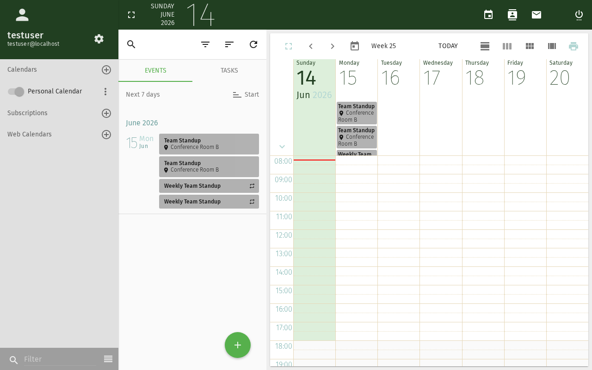

# iCal-Feed abonnieren

Importieren Sie externe Kalender in Ihren SOGo 6-Kalender — öffentliche Feiertage,
Teamkalender oder jeden online verfügbaren `.ics`-Feed.

## Voraussetzungen

- Ein SOGo 6-Konto mit gültigen Anmeldedaten
- Sie sind bei SOGo 6 angemeldet
- Eine URL zu einem iCal-Feed (`.ics`-Datei oder CalDAV-Endpunkt)

## Schritt-für-Schritt-Anleitung

### Schritt 1: iCal-Feed-URL finden

Sie benötigen die Webadresse (URL) eines iCal-Feeds. Häufige Beispiele:

| Quelle | Beispiel-URL |
|--------|-------------|
| Öffentliche Feiertage | `https://calendar.google.com/calendar/ical/.../basic.ics` |
| Team-Kalender | `https://teamup.com/.../events.ics` |
| Freigegebener SOGo 6-Kalender | `https://sogo.example.com/SOGo/dav/benutzername/calendar/shared/` |

### Schritt 2: Webkalender öffnen

1. Klicken Sie oben in der Navigationsleiste auf **Kalender**
2. Klicken Sie auf **Webkalender** — die Option liegt direkt auf der Oberfläche, es gibt kein Zahnrad dafür

### Schritt 3: Feed-URL einfügen und abonnieren

1. Fügen Sie die kopierte Feed-URL ein
2. Bestätigen Sie das Abonnement

Der abonnierte Kalender erscheint anschließend in Ihrer Kalenderliste.

## Abonnements verwalten

### Abonnierte Ereignisse anzeigen

Abonnierte Kalender funktionieren wie Ihre eigenen — Ereignisse werden in der
Kalenderansicht angezeigt. Sie können die Sichtbarkeit durch Aktivieren/Deaktivieren
des Kalenders in der Liste umschalten.

### Aktualisierung

Die Daten abonnierter Kalender werden beim Anmelden neu geladen:
Öffnen Sie **Einstellungen** (Zahnrad) → **Kalender** und aktivieren Sie **Neu laden beim Anmelden**.

### Abonnement-Eigenschaften bearbeiten

Dreipunkt-Menü (⋯) neben dem Kalender → **Eigenschaften**:
- Anzeigenamen oder Farbe ändern
- Feed-URL aktualisieren

### Abonnement kündigen

Wählen Sie im Dreipunkt-Menü (⋯) neben dem Kalender die Option zum Entfernen.
Der Kalender wird aus Ihrer Ansicht entfernt. Die Quelle bleibt unverändert.

## Fehlerbehebung

### "Ungültige Kalender-URL"

- Überprüfen Sie, ob die URL erreichbar ist (versuchen Sie, sie im Browser zu öffnen)
- Die URL muss gültige iCalendar-Daten (`.ics`) zurückgeben
- Einige öffentliche Feeds erfordern eine Authentifizierung

### Kalender wird nicht aktualisiert

- Melden Sie sich ab und wieder an (abonnierte Kalender werden beim Anmelden neu geladen, siehe oben)
- Der Feed-Anbieter hat möglicherweise die URL geändert

### Ereignisse haben falsche Uhrzeiten

- SOGo 6 konvertiert alle Daten in Ihre konfigurierte Zeitzone
- Überprüfen Sie Ihre Zeitzone unter **Einstellungen** → **Allgemein** → **Zeitzone**
- Einige iCal-Feeds enthalten keine Zeitzoneninformationen — diese werden standardmäßig auf UTC gesetzt

## Fazit

iCal-Abonnements ermöglichen es Ihnen, externe Kalender in Ihre
SOGo 6-Ansicht einzublenden — perfekt für öffentliche Feiertage, Teamtermine und
Kalenderfeeds von Drittanbietern.
## Barrierefreiheit

### Tastaturnavigation

Diese Anwendung unterstützt die Tastaturnavigation. Keine Maus erforderlich.

| Aktion | Tastenkombination | Hinweise |
|--------|-------------------|----------|
| Module navigieren | `Tab` / `Umschalt+Tab` | Wechselt zwischen Bereichen |
| Auswählen/Aktivieren | `Eingabetaste` oder `Leertaste` | Link oder Schaltfläche aktivieren |
| Abbrechen/Schließen | `Escape` | Aktuelle Aktion abbrechen |
| Listen navigieren | `Pfeiltasten` | Durch Einträge bewegen |

**Reihenfolge der Screenreader-Navigation:**
1. Modul-Navigation → `Tab` zum Betreten
2. Modulinhalte → `Pfeiltasten` zum Navigieren
3. Aktionsschaltflächen → `Leertaste` oder `Eingabetaste` zum Aktivieren
4. Formulare → `Tab` zwischen Feldern, Pfeiltasten für Dropdowns

### Hochkontrastmodus

SOGo unterstützt den Hochkontrast- und Dunkelmodus. Aktivierung über Benutzereinstellungen oder systemweite Barrierefreiheitseinstellungen:
- **Windows:** `Win+Strg+C` schaltet den Hochkontrast um
- **macOS:** Systemeinstellungen → Bedienungshilfen → Anzeige → Kontrast erhöhen
- **Browser-Erweiterungen:** Dark Reader, High Contrast (Chrome)
