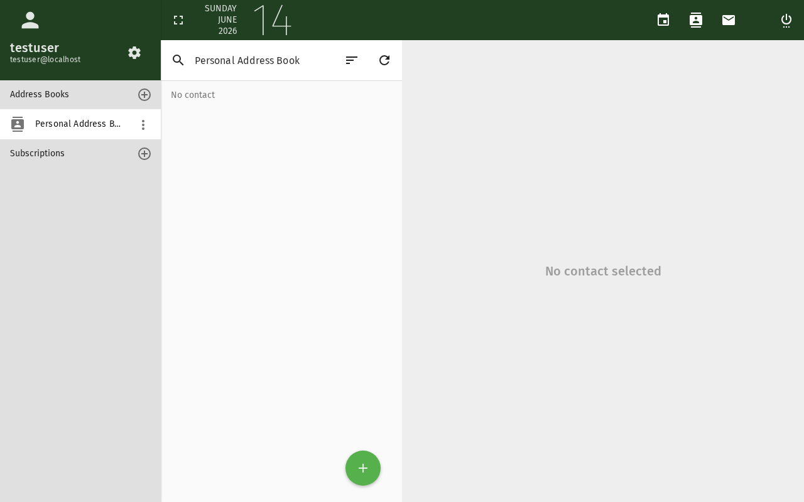

# Kontakt hinzufügen

Dieses Tutorial erklärt, wie Sie Kontakte zu Ihrem SOGo 6-Adressbuch hinzufügen
und in Listen organisieren.

## Voraussetzungen

- Ein SOGo 6-Konto mit gültigen Anmeldedaten
- Sie sind bei SOGo 6 angemeldet

## Schritt-für-Schritt-Anleitung

### Schritt 1: Kontaktmodul öffnen

Klicken Sie oben in der Navigationsleiste auf **Kontakte**,
um Ihr Adressbuch zu öffnen.

Die Kontaktansicht zeigt Ihr Adressbuch mit allen vorhandenen Kontakten.
Auf der linken Seite sehen Sie Ihre Adressbücher und Listen.

### Schritt 2: Neuen Kontakt erstellen

Klicken Sie auf die **+** (Plus)-Schaltfläche, um einen neuen Kontakt hinzuzufügen.

Ein leeres Kontaktformular wird angezeigt.

### Schritt 3: Kontaktinformationen eingeben

Füllen Sie die Details des Kontakts aus. Die am häufigsten verwendeten Felder sind:

| Eingabefeld | Beschreibung | Empfohlen |
|------|-------------|-----------|
| **Vorname** | Vorname | ✅ Immer |
| **Nachname** | Familienname | ✅ Immer |
| **E-Mail** | Primäre E-Mail-Adresse | ✅ Immer |
| **Telefon** | Telefonnummer | Optional |
| **Mobil** | Mobiltelefonnummer | Optional |
| **Organisation** | Organisation oder Unternehmen | Optional |
| **Rolle** | Funktion oder Rolle im Unternehmen | Optional |
| **Titel** | z. B. Dr., Prof. | Optional |

:::tip
Das Feld **Anzeigename** wird automatisch aus Vor- und Nachname ausgefüllt,
aber Sie können es anpassen (z. B. "Max M. (IT-Support)").
:::

### Schritt 4: Zusätzliche Details hinzufügen (Optional)

Scrollen Sie nach unten, um auf weitere Felder zuzugreifen:

| Bereich | Felder |
|---------|-------|
| **Adresse** | Straße, Stadt, PLZ, Land |
| **Weitere E-Mail** | Sekundäre E-Mail-Adressen |
| **Webseite** | Private oder geschäftliche URL |
| **IM** | Instant-Messaging-Handler (Jabber usw.) |
| **Notizen** | Freitext-Notizen zum Kontakt |

### Schritt 5: Adressbuch auswählen

Wenn Sie mehrere Adressbücher haben, wählen Sie über das Dropdown-Menü oben im
Kontaktformular aus, in welchem gespeichert werden soll.

In der Regel gibt es ein persönliches Adressbuch — an der Uni Marburg trägt es
Ihr Account-Kürzel, ähnlich wie Ihr Persönlich-Kalender — sowie möglicherweise
weitere freigegebene Adressbücher.
- **Gesammelte Adressen** — Automatisch aus gesendeten E-Mails gespeichert

### Schritt 6: Kontakt speichern

Klicken Sie auf **Speichern**, um den Kontakt zu Ihrem Adressbuch hinzuzufügen.

Der Kontakt wird nun in Ihrer Kontaktliste angezeigt. Sie können:

- Darauf klicken, um Details anzuzeigen oder zu bearbeiten
- Bei der E-Mail-Eingabe den Namen tippen, um die automatische Vervollständigung zu nutzen

## Kontakte in Listen organisieren

### Liste erstellen

1. Klicken Sie oben in der Navigationsleiste auf **+** neben **Listen**
2. Geben Sie einen Namen für die Liste ein (z. B. "Team", "Kunden", "Familie")
3. Klicken Sie auf **OK**

### Kontakte zu einer Liste hinzufügen

1. Ziehen Sie einen Kontakt aus der Liste auf den Listennamen, oder
2. Klicken Sie auf das Dreipunkt-Menü (⋯) neben die Liste, wählen Sie **Mitglieder hinzufügen** und wählen Sie Kontakte aus

## Kontakte importieren (CSV/vCard)

Um Kontakte aus einem anderen Dienst zu importieren:

1. Klicken Sie auf das **Dreipunkt-Menü** (⋯) in der Kontakt-Symbolleiste
2. Wählen Sie **Importieren**
3. Wählen Sie eine Datei aus:
   - **vCard (.vcf)** — Standardformat, funktioniert mit den meisten Adressbüchern
   - **CSV (.csv)** — Tabellenkalkulations-Exportformat
4. Klicken Sie auf **Importieren**

:::warning
Importierte Kontakte werden dem aktuell ausgewählten Adressbuch hinzugefügt.
Stellen Sie sicher, dass vor dem Import das richtige Adressbuch ausgewählt ist.
:::

## Kontakt bearbeiten oder löschen

- **Bearbeiten:** Klicken Sie auf einen Kontakt in der Liste, dann auf **Bearbeiten**
- **Löschen:** Wählen Sie den Kontakt aus und klicken Sie auf **Löschen** (Papierkorbsymbol)

## Fazit

Sie haben erfolgreich einen Kontakt zu Ihrem SOGo 6-Adressbuch hinzugefügt.
Kontakte stehen in ganz SOGo 6 zur Verfügung — beim Verfassen von E-Mails, Einladen
von Teilnehmern zu Kalenderereignissen oder Suchen nach Kollegen.
## Barrierefreiheit

### Tastaturnavigation

Diese Anwendung unterstützt die Tastaturnavigation. Keine Maus erforderlich.

| Aktion | Tastenkombination | Hinweise |
|--------|-------------------|----------|
| Module navigieren | `Tab` / `Umschalt+Tab` | Wechselt zwischen Bereichen |
| Auswählen/Aktivieren | `Eingabetaste` oder `Leertaste` | Link oder Schaltfläche aktivieren |
| Abbrechen/Schließen | `Escape` | Aktuelle Aktion abbrechen |
| Listen navigieren | `Pfeiltasten` | Durch Einträge bewegen |

**Reihenfolge der Screenreader-Navigation:**
1. Modul-Navigation → `Tab` zum Betreten
2. Modulinhalte → `Pfeiltasten` zum Navigieren
3. Aktionsschaltflächen → `Leertaste` oder `Eingabetaste` zum Aktivieren
4. Formulare → `Tab` zwischen Feldern, Pfeiltasten für Dropdowns

### Hochkontrastmodus

SOGo unterstützt den Hochkontrast- und Dunkelmodus. Aktivierung über Benutzereinstellungen oder systemweite Barrierefreiheitseinstellungen:
- **Windows:** `Win+Strg+C` schaltet den Hochkontrast um
- **macOS:** Systemeinstellungen → Bedienungshilfen → Anzeige → Kontrast erhöhen
- **Browser-Erweiterungen:** Dark Reader, High Contrast (Chrome)
