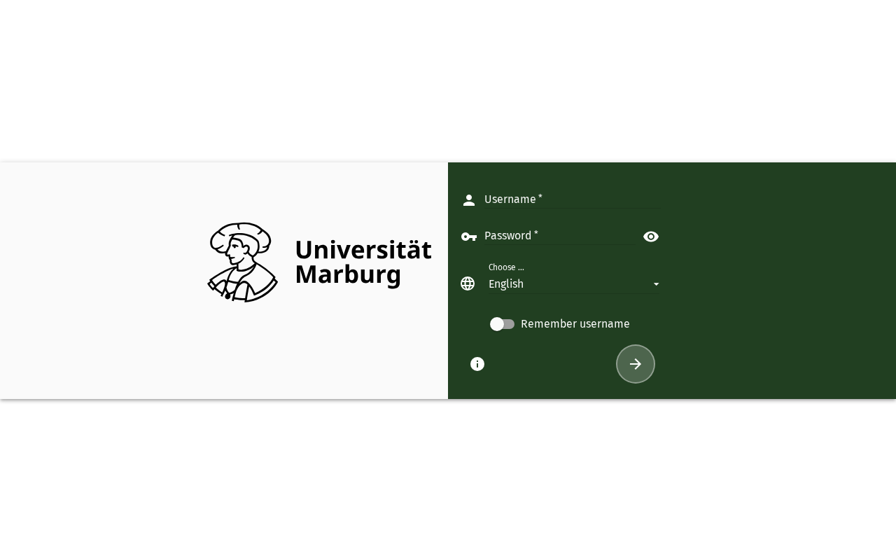

# Erste Schritte mit SOGo 6

Willkommen! Diese Seite hilft Ihnen, sich mit der SOGo 6-Oberfläche vertraut zu machen, sodass Sie sofort loslegen können.

## Anmelden

Öffnen Sie Ihren Browser, geben Sie die URL Ihrer SOGo 6-Instanz ein (z. B. `https://demov6.sogo.nu/SOGo/`), tragen Sie Benutzername und Passwort ein und klicken Sie auf **Anmelden**. Nach erfolgreicher Authentifizierung sehen Sie das Haupt-Dashboard.

## Die Bedienoberfläche

Nach der Anmeldung besteht die SOGo-Oberfläche aus drei Hauptbereichen:

- **Linke Seitenleiste** — Modulnavigation: Wechseln Sie zwischen **E-Mail**, **Kalender**, **Kontakte** und **Aufgaben**.
- **Obere Symbolleiste** — Modul-Tabs, das Einstellungs-Zahnrad ⚙ und das Abmelde-Symbol ⏻.
- **Hauptbereich** — Hier wird der Inhalt des aktiven Moduls angezeigt.

## Einstellungen (Zahnrad-Symbol)

Klicken Sie auf das **Zahnrad-Symbol** ⚙ in der oberen Symbolleiste, um Ihre **Einstellungen** zu öffnen. Hier können Sie Sprache, Zeitzone, Benachrichtigungen, Standard-Kalenderansicht, E-Mail-Signaturen und mehr konfigurieren.

:::warning[Grünen Speichern-Button verwenden]

Klicken Sie immer auf den **grünen Speichern-Button**, um Ihre Änderungen zu bestätigen. Einstellungen werden **nicht** automatisch gespeichert — wenn Sie die Seite verlassen, ohne auf Speichern zu klicken, gehen Ihre Änderungen verloren.

:::

## Abmelden

Klicken Sie auf das **Ein/Aus-Symbol** ⏻ in der oberen rechten Ecke der Symbolleiste, um Ihre Sitzung zu beenden. Details finden Sie unter [Abmelden](./sogo-logout).

## Barrierefreiheit

### Tastaturnavigation

SOGo 6 unterstützt die vollständige Tastaturnavigation für die Anmeldung.

| Aktion | Tastenkombination: Welche Taste drücken | Hinweise: Zusätzliche Informationen |
|--------|----------------------------------|---------------------------|
| | Zum Benutzernamen-Feld navigieren | `Tab` (ggf. mehrfach) drücken, bis Sie hören: „Benutzername, Bearbeiten, leer“ — es ist in der Regel das erste Feld der Formularfelder |
| | Zum Passwort-Feld wechseln | `Tab` nach dem Benutzernamen |
| | „Angemeldet bleiben“ umschalten | `Tab` zum Kontrollfeld (Checkbox), `Leertaste` zum Umschalten |
| | Anmeldeformular absenden | `Eingabetaste` in einem beliebigen Feld |

Je nach Instanz liegen in der Tab-Reihenfolge vor dem Benutzernamen-Feld noch der Sprachumschalter und das Passwort-Auge (Passwort anzeigen). `Escape` erreicht zunächst den Fokusmodus des Screenreaders und leert die Eingaben nicht — das Formular bleibt ausgefüllt.

### Screenreader-Workflow

1. Ob der Screenreader die Seite nach dem Laden vorliest, hängt von dessen Einstellungen ab. Verlässlicher Einstieg: mit `Strg+Pos1` an den Seitenanfang springen und die Seite anschließend schrittweise durch Navigieren mit `Tab` erschließen
2. `Tab` (ggf. mehrfach) zum Benutzernamen-Feld — "Benutzername, Bearbeiten, leer"
3. Geben Sie Ihren Benutzernamen ein
4. `Tab` zum Passwort-Feld — "Passwort, Bearbeiten, leer"
5. Geben Sie Ihr Passwort ein
6. `Tab` zum Kontrollfeld „Angemeldet bleiben“ — der Screenreader sagt z. B. „Benutzername merken, Kontrollfeld nicht aktiviert“ an (der zugängliche Name weicht vom sichtbaren Label „Angemeldet bleiben“ ab)
7. `Leertaste` zum Umschalten (falls gewünscht)
8. `Tab` zur Anmelde-Schaltfläche — "Anmelden, Schaltfläche"
9. `Eingabetaste` zum Absenden

### Hochkontrastmodus

SOGo 6 verfügt derzeit über keinen integrierten Hochkontrastmodus. Browser-/Betriebssystem-Alternativen:
- **Windows:** `Win+Strg+C` schaltet den Hochkontrast um
- **macOS:** Systemeinstellungen → Bedienungshilfen → Anzeige → Kontrast erhöhen
- **Browser-Erweiterungen:** Dark Reader, High Contrast (Chrome)

