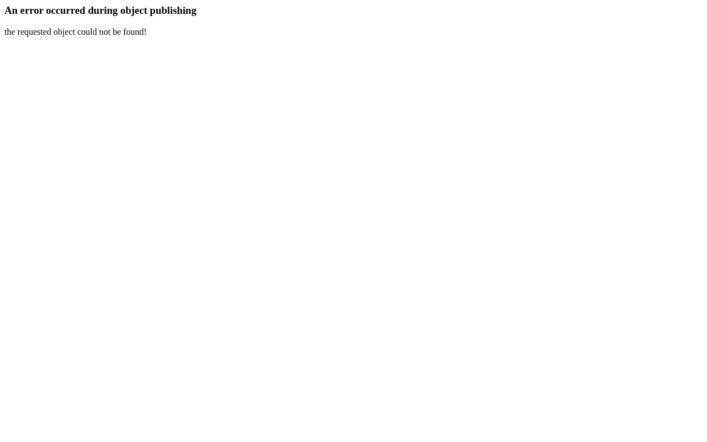

# Abwesenheitsnotiz

Konfigurieren Sie automatische E-Mail-Antworten und markieren Sie sich im
Kalender als abwesend, wenn Sie im Urlaub oder außer Haus sind.

## Voraussetzungen

- Ein SOGo 6-Konto mit gültigen Anmeldedaten
- Sie sind bei SOGo 6 angemeldet
- Die Abwesenheitsnotiz muss von Ihrem Administrator aktiviert sein
  (`SOGoVacationEnabled = YES` — eine Servereinstellung, die Ihr Administrator konfiguriert)

## Schritt-für-Schritt-Anleitung

### Schritt 1: Abwesenheitseinstellungen öffnen

1. Klicken Sie auf das **Dreipunkt-Menü** (⋯) (Einstellungen) in der oberen Symbolleiste
2. Wählen Sie **Abwesenheitsnotiz** aus dem Einstellungsmenü



### Schritt 2: Automatische Antwort aktivieren

Schalten Sie **Automatische Antwort aktivieren** auf **EIN**.

### Schritt 3: Zeitraum festlegen

| Eingabefeld | Beschreibung | Beispiel |
|------|-------------|----------|
| **Startdatum** | Beginn Ihrer Abwesenheit | 2026-07-15 |
| **Enddatum** | Rückkehrdatum | 2026-07-28 |
| **Zeitzone** | Ihre lokale Zeitzone | Europe/Berlin |

Die Automatische Antwort wird am Startdatum um 00:00 Uhr aktiviert und
nach dem Enddatum um 23:59 Uhr deaktiviert.

:::tip
Legen Sie den Zeitraum so fest, dass er Reisetage einschließt — aktivieren Sie ihn
am Abend vor Ihrer Abreise und deaktivieren Sie ihn am Morgen nach Ihrer Rückkehr.
:::

### Schritt 4: Automatische Antwort-Nachricht verfassen

Verfassen Sie die Nachricht, die an Personen gesendet wird, die Ihnen eine E-Mail schreiben:

```
Betreff: Abwesenheit — Max Mustermann

Vielen Dank für Ihre Nachricht.

Ich bin vom 15. Juli bis 28. Juli 2026 außer Haus
und habe nur eingeschränkten E-Mail-Zugriff.

Bei dringenden Angelegenheiten wenden Sie sich bitte an
Erika Mustermann (erika.mustermann@firma.com).

Mit freundlichen Grüßen,
Max Mustermann
```

### Schritt 5: Antwortoptionen wählen

| Option | Beschreibung |
|--------|-------------|
| **Antwort senden an** | Jeder oder nur Personen in Ihren Kontakten/Ihrem Adressbuch |
| **Wiederholte Antworten** | Einmal pro Absender (Standard) oder jedes Mal, wenn sie schreiben |
| **Originalbetreff beibehalten** | `Re:` hinzufügen oder den ursprünglichen Betreff beibehalten |

**Empfohlen:** Einmal pro Absender senden, um Kollegen, die mehrfach
schreiben, nicht zu überfluten.

### Schritt 6: Speichern

Klicken Sie auf **Speichern** oder **Übernehmen**. Das Sieve-Skript wird auf dem
Mail-Server aktiviert.

## Kalender: Abwesenheit markieren

Während Sie die Abwesenheitsnotiz konfigurieren, blockieren Sie auch Ihren Kalender:

### Ein Abwesenheitsereignis erstellen

1. Öffnen Sie das Modul **Kalender**
2. Erstellen Sie ein neues Ereignis, das Ihren Abwesenheitszeitraum abdeckt
3. Stellen Sie es als **Ganztägiges** Ereignis ein
4. Fügen Sie "Abwesenheit" oder "Urlaub" als Titel hinzu
5. Markieren Sie es in den Sichtbarkeitseinstellungen als **Beschäftigt** oder **Abwesend**
6. Speichern

Dadurch wird der Zeitraum blockiert, sodass Kollegen bei der
Frei/Gebucht-Abfrage sehen, dass Sie nicht verfügbar sind.

## Einrichtung testen

### Test-E-Mail senden

1. Senden Sie eine E-Mail an Ihre SOGo 6-Adresse von einem anderen Konto aus
2. Sie sollten die Automatische Antwort innerhalb weniger Minuten erhalten
3. Die Automatische Antwort wird nur einmal pro Absender ausgelöst (gemäß konfigurierter Regel)

### Abwesenheitsstatus überprüfen

Öffnen Sie erneut **Einstellungen** → **Abwesenheitsnotiz**, um zu überprüfen:
- Der Schalter zeigt **EIN**
- Der Zeitraum ist korrekt
- Die Nachricht ist gespeichert

## Automatische Antwort deaktivieren

Wenn Sie zurück sind:

1. Gehen Sie zu **Einstellungen** → **Abwesenheitsnotiz**
2. Schalten Sie **Automatische Antwort aktivieren** auf **AUS**
3. Klicken Sie auf **Speichern**

Die Automatische Antwort wird sofort gestoppt. Löschen Sie optional das
Kalenderblock-Ereignis.

## Fehlerbehebung

### Automatische Antwort wird nicht gesendet

- Überprüfen Sie, ob die Abwesenheitsnotiz von Ihrem Administrator aktiviert wurde
- Vergewissern Sie sich, dass der Sieve-Server läuft (`SOGoSieveScriptsEnabled` — Servereinstellung, fragen Sie Ihren Administrator)
- Die Automatische Antwort wird nur einmal pro Absender gesendet — testen Sie mit einer
  anderen E-Mail-Adresse
- Überprüfen Sie, ob der Zeitraum das aktuelle Datum einschließt

### "Sieve-Skript-Fehler" beim Speichern

- Der Sieve-Server ist möglicherweise nicht verfügbar
- Kontaktieren Sie Ihren Administrator, um den Sieve-Dienst zu überprüfen
- Vereinfachen Sie den Nachrichtentext (Sonderzeichen können Probleme verursachen)

## Fazit

Die automatische Abwesenheitsnotiz stellt sicher, dass Personen über Ihre Abwesenheit
informiert sind. In Kombination mit einem Kalenderblock
können Kollegen Ihre Verfügbarkeit auf einen Blick erkennen.
## Barrierefreiheit

### Tastaturnavigation

Diese Anwendung unterstützt die Tastaturnavigation. Keine Maus erforderlich.

| Aktion | Tastenkombination | Hinweise |
|--------|-------------------|----------|
| Module navigieren | `Tab` / `Umschalt+Tab` | Wechselt zwischen Bereichen |
| Auswählen/Aktivieren | `Eingabetaste` oder `Leertaste` | Link oder Schaltfläche aktivieren |
| Abbrechen/Schließen | `Escape` | Aktuelle Aktion abbrechen |
| Listen navigieren | `Pfeiltasten` | Durch Einträge bewegen |

**Reihenfolge der Screenreader-Navigation:**
1. Modul-Navigation → `Tab` zum Betreten
2. Modulinhalte → `Pfeiltasten` zum Navigieren
3. Aktionsschaltflächen → `Leertaste` oder `Eingabetaste` zum Aktivieren
4. Formulare → `Tab` zwischen Feldern, Pfeiltasten für Dropdowns

### Hochkontrastmodus

SOGo unterstützt den Hochkontrast- und Dunkelmodus. Aktivierung über Benutzereinstellungen oder systemweite Barrierefreiheitseinstellungen:
- **Windows:** `Win+Strg+C` schaltet den Hochkontrast um
- **macOS:** Systemeinstellungen → Bedienungshilfen → Anzeige → Kontrast erhöhen
- **Browser-Erweiterungen:** Dark Reader, High Contrast (Chrome)
