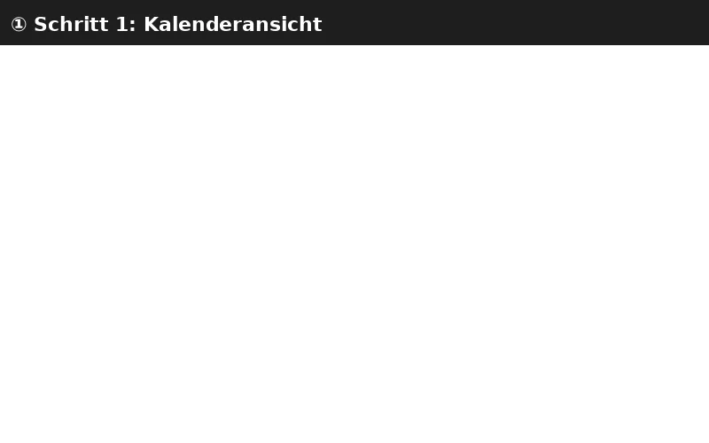

import PageSEO from '@site/src/components/PageSEO';

<PageSEO title="Edit & Delete Calendar Events" description="Step-by-step tutorial to modify or remove existing events in the SOGo 5 calendar" keywords={["calendar", "editing", "deleting", "events", "modification"]} />

# Edit & Delete Calendar Events

Learn how to modify event details or remove events from your SOGo 5 calendar.

## Prerequisites

- A SOGo 5 account with valid credentials
- You are logged into SOGo 5
- At least one existing event in your calendar

## Part 1: Edit an Existing Event

### Step 1: Select the Event

Click on any event in the calendar to open its details.

### Step 2: Modify Event Details

The event editor allows you to change:

| Field | Description |
|-------|-------------|
| **Title** | Change the event name |
| **Location** | Update the venue or room |
| **Start / End** | Adjust the date and time |
| **Calendar** | Move the event to a different calendar |
| **Category** | Change the color category |
| **Description** | Add or edit notes about the event |

To edit an event:

1. Click inside any editable field
2. Make your changes
3. Click **Save** to apply them

### Step 3: Edit Recurring Events

If the event is part of a recurring series, you will be asked:

| Option | Effect |
|--------|--------|
| **This event only** | Changes only the selected instance |
| **All events in the series** | Changes every occurrence of the recurring event |

Select the option that matches your intent.

## Part 2: Delete an Event

### Step 1: Open the Event

Click the event you want to delete to view its details.

### Step 2: Delete the Event

1. Click the **Delete** button in the event editor
2. Confirm the deletion when prompted

For recurring events, you will be asked:

| Option | Effect |
|--------|--------|
| **Delete this event only** | Removes only the selected instance |
| **Delete all events in the series** | Removes every occurrence |

:::warning
Deletion cannot be undone. Consider this before permanently removing events.
:::

## Troubleshooting

| Issue | Possible Cause | Solution |
|-------|---------------|----------|
| Cannot edit an event | Read-only calendar (shared by another user) | Check the calendar's color — grey usually means read-only |
| Delete button not visible | Insufficient permissions on shared calendar | Ask the calendar owner to grant delete permissions |
| Changes lost after saving | Session timeout | Log out and back in, then retry the edit |
