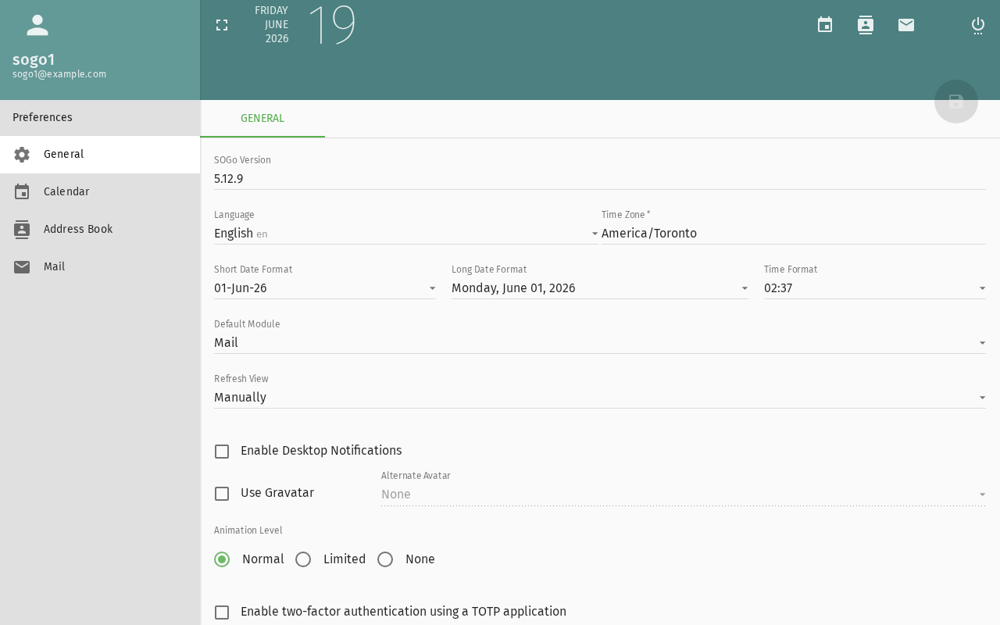
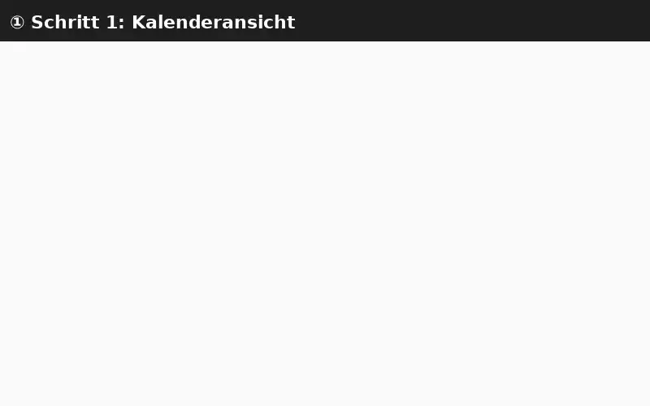

import PageSEO from '@site/src/components/PageSEO';

<PageSEO title="Share a Calendar" description="Step-by-step tutorial to share your SOGo 5 calendar with colleagues and set permissions" keywords={["calendar sharing", "permissions", "collaboration", "delegation", "access control"]} />

# Share a Calendar

This tutorial explains how to share your SOGo 5 calendar with other users
and control what they can see or do.

## Prerequisites

- A SOGo 5 account with valid credentials
- You are logged into SOGo 5
- You have at least one calendar (e.g., the default "Personal" calendar)

## Step-by-Step Instructions

### Step 1: Open Calendar Settings

1. In the sidebar navigation, click **Calendar**
2. In the top toolbar, click the **gear icon** ⚙ (Settings)
3. Select **Calendar** from the settings menu

Alternatively, right-click on a calendar name in the left sidebar
and select **Properties** or **Sharing**.

### Step 2: Choose a Calendar to Share



In the calendar list, you will see all your calendars:

- **Personal** — Your default calendar
- Any additional calendars you have created

Select the calendar you want to share.

### Step 3: Add a User

1. In the **Permissions** or **Sharing** tab, click **Add User**
2. Start typing the person's name or email address
3. Select them from the auto-complete list

### Step 4: Set Permission Level

Choose what the user can do:

| Permission: What user can do with your calendar | Can View: Whether user can see events | Can Create/Edit: Whether user can create or edit events | Can Delete: Whether user can delete events | Can Share: Whether user can share with others |
|:-------------------------------------------------|:---------------------------------------|:-----------------------------------------------------|:------------------------------------------|:----------------------------------------------|
| **Free/Busy** | ✅ Time slots only | ❌ | ❌ | ❌ |
| **View (read-only)** | ✅ All details | ❌ | ❌ | ❌ |
| **View + Respond** | ✅ All details | ❌ | ❌ | ❌ |
| **Modify** | ✅ All details | ✅ Own events | ✅ Own events | ❌ |
| **Modify All** | ✅ All details | ✅ Any event | ✅ Any event | ❌ |
| **Admin** | ✅ All details | ✅ Any event | ✅ Any event | ✅ Can add others |

**Recommended for most cases:** **Modify** allows a colleague to create
and edit events in your calendar.



### Step 5: Confirm the Share

Click **OK** or **Save** to apply the permission. The user will now be
able to access your calendar according to the permission level you set.

### Step 6: Verify (Optional)

To verify the share is working:

1. Open a **private/incognito browser window**
2. Log in as the user you shared with
3. Open the Calendar module
4. Check that your shared calendar appears in their calendar list

## Sharing via CalDAV (Advanced)

If you use a CalDAV client (Thunderbird, macOS Calendar, iOS):

1. Open your CalDAV client
2. Add a new calendar with the URL:
   ```
   https://your-sogo-instance/SOGo/dav/your-username/calendar/personal/
   ```
3. Enter your SOGo 5 credentials
4. The calendar will sync automatically

Shared calendars will appear under the same CalDAV endpoint for users
who have been granted access.

## Remove or Change Sharing

To revoke or change access later:

1. Go to **Calendar Settings** → **Permissions**
2. Find the user in the list
3. To change: select a different permission level
4. To remove: click the **X** or **Remove** button next to their name

## Conclusion

You have successfully shared your calendar. Shared calendars are a great
way to coordinate team schedules, plan meetings, and keep everyone
on the same page.

## Accessibility

### Keyboard Navigation

SOGo 5 supports full keyboard navigation for calendar sharing features.

| Action | Keyboard Shortcut: What key to press | Notes: Additional information |
|--------|----------------------------------|---------------------------|
| | Open Calendar module | `Alt+C` | From any module
| | Open calendar settings (gear) | `Tab` then `Enter` | Navigate to gear icon in toolbar
| | Open Properties/Sharing | `Shift+F10` or `Tab` then `Enter` | Context menu on calendar name
| | Add User field | `Tab` to Add button, then `Enter` | Opens user autocomplete
| | Navigate permission level dropdown | `Tab` then `Up`/`Down` | Cycles through permission options
| | Confirm share | `Tab` to OK/Save, then `Enter` | Applies the permission
| | Remove shared user | `Tab` to X/Remove, then `Enter` | Revokes access
| | Close settings | `Escape` | Returns to calendar view

### Screen Reader Workflow

**Sharing a Calendar: Adding a Colleague with Modify Permission**

**Step 1: Open Calendar Module**
- Press `Alt+C` to navigate to the Calendar module
- Screen reader announces: "Calendar, module heading"

**Step 2: Open Calendar Settings**
- Press `Tab` to navigate to the gear icon (Settings) in the toolbar
- Press `Enter` to open settings
- Screen reader announces: "Settings dialog, Calendar tab"

**Step 3: Select Calendar to Share**
- Press `Tab` to navigate the calendar list
- Use `Up`/`Down` arrow keys to select the desired calendar
- Screen reader announces: "Personal calendar, selected"

**Step 4: Open Permissions Tab**
- Press `Tab` to reach the Permissions or Sharing tab
- Press `Enter` to activate
- Screen reader announces: "Permissions tab, selected"

**Step 5: Add a User**
- Press `Tab` to reach the "Add User" button
- Press `Enter` to activate the autocomplete field
- Start typing the colleague's name or email
- Screen reader announces: "Edit, autocomplete, suggestions available"
- Use `Down` arrow to navigate suggestions, `Enter` to select

**Step 6: Set Permission Level**
- Press `Tab` to reach the permission level dropdown
- Use `Up`/`Down` arrow keys to cycle through permission options
- Screen reader announces each option: "Modify, selected" or "View read-only, selected"
- Select **Modify** for the recommended level

**Step 7: Confirm and Save**
- Press `Tab` to reach the OK or Save button
- Press `Enter` to apply the share
- Screen reader announces: "Saved successfully" or similar confirmation

**Step 8: Verify (Optional)**
- Open a private/incognito browser window
- Log in as the shared user
- Open Calendar module
- The shared calendar appears in their list with your name

**Common Screen Reader Announcements:**

| Announcement: What screen reader says | Meaning: What it means | Action: What to do |
|-------------------------------|----------------------|-----------------|
| "Calendar, module heading" | Calendar list is loaded | Begin navigation to settings |
| "Permissions tab, selected" | Sharing options are open | Proceed to add a user |
| "Edit, autocomplete, suggestions available" | User search field is active | Type colleague's name and select from list |
| "Modify, selected" | Permission level is set | Confirm or change the level |
| "Saved successfully" | Share has been applied | Share is active — inform the user |
| "User already has access" | Duplicate share attempt | Change permission level or remove and re-add |
| "Invalid user" | User not found in SOGo | Check spelling or full email address |

### Visual Content Descriptions

**[calendar-share.webp]:** Animated demonstration of sharing a calendar with a colleague in SOGo 5.

- **Frame 1 (0–1.5s):** User right-clicks the "Personal" calendar in the left sidebar and selects **Properties** from the context menu
- **Frame 2 (1.5–3.5s):** Properties dialog opens to the Permissions tab. User clicks **Add User** and begins typing a colleague's name
- **Frame 3 (3.5–5.0s):** Autocomplete dropdown appears with matching colleagues. User selects one with the mouse
- **Frame 4 (5.0–7.0s):** User opens the permission level dropdown and selects **Modify** from the list
- **Frame 5 (7.0–8.5s):** User clicks **OK** to confirm. The colleague appears in the permissions list with the Modify badge

### High Contrast Mode

SOGo 5's dark mode and high contrast mode work with all sections described above. Toggle via: Settings button (gear icon) → General → Theme → Dark/High Contrast.
