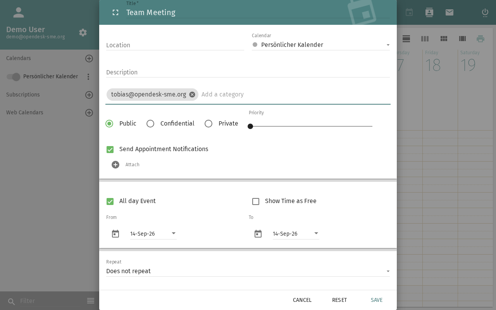

import PageSEO from '@site/src/components/PageSEO';

<PageSEO title="Subscribe to an iCal Feed" description="Step-by-step tutorial to import external calendars into SOGo 5" keywords={["ical feed", "subscribe", "external calendar", "sync", "calendar subscription"]} />

# Subscribe to an iCal Feed

Import external calendars into your SOGo 5 calendar — public holidays,
team calendars, or any `.ics` feed available online.

Unlike the [iCal import/export](./sogo-calendar-ical), subscribing here adds a
live feed that refreshes automatically on each login — not a one-time file import.

## Prerequisites

- A SOGo 5 account with valid credentials
- You are logged into SOGo 5
- A URL to an iCal feed (`.ics` file or CalDAV endpoint)

## Step-by-Step Instructions

### Step 1: Find an iCal Feed URL

You need the web address (URL) of an iCal feed. Common examples:

| Source | Example URL |
|:-------|:------------|
| Public holidays | `https://calendar.google.com/calendar/ical/.../basic.ics` |
| Team calendar | `https://teamup.com/.../events.ics` |
| Shared SOGo 5 calendar | `https://sogo.example.com/SOGo/dav/username/calendar/shared/` |

### Step 2: Open Web Calendar

1. Click **Calendar** in the top navigation bar
2. Click **Web Calendar** — the option sits directly on the surface; there is no gear icon for it

### Step 3: Paste the Feed URL and Subscribe

1. Paste the copied feed URL
2. Confirm the subscription

The subscribed calendar then appears in your calendar list.

## Managing Subscriptions

### View Subscribed Events

Subscribed calendars work like your own — events appear in the
calendar view. You can toggle visibility by checking/unchecking
the calendar in the list.

### Refreshing

Data from subscribed calendars is reloaded when you log in: open **Settings (gear icon)** → **Calendar** and enable **Reload on login**.

### Edit Subscription Properties

Three-dot menu (⋯) next to the calendar → **Properties**:
- Change the display name or color
- Update the feed URL

### Unsubscribe

Choose the remove option in the three-dot menu (⋯) next to the calendar.
The calendar is removed from your view. The source is unaffected.

## Troubleshooting

### "Invalid calendar URL"

- Verify the URL is accessible (try opening it in a browser)
- The URL must return valid iCalendar (`.ics`) data
- Some public feeds require authentication

### Calendar not updating

- Log out and back in (subscribed calendars are reloaded on login, see above)
- The feed provider may have changed the URL

### Events have wrong times

- SOGo 5 converts all dates to your configured timezone
- Check your timezone in **Settings** → **General** → **Timezone**
- Some iCal feeds don't include timezone info — these default to UTC

## Conclusion

iCal subscriptions let you overlay external calendars onto your
SOGo 5 view — perfect for public holidays, team schedules, and
third-party calendar feeds.

## Accessibility

### Keyboard Navigation

SOGo 5 supports full keyboard navigation for subscribing to calendars.

| Action | Keyboard Shortcut | Notes |
|--------|--------------------------------------|------------------------------|
| Open Calendar module | `Alt+C` | From any module |
| Open Web Calendar | `Tab` to **Web Calendar**, `Enter` | Sits directly on the calendar surface |
| Enter the feed URL | `Tab` to the URL field, paste | Full address of the `.ics` feed |
| Confirm subscription | `Enter` | The calendar appears in the list |

### Screen Reader Workflow

**Subscribing to External Calendar**

**Step 1: Navigate to Calendar Module**
1. `Alt+C` to open the Calendar module
2. You should hear: "Calendar, module heading"

**Step 2: Open Web Calendar**
1. `Tab` to the **Web Calendar** control
2. Press `Enter`

**Step 3: Subscribe to the Feed**
1. `Tab` to the URL field
2. Paste the calendar URL
3. Press `Enter` to confirm
4. You should hear the calendar was added

**Step 4: Verify**
1. `Tab` through the calendar list
2. The subscribed calendar appears there

**Common Screen Reader Announcements:**

| Announcement | Meaning | Action |
|--------------------------------------|------------------------|-------------------|
| "Web Calendar" | Subscription control focused | Press Enter to open |
| "URL, edit" | Calendar address field | Paste the full calendar URL |
| "Display name, edit" | Friendly calendar name | Type a memorable name (if offered) |
| "Refresh frequency" | How often to sync | Arrow to select interval |
| "Calendar subscribed" | Success | Calendar now visible |

### High Contrast Mode

SOGo 5's dark mode and high contrast mode work with all sections described above. Toggle via: three-dot menu (⋯) → General → Theme → Dark/High Contrast.
