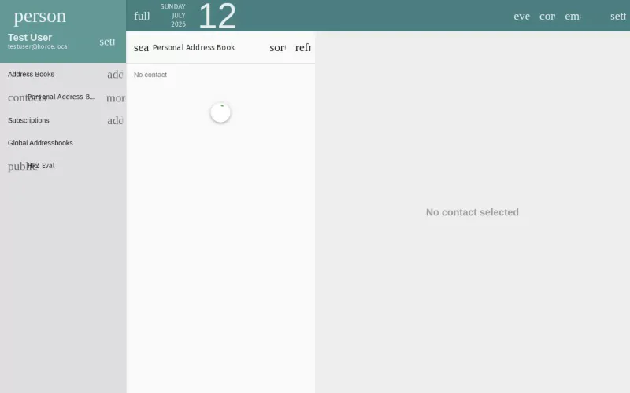

import PageSEO from '@site/src/components/PageSEO';

<PageSEO title="Edit & Delete Contacts" description="Step-by-step tutorial to modify or remove contacts in the SOGo 5 address book" keywords={["contacts", "editing", "deleting", "address book", "management"]} />

# Edit & Delete Contacts

Learn how to update contact information or remove contacts from your SOGo 5 address book.

## Prerequisites

- A SOGo 5 account with valid credentials
- You are logged into SOGo 5
- At least one existing contact in your address book

## Part 1: Edit a Contact

### Step 1: Select a Contact

In the sidebar navigation on the left, click **Contacts** to open the address book.

Find the contact you want to edit and click on their name or entry.

### Step 2: Modify Contact Details

The contact editor allows you to change:

| Field | Description |
|-------|-------------|
| **First Name** | Given name |
| **Last Name** | Surname / family name |
| **Email** | Primary email address |
| **Phone** | Telephone number |
| **Mobile** | Mobile/cell phone number |
| **Company** | Organization or employer |
| **Notes** | Free-text notes about the contact |

To edit a field:

1. Click inside the field you want to change
2. Update the text as needed
3. Click **Save** to apply all changes at once

### Step 3: Save Changes

Click the **Save** button to persist your changes. The contact details will update immediately.

## Part 2: Delete a Contact

### Step 1: Open the Contact

Click the contact you want to remove from your address book.

### Step 2: Delete

1. Click the **Delete** button in the contact editor
2. Confirm the deletion when prompted

:::warning
Deletion is permanent. Once deleted, the contact cannot be recovered.
:::

## Troubleshooting

| Issue | Possible Cause | Solution |
|-------|---------------|----------|
| Cannot edit contact | Read-only address book (shared by another user) | You can only view contacts in shared address books |
| Changes not saving | Session timeout | Refresh the page and try again |
| Wrong contact shown | Search filter active | Clear any search terms in the contact list |
