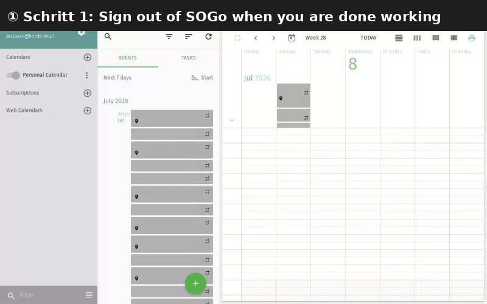

import PageSEO from '@site/src/components/PageSEO';

<PageSEO title="Logout" description="Step-by-step tutorial to securely log out of your SOGo 5 session" keywords={["logout", "sign out", "session", "security", "end session"]} />

# Logout

Safely end your SOGo 5 session by logging out when you're done working.

## Prerequisites

- You are logged into SOGo 5

## Step-by-Step Instructions

### Step 1: Locate the Logout Button

In the top-right toolbar, find the **power icon** ⏻ (Logout).

### Step 2: Click to Log Out

Click the power icon to end your session. You will be redirected to the login page.

### Step 3: Confirm You Are Logged Out

Once redirected, you will see the SOGo login screen confirming that your session has ended safely.

:::tip
If you are using a shared or public computer, always log out when you are done. Do not just close the browser tab.
:::

## Troubleshooting

| Issue: Description | Possible Cause | Solution |
|-------|---------------|----------|
| Logout button not visible | Screen resolution too narrow | Try widening the browser window or clicking the menu button (☰) first |
| Session still active after logout | Browser cached the page | Clear browser cache and close all SOGo tabs |
## Accessibility

### Keyboard Navigation

This application supports keyboard navigation. No mouse required for completing this task.

| Action | Keyboard Shortcut: What key to press | Notes: Additional information |
|--------|--------------------------------------|------------------------------|
| | Navigate modules | `Tab` / `Shift+Tab` | Cycles through sections |
| | Select/activate | `Enter` or `Space` | Activate button or link |
| | Cancel/close | `Escape` | Cancel current action |
| | Navigate lists | `Arrow keys` | Move through items |

**Screen Reader Navigation Order:**
1. Sidebar navigation → `Tab` to enter
2. Module content → `Arrow keys` to navigate
3. Action buttons → `Space` or `Enter` to activate
4. Forms → `Tab` between fields, arrows for dropdowns

### High Contrast Mode

SOGo supports high contrast and dark mode. Toggle via user preferences or use browser/OS-level accessibility settings:
- **Windows:** `Win+Ctrl+C` toggles high contrast
- **macOS:** System Preferences → Accessibility → Display → Increase contrast
- **Browser Extensions:** Dark Reader, High Contrast (Chrome)

