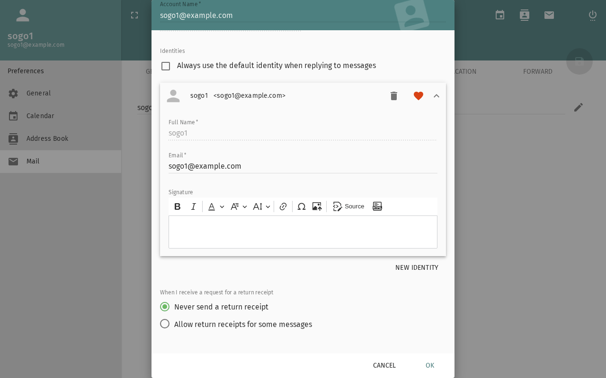

import PageSEO from '@site/src/components/PageSEO';

<PageSEO title="Mail Signatures & Identities" description="Step-by-step tutorial to set up email signatures and multiple sender identities in SOGo 5" keywords={["email signatures", "identities", "sender", "professional", "configuration"]} />

# Mail Signatures & Identities

Configure professional email signatures and manage multiple
sender identities (e.g., work vs. personal email).

## Part 1: Creating an Email Signature

### Step 1: Open the Identity Settings

1. Click the **gear icon** (Settings) in the top toolbar
2. Select **Mail** → **IMAP Accounts**
3. Click your email account to edit its identity



### Step 2: Create a New Identity

Signatures are managed per identity — there is no separate "Signatures" section. Use **New Identity** to add another identity.

### Step 3: Write Your Signature

Enter your signature text in the **Signature** field. SOGo 5 supports **plain text** signatures.

**Signature style commonly used at the University of Marburg:**
```
Best regards
John Doe
Department / Institute
Philipps-Universität Marburg
Phone: +49 6421 28-XXXXX
Email: john.doe@uni-marburg.de
```

### Step 4: Choose the Signature Placement

The signature placement options are located on the identity's **General** tab — not where you created the signature. Choose there whether and where the signature is inserted automatically when composing.

### Step 5: Save

Click **Save** to apply.

## Part 2: Using Your Signature

Your signature is inserted automatically when composing, according to the placement you chose (the **General** tab, see Part 1). To use a different signature, switch the identity (see Part 4).

## Part 3: HTML Signatures (Advanced)

SOGo 5 primarily supports plain text signatures. For rich signatures
with images or formatting:

1. Create your HTML signature in an external editor
2. Copy the formatted content (e.g., from Gmail or Outlook)
3. Paste it into the signature field — SOGo 5 preserves basic formatting

:::tip
**Best practice:** Keep signatures plain text for maximum
compatibility across email clients.
:::

## Part 4: Managing and Switching Identities

Your email address and signature belong to the identity you edit in
Part 1 via **Mail** → **IMAP Accounts**. Additional alternate identities are
available if your administrator has configured them
(`SOGoMailAuxiliaryUserAccountsEnabled`).

### Switch Identity When Composing

When writing a new message:

1. Look for the **From** field in the compose window
2. Click the **X** next to your email address
3. The list of available identities opens above it — select the identity you want


## Conclusion

Signatures and identities help you communicate professionally.
Set up a complete signature and add alternate identities if you
manage multiple email addresses.

## Accessibility

### Keyboard Navigation

SOGo 5 supports full keyboard navigation for managing signatures and identities.

| Action | Keyboard Shortcut | Notes |
|--------|--------------------------------------|------------------------------|
| Open Settings | `Alt+S` or `Tab` to gear icon, `Enter` | Top toolbar |
| Navigate to Mail section | `Tab` through settings sidebar | Arrow keys to Mail option |
| Navigate to IMAP Accounts | `Tab` or arrow keys to IMAP Accounts link | Under Mail settings |
| Add new identity | `Tab` to New Identity button, `Enter` | Opens identity editor |
| Focus name field | `Tab` | First field in editor |
| Focus signature text area | `Tab` | Body of the signature |
| Switch to General tab | `Tab` to General tab, `Enter` | Placement options live here |
| Save changes | `Tab` to Save button, `Enter` or `Ctrl+S` | Applies settings |
| Switch sender identity | `Tab` to the X in the From field, `Enter` | In compose window; the identity list opens above |
| Delete identity | `Tab` to delete / remove button, `Enter` | Confirm deletion |
| Close settings | `Escape` | Returns to main interface |

### Screen Reader Workflow

**Creating an Email Signature**

**Step 1: Open Settings**
1. `Tab` to the gear icon (Settings) in the top toolbar
2. `Enter` to open settings
3. Screen reader: "Settings menu"

**Step 2: Navigate to Mail → IMAP Accounts**
1. `Tab` through the settings sidebar to "Mail" option
2. `Enter` to expand Mail options
3. Arrow keys or `Tab` to "IMAP Accounts" link
4. `Enter` to open the account list
5. Screen reader: "IMAP Accounts"

**Step 3: Open Your Account and Add a New Identity**
1. `Tab` to your email account in the list, `Enter` to open it
2. `Tab` to the "New Identity" button, `Enter`
3. Screen reader: "New Identity, dialog" or similar

**Step 4: Name and Write Your Signature**
1. `Tab` to the name field
2. Type a name (e.g., "Professional")
3. `Tab` to the signature text area
4. Type your signature content (name, title, contact info)
5. Screen reader: "Name, edit" then "Signature, content editable"

**Step 5: Set the Signature Placement**
1. `Tab` to the **General** tab of the identity and open it
2. There, choose whether and where the signature is inserted automatically
3. Screen reader: "General, tab"

**Step 6: Save the Identity**
1. `Tab` to the "Save" button
2. `Enter` to apply changes
3. Screen reader: "Signature saved" or "Mail Preferences Saved"

**Switching Sender Identity (When Composing)**

**Step 1: Open Compose Window**
1. From inbox, press `c` or `Tab` to Compose button, `Enter`

**Step 2: Change From Address**
1. `Tab` to the From field
2. Screen reader: "From, [current address]"
3. `Tab` to the **X** next to your email address and press `Enter`
4. The list of available identities opens above it
5. Arrow keys to select a different identity
6. `Enter` to confirm selection
7. Screen reader: "From, [selected identity]"

**Common Screen Reader Announcements:**

| Announcement | Meaning | Action |
|-------------------------------|----------------------|-----------------|
| "IMAP Accounts, heading" | Account/identity settings loaded | Proceed to add or edit identities |
| "New Identity, button" | Create new identity with its own signature | Press Enter to start |
| "Signature, edit" | Signature text area focused | Type your signature content |
| "Placement, combo box" | Signature insertion mode | Arrow keys to choose option |
| "Save, button" | Changes ready to apply | Press Enter to save |
| "Mail Preferences Saved" | Settings updated successfully | Continue to next task |
| "From, combo box" | Sender identity selector | Arrow keys to change identity |
| "Delete signature, button" | Remove this signature | Press Enter, confirm |

### Visual Content Descriptions

**mail-signatures.png:** This 3-second animated GIF shows creating a new email identity (with its signature) in SOGo 5.

- **Frame 1 (0-1s):** Settings screen with Mail → IMAP Accounts selected, cursor hovering over the "New Identity" button
- **Frame 2 (1-2s):** Signature editor open with name field filled ("Professional") and user typing signature text (name, title, contact info)
- **Frame 3 (2-3s):** Save button clicked, signature appears in the signatures list with confirmation message

**Screen Reader Alternative:** If you cannot view this GIF, please use the **Screen Reader Workflow: Creating an Email Signature** above. It provides the same information in text format suitable for screen readers.

**Duration:** 3 seconds, 3 frames  
**File size:** 22 KB (approximate)

### High Contrast Mode

SOGo 5 currently does not have built-in high contrast mode. Workarounds for low-vision users:

**Browser/OS-Level High Contrast:**
1. **Windows:** `Win+Ctrl+C` toggles high contrast → Settings → Ease of Access → High Contrast
2. **macOS:** `System Preferences → Accessibility → Display → Increase contrast`
3. **Browser Extensions:** Dark Reader, High Contrast (Chrome)

**Signature Settings Accessibility:** All form fields (name, text area, placement) have associated labels. Use `Tab` to navigate between fields. Screen readers announce field labels and current values. The Signatures list supports standard keyboard navigation with arrow keys and Enter to activate.
