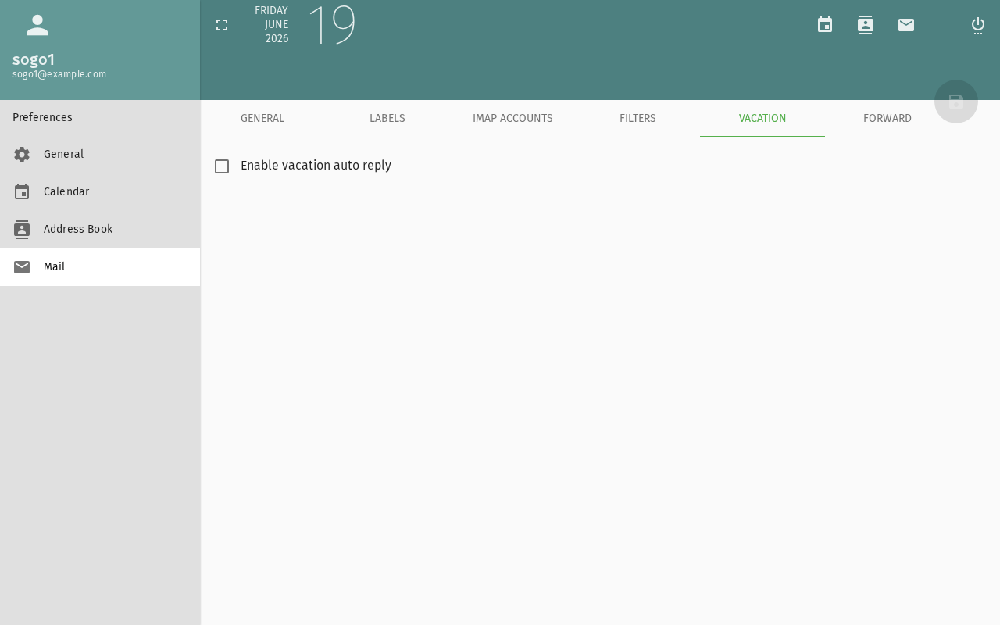

import PageSEO from '@site/src/components/PageSEO';

<PageSEO title="Vacation & Out-of-Office" description="Step-by-step tutorial to set up automatic email replies and calendar blocks for your absence in SOGo 5" keywords={["vacation", "out of office", "auto-reply", "absence", "automatic reply"]} />

# Vacation & Out-of-Office

Configure automatic email replies and mark yourself as away
in the calendar when you're on vacation or out of office.

## Prerequisites

- A SOGo 5 account with valid credentials
- You are logged into SOGo 5
- Vacation/auto-reply must be enabled by your administrator
  (`SOGoVacationEnabled = YES`)

## Step-by-Step Instructions

### Step 1: Open Vacation Settings

1. Click the **gear icon** ⚙ (Settings) in the top toolbar
2. Select **Vacation** from the settings menu



### Step 2: Enable Auto-Reply

Toggle **Enable auto-reply** to **ON**.

### Step 3: Set the Date Range

| Field | Description: What this field is for | Example: Example value |
|:------|:------------|:--------|
| **Start date** | When your absence begins | 2026-07-15 |
| **End date** | When you return | 2026-07-28 |
| **Time zone** | Your local timezone | Europe/Berlin |

The auto-reply activates on the start date at 00:00 and deactivates
after the end date at 23:59.

:::tip
Set the range to include travel days — enable it the evening before
you leave and disable it the morning after you return.
:::

### Step 4: Write Your Auto-Reply Message

Compose the message that will be sent to people who email you:

```
Subject: Out of office — John Doe

Thank you for your message.

I am out of the office from July 15 to July 28, 2026,
with limited access to email.

For urgent matters, please contact Jane Smith
(jane.smith@company.com).

Best regards,
John Doe
```

### Step 5: Choose Reply Options

| Option | Description: What this option does |
|:-------|:------------|
| **Send reply to** | Everyone, or only people in your contacts/address book |
| **Repeated replies** | Send once per sender (default) or every time they write |
| **Keep original subject** | Add `Re:` or keep the original subject line |

**Recommended:** Send once per sender to avoid flooding colleagues
who email multiple times.

### Step 6: Save

Click **Save** or **Apply**. The Sieve script is activated on the
mail server.

## Calendar: Marking Your Absence

While you're configuring vacation, also block your calendar:

### Create a Vacation Event

1. Open the **Calendar** module
2. Create a new event covering your absence period
3. Set it as an **All-day** event
4. Add "Out of Office" or "Vacation" as the title
5. Mark it as **Busy** or **Out of Office** in the visibility settings
6. Save

This blocks the time so colleagues see you're unavailable when
checking free/busy.

## Testing Your Setup

### Send a Test Email

1. Send an email to your SOGo 5 address from another account
2. You should receive the auto-reply within a few minutes
3. The auto-reply only fires once per sender (per configured rule)

### Check Vacation Status

Re-open **Settings** → **Vacation** to verify:
- The toggle shows **ON**
- Date range is correct
- Message is saved

## Disabling Auto-Reply

When you return:

1. Go to **Settings** → **Vacation**
2. Toggle **Enable auto-reply** to **OFF**
3. Click **Save**

The auto-reply stops immediately. Optionally delete the
calendar block event.

## Troubleshooting

### Auto-reply not sending

- Check that vacation is enabled by your administrator
- Verify the Sieve server is running (`SOGoSieveScriptsEnabled`)
- The auto-reply only sends once per sender — test with a different
  email address
- Check that the date range includes the current date

### "Sieve script error" when saving

- The Sieve server may be unavailable
- Contact your administrator to check the Sieve service
- Simplify the message text (special characters can cause issues)

## Conclusion

Vacation auto-reply ensures people know you're away without
leaving them wondering. Combined with a calendar block,
colleagues can see your availability at a glance.

## Accessibility

### Keyboard Navigation

SOGo 5 supports full keyboard navigation for vacation settings.

| Action | Keyboard Shortcut: What key to press | Notes: Additional information |
|--------|----------------------------------|---------------------------|
| | Open settings | `Alt+M`, `Tab` to gear icon |
| | Navigate settings | `Arrow keys` in settings menu |
| | Open Vacation settings | `V` or search for "Vacation" |
| | Enable toggle | `Space` to toggle ON/OFF |
| | Navigate form fields | `Tab` between fields |
| | Save settings | `Ctrl+S` or Enter on Save button |
| | Cancel | `Escape` closes dialog |

### Screen Reader Workflow

**Step 1: Open Settings Menu**
1. `Alt+M` to focus sidebar
2. `Tab` to gear icon (settings)
3. `Enter` to open menu
4. Screen reader: "Settings, popup menu..."

**Step 2: Navigate to Vacation**
1. Arrow keys to "Vacation" in menu
2. `Enter` to open Vacation settings
3. Screen reader: "Vacation, heading, level 3"

**Step 3: Enable Auto-Reply**
1. `Tab` to "Enable auto-reply" toggle
2. Screen reader: "Enable auto-reply, checkbox, not checked"
3. `Space` to toggle ON
4. Screen reader: "Enable auto-reply, checkbox, checked"

**Step 4: Set Date Range**
1. `Tab` to Start date field
2. Type or select date (format: YYYY-MM-DD)
3. `Tab` to End date field
4. Type or select end date
5. `Tab` to Time zone dropdown
6. `Arrow` keys to select timezone
7. `Enter` to confirm

**Step 5: Write Auto-Reply Message**
1. `Tab` to message text area
2. Type auto-reply message
3. For multi-line: Enter to create new lines
4. Screen reader announces: "Message, content editable, blank"

**Step 6: Configure Reply Options**
1. `Tab` to "Send reply to" dropdown
2. `Arrow` to select: "Everyone", "Only contacts", or custom
3. `Tab` to "Repeated replies"
4. `Arrow` to select: "Once per sender" or "Every time"
5. `Tab` to "Keep original subject"
6. `Space` to toggle ON/OFF

**Step 7: Save Vacation Settings**
1. `Tab` to Save button
2. `Enter` to activate
3. Screen reader: "Save, button"
4. Screen reader announces: "Settings saved" or "Auto-reply enabled"

**Common Screen Reader Announcements:**

| Announcement: What screen reader says | Meaning: What it means | Action: What to do |
|-------------------------------|----------------------|-----------------|
| "Enable auto-reply, checked/unchecked" | Toggle state | Press Space to change |
| "Start date, edit" | Date field ready | Enter date (YYYY-MM-DD) |
| "Message, content editable" | Message textarea | Type your auto-reply |
| "Save, button" | Ready to save | Press Enter to save |
| "Settings saved" | Success | Auto-reply now active or updated |

### Visual Content Descriptions

**vacation.webp:** This 3.5-second animated GIF shows configuring vacation auto-reply in SOGo 5.

- **Frame 1 (0-1.7s):** Vacation settings page with "Enable auto-reply" toggle in OFF state
- **Frame 2 (1.7-3.5s):** Toggle switched to ON (appears blue), date range fields filled (Start date and End date), auto-reply message text area shows example message, reply options configured

**Screen Reader Alternative:** If you cannot view this GIF, please use the **Screen Reader Workflow** section above.

**Duration:** 3.5 seconds, 2 frames  
**File size:** 11.1 KB

### High Contrast Mode

SOGo 5 currently does not have built-in high contrast mode. Workarounds for low-vision users:

**Browser/OS-Level High Contrast:**
1. **Windows:** `Win+Ctrl+C` toggles high contrast → Settings → Ease of Access → High Contrast
2. **macOS:** `System Preferences → Accessibility → Display → Increase contrast`
3. **Browser Extensions:** Dark Reader, High Contrast (Chrome)

**Important Toggle States:**
- Toggle ON (checked) → Usually blue or highlighted background
- Toggle OFF (unchecked) → Usually gray or unhighlighted  
- Screen reader announces checked/unchecked status
