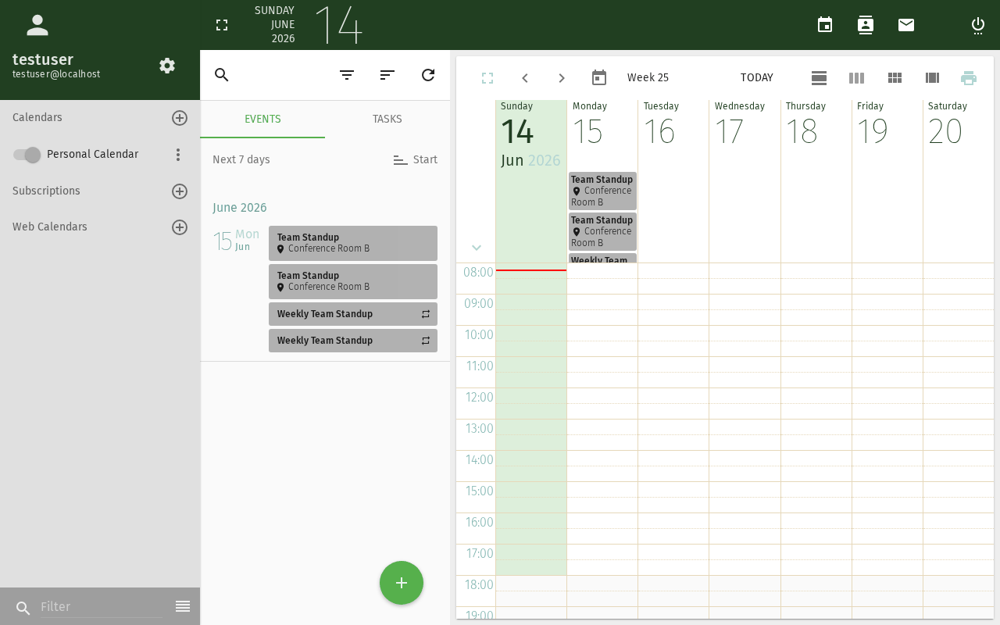

import PageSEO from '@site/src/components/PageSEO';

<PageSEO title="Share a Calendar" description="Step-by-step tutorial to share your SOGo 6 calendar with colleagues and set permissions" keywords={["calendar sharing", "permissions", "collaboration", "delegation", "access control"]} />

# Share a Calendar

This tutorial explains how to share your SOGo 6 calendar with other users
and control what they can see or do.

## Prerequisites

- A SOGo 6 account with valid credentials
- You are logged into SOGo 6
- You have at least one calendar (your default calendar carries the account abbreviation assigned by the university computing center)

## Step-by-Step Instructions

### Step 1: Open the Sharing Dialog

1. Click **Calendar** in the top navigation bar
2. In the calendar list, click the **three-dot menu** (⋯) next to the calendar you want to share
3. Select **Sharing…**



Note: Your default calendar is not named "Personal" — it carries the account abbreviation assigned individually by the university computing center.

### Step 2: Enter the Person

In the sharing dialog, enter the person who should receive the share directly:

1. Start typing the person's name or email address
2. Select them from the auto-complete list

### Step 3: Set the Permission

Choose the permission for the person you added — from view-only up to editing.
For team collaboration, a permission that allows viewing as well as creating and
editing events is usually sufficient.

### Step 4: Confirm the Share

Save the share. The person can now access your calendar according to the
permission you set.

### Step 5: Verify (Optional)

To verify the share is working:

1. Open a **private/incognito browser window**
2. Log in as the user you shared with
3. Open the Calendar module
4. Check that your shared calendar appears in their calendar list

## Sharing via CalDAV (Advanced)

If you use a CalDAV client (Thunderbird, macOS Calendar, iOS):

1. Open your CalDAV client
2. Add a new calendar with the URL:
   ```
   https://your-sogo-instance/SOGo/dav/your-username/calendar/personal/
   ```
3. Enter your SOGo 6 credentials
4. The calendar will sync automatically

Shared calendars will appear under the same CalDAV endpoint for users
who have been granted access.

## Remove or Change Sharing

Open the **three-dot menu** (⋯) next to the calendar again and select **Sharing…**:

- **Change:** adjust the person's permission
- **Remove:** delete the person's entry from the sharing list
- Save your change afterwards

## Conclusion

You have successfully shared your calendar. Shared calendars are a great
way to coordinate team schedules, plan meetings, and keep everyone
on the same page.

## Accessibility

### Keyboard Navigation

SOGo 6 supports full keyboard navigation for calendar sharing features.

| Action | Keyboard Shortcut | Notes |
|--------|----------------------------------|---------------------------|
| Open Calendar module | `Alt+C` | From any module |
| Select a calendar | `Tab` then `Up`/`Down` | In the calendar list |
| Open the three-dot menu (⋯) | `Tab` then `Enter` | Next to the selected calendar |
| Choose **Sharing…** | Arrow keys, then `Enter` | Opens the sharing dialog |
| Enter the person | `Tab` to the input field, type | Autocomplete suggests users |
| Set the permission | `Tab` to the permission control | Choose view-only or editing |
| Save the share | `Tab` to Save, then `Enter` | Applies the share |
| Close the dialog | `Escape` | Returns to calendar view |

### Screen Reader Workflow

**Sharing a Calendar: Adding a Colleague with Modify Permission**

**Step 1: Open Calendar Module**
- Press `Alt+C` to navigate to the Calendar module
- Screen reader announces: "Calendar, module heading"

**Step 2: Open the Sharing Dialog**
- Press `Tab` to navigate the calendar list
- Use `Up`/`Down` arrow keys to select the desired calendar
- Press `Tab` to the three-dot menu (⋯) next to it, `Enter` to open
- Arrow keys to "Sharing…", `Enter`

**Step 3: Enter the Person**
- Press `Tab` to the input field
- Start typing the colleague's name or email
- Screen reader announces: "Edit, autocomplete, suggestions available"
- Use `Down` arrow to navigate suggestions, `Enter` to select

**Step 4: Set the Permission**
- Press `Tab` to the permission control
- Choose view-only or editing for the person
- Screen reader announces the selected option

**Step 5: Confirm and Save**
- Press `Tab` to reach the Save button
- Press `Enter` to apply the share
- Screen reader announces: "Saved successfully" or similar confirmation

**Step 6: Verify (Optional)**
- Open a private/incognito browser window
- Log in as the shared user
- Open Calendar module
- The shared calendar appears in their list with your name

**Common Screen Reader Announcements:**

| Announcement | Meaning | Action |
|-------------------------------|----------------------|-----------------|
| "Calendar, module heading" | Calendar list is loaded | Begin navigation to the sharing dialog |
| "Sharing…, menu item" | Sharing dialog is opening | Proceed to enter the person |
| "Edit, autocomplete, suggestions available" | User search field is active | Type colleague's name and select from list |
| "Modify, selected" | Permission level is set | Confirm or change the level |
| "Saved successfully" | Share has been applied | Share is active — inform the user |
| "User already has access" | Duplicate share attempt | Change permission level or remove and re-add |
| "Invalid user" | User not found in SOGo | Check spelling or full email address |

