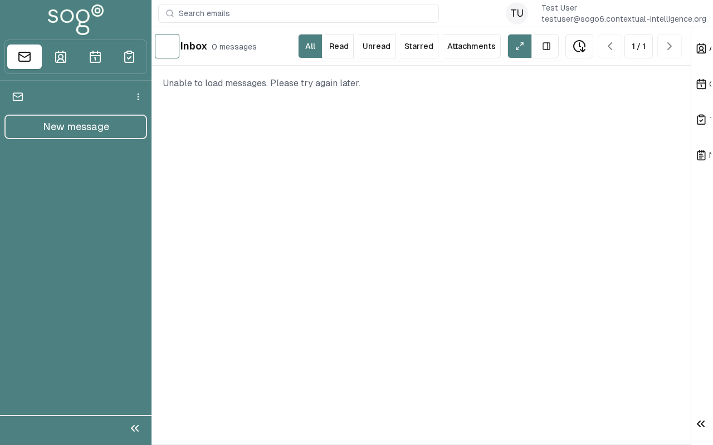

import PageSEO from '@site/src/components/PageSEO';

<PageSEO title="Search" description="Step-by-step tutorial to search emails, contacts, and calendar events in SOGo 6" keywords={["search", "find", "modules", "quick access"]} />

# Search in SOGo 6

Searching in SOGo 6 works per module: search emails in the Mail module, contacts in the Address Book, and calendar events in the Calendar — each via the search field of that surface.

## Prerequisites

- A SOGo 6 account with valid credentials
- You are logged into SOGo 6

## Step-by-Step Instructions

### Step 1: Open a Module

There is no central search button. Open the module you want to search — **Mail**, **Calendar**, or **Address Book** in the top bar.

### Step 2: Enter Your Query

Type your search term into the module's search field. Results appear as you type.

### Step 3: Browse Results

Each module searches its own content:

| Module | What It Searches |
|--------|------------------|
| **Mail** | Email subject lines and sender names (if IMAP available) |
| **Calendar** | Event titles, locations, and descriptions |
| **Contacts** | Contact names, email addresses, and phone numbers |
| **Tasks** | Task titles (if available) |

Click on any result to navigate directly to that item.

## Search Tips

| Technique | Example | Result |
|-----------|---------|--------|
| **Partial match** | `Meet` | Finds "Meeting", "Meetup", "Street Meet" |
| **By contact name** | `John` | Finds contacts named John and events with John |
| **By date** | `June` | Finds events and emails from June |
| **By location** | `Conference` | Finds events in Conference Room |
| **By keyword** | `Invoice` | Finds all matching items with "Invoice" |

:::tip
Search in the module where you expect the item — results are shown per module.
:::

## Troubleshooting

| Issue | Possible Cause | Solution |
|-------|---------------|----------|
| No results found | Typo in search term | Double-check spelling or try a partial word |
| Mail results not showing | IMAP server unavailable | Mail search requires an active IMAP connection |
| Results loading slowly | Large mailbox | Narrow your search with more specific terms |
## Accessibility

### Keyboard Navigation

SOGo 6 supports full keyboard navigation for searching.

| Action | Keyboard Shortcut | Notes |
|--------|--------------------------------------|------------------------------|
| Navigate modules | `Tab` / `Shift+Tab` | Cycles through sections |
| Select/activate | `Enter` or `Space` | Activate button or link |
| Cancel/close | `Escape` | Cancel current action |
| Navigate lists | `Arrow keys` | Move through items |

**Screen Reader Navigation Order:**
1. Sidebar navigation → `Tab` to enter
2. Module content → `Arrow keys` to navigate
3. Action buttons → `Space` or `Enter` to activate
4. Forms → `Tab` between fields, arrows for dropdowns

### High Contrast Mode

SOGo supports high contrast and dark mode. Toggle via user preferences or use browser/OS-level accessibility settings:
- **Windows:** `Win+Ctrl+C` toggles high contrast
- **macOS:** System Preferences → Accessibility → Display → Increase contrast
- **Browser Extensions:** Dark Reader, High Contrast (Chrome)

