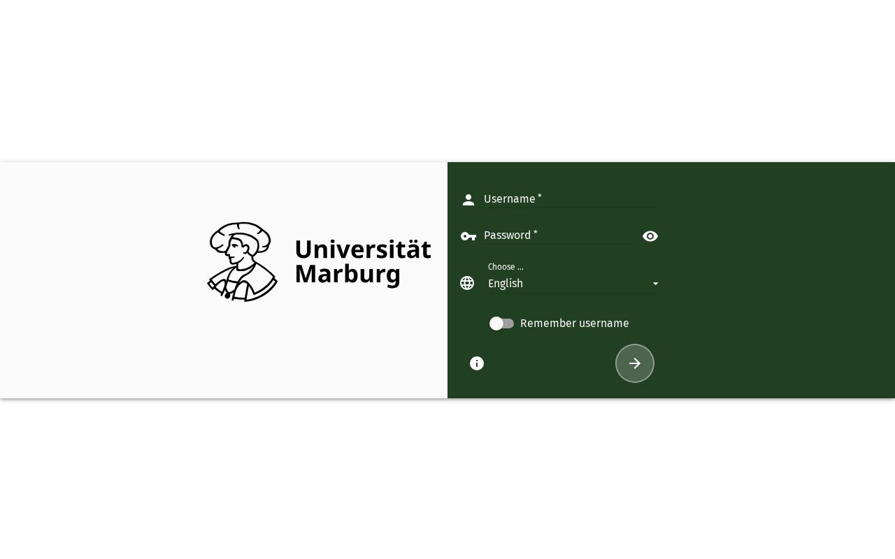

import PageSEO from '@site/src/components/PageSEO';

<PageSEO title="Getting Started with SOGo 6" description="Get started with SOGo 6 — log in, navigate the interface, find preferences, and use the green Save button" keywords={["getting started", "login", "interface", "preferences", "save button", "SOGo 6"]} />

# Getting Started with SOGo 6

Welcome! This page helps you get familiar with the SOGo 6 interface so you can start working right away.

## Logging In

Open your browser, enter your SOGo 6 instance URL (e.g. `https://demov6.sogo.nu/SOGo/`), type your username and password, and click **Login**. After successful authentication you'll see the main dashboard.

## Understanding the Interface

Once logged in, the SOGo interface is divided into three main areas:

- **Left sidebar** — Module navigation: click to switch between **Mail**, **Calendar**, **Contacts**, and **Tasks**.
- **Top toolbar** — Module tabs, the preferences gear icon ⚙, and the logout power icon ⏻.
- **Main content area** — Where the active module's content is displayed.

## Preferences (Gear Icon)

Click the **gear icon** ⚙ in the top toolbar to open your **Preferences**. Here you can configure language, time zone, notifications, default calendar view, email signatures, and more.

:::warning[Use the Green Save Button]

Always click the **green Save** button to confirm your changes. Preferences are **not** saved automatically — if you navigate away without clicking Save, your changes will be lost.

:::

## Logging Out

Click the **power icon** ⏻ in the top-right corner of the toolbar to end your session. See [Logout](./sogo-logout) for details.

## Accessibility

### Keyboard Navigation

SOGo 6 supports full keyboard navigation for login.

| Action | Keyboard Shortcut | Notes |
|--------|----------------------------------|---------------------------|
| | Navigate to username field | Press `Tab` (repeat as needed) until you hear "Username, edit, blank" — it is usually the first field of the form |
| | Move to password field | `Tab` after the username |
| | Toggle "Remember me" | `Tab` to the checkbox, `Space` to toggle |
| | Submit login form | `Enter` on any field |

Depending on the instance, the tab order starts with the language selector and the show-password toggle before the username field. `Escape` first reaches the screen reader's focus mode and does not clear the form — your input is kept.

### Screen Reader Workflow

1. Whether the screen reader reads the page after it loads depends on its settings. A reliable start: press `Ctrl+Home` to jump to the top of the page, then explore it step by step by navigating with `Tab`
2. `Tab` (repeat as needed) to the username field — "Username, edit, blank"
3. Enter your username
4. `Tab` to the password field — "Password, edit, blank"
5. Enter your password
6. `Tab` to the "Remember me" checkbox — announced as a checkbox, e.g. "…, checkbox, not checked"; depending on the instance its accessible name may differ from the visible label
7. `Space` to toggle if desired
8. `Tab` to the Login button — "Login, button"
9. `Enter` to submit

### High Contrast Mode

SOGo 6 currently does not have built-in high contrast mode. Browser/OS-level alternatives:
- **Windows:** `Win+Ctrl+C` toggles high contrast
- **macOS:** System Preferences → Accessibility → Display → Increase contrast
- **Browser Extensions:** Dark Reader, High Contrast (Chrome)
