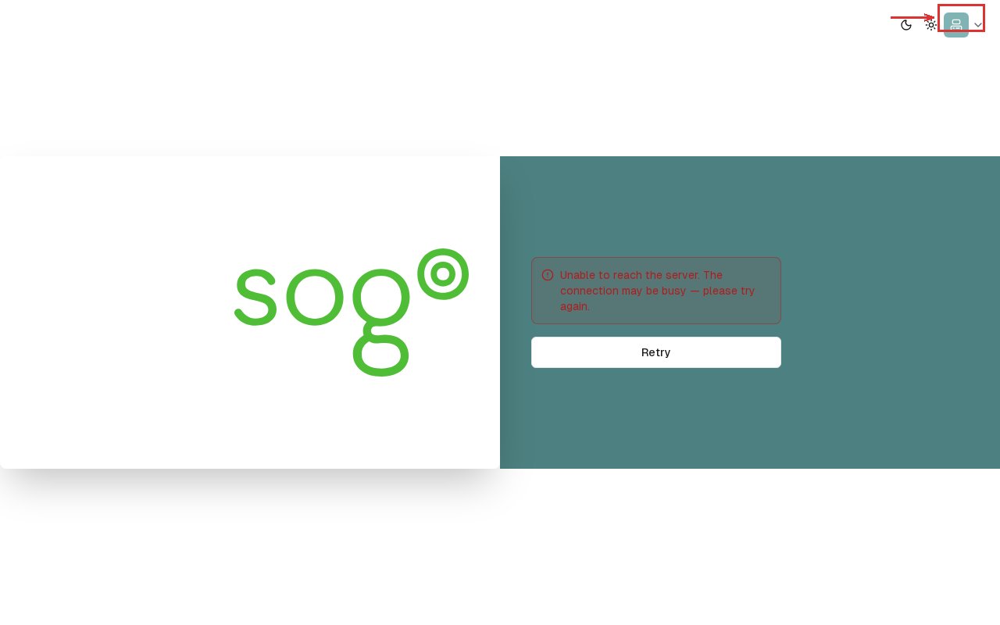

import PageSEO from '@site/src/components/PageSEO';

<PageSEO title="Logout" description="How to securely log out of SOGo 6 — end your session via the avatar menu" keywords={["logout", "sign out", "session", "security", "SOGo 6"]} />

# Logout

Click your **avatar** in the top-right toolbar and select **Logout** to end your SOGo 6 session. You'll be returned to the login page.

:::tip
On shared or public computers, always log out when you're done. Don't just close the browser tab.
:::

## Troubleshooting

| Issue | Cause | Solution |
|-------|-------|----------|
| Logout button not visible | Narrow screen | Widen the window or click the menu (☰) first |
| Session still active after logout | Cached page | Clear browser cache and close all SOGo tabs |

## Accessibility

### Keyboard Navigation

SOGo 6 supports full keyboard navigation for logout.

| Action | Keyboard Shortcut | Notes |
|--------|----------------------------------|---------------------------|
| Navigate to the avatar button | `Tab` to the top-right toolbar |
| Open the menu and activate logout | `Enter` on the avatar button, then `Enter` on Logout |
| Confirm logout | `Enter` on dialog (if shown) |

### Screen Reader Workflow

1. `Tab` through the top-right toolbar until the avatar button is announced
2. `Enter` to open the menu, then `Enter` on **Logout**
3. Depending on the screen reader settings a confirmation is announced, or you are redirected straight to the login page
4. You are returned to the login page, session ended

### High Contrast Mode

SOGo 6 currently does not have built-in high contrast mode. Browser/OS-level alternatives:
- **Windows:** `Win+Ctrl+C` toggles high contrast
- **macOS:** System Preferences → Accessibility → Display → Increase contrast
- **Browser Extensions:** Dark Reader, High Contrast (Chrome)
