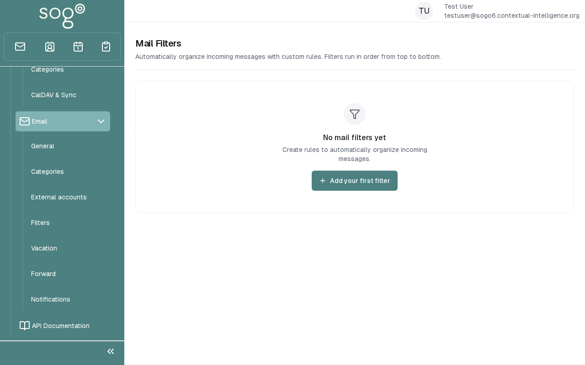

import PageSEO from '@site/src/components/PageSEO';

<PageSEO title="Mail Folders & Filters" description="Step-by-step tutorial to organize your inbox with folders and automatic mail filters in SOGo 6" keywords={["mail folders", "filters", "sieve", "organize", "inbox management"]} />

# Mail Folders & Filters

Learn how to keep your inbox organized using folders and
automatic message filters (Sieve scripts).

## Part 1: Managing Folders

### Step 1: Open the Mail Module

Click **Mail** in the sidebar. Your folders are listed on the left:

- **Inbox** — Received messages
- **Sent** — Messages you've sent
- **Drafts** — Unsaved messages
- **Trash** — Deleted messages
- **Spam** — Junk mail (if enabled)

### Step 2: Create a New Folder

1. Click the three-dot menu (⋯) next to any folder (e.g., Inbox)
2. Select **New Folder** or **Add Folder**
3. Enter a name (e.g., "Projects", "Clients", "Archive")
4. Click **OK**

Alternatively, click the **+** icon next to the folder list header.

### Step 3: Create Nested Subfolders

To organize further, create subfolders:

1. Click the three-dot menu (⋯) next to a folder you created
2. Select **New Subfolder**
3. Name it (e.g., "Projects/Active", "Projects/Completed")

**Result:**
```
📁 Inbox
📁 Sent
📁 Projects
  📁 Active
  📁 Completed
📁 Clients
```

### Step 4: Move Messages to Folders

**Drag and drop:** Click a message and drag it onto a folder
**Three-dot menu (⋯):** Click the three-dot menu (⋯) next to a message → **Move to folder** → select destination
**Keyboard:** Select messages, press `V`, then choose folder

### Step 5: Rename or Delete a Folder

- **Rename:** Three-dot menu (⋯) next to folder → **Rename**
- **Delete:** Three-dot menu (⋯) next to folder → **Delete** (empties folder first)

:::warning
Deleting a folder also deletes all messages inside it.
Move important messages elsewhere first.
:::

## Part 2: Automatic Filters (Sieve)

SOGo 6 uses **Sieve** scripts for server-side mail filtering.
Filters run when email arrives — before you see it in your inbox.

### Step 1: Open Filter Settings

1. Click the **three-dot menu** (⋯) (Settings) in the top toolbar
2. Select **Mail** → **Filters**



### Step 2: Create a New Filter

Click **Create filter**.

### Step 3: Define Conditions

Choose when the filter should apply:

| Condition | Example |
| :--- | :--- |
| **From contains** | `@example.com` → all mail from that domain |
| **Subject contains** | `[Spam]` → flag potential spam |
| **To contains** | `team@company.com` → mailing list messages |
| **Size larger than** | `5M` → large attachments |

You can combine multiple conditions:
- **All conditions must match** (AND)
- **Any condition can match** (OR)

### Step 4: Define Actions

Choose what happens when conditions are met. Exact labels may vary slightly between versions — typical actions:

| Action | Use Case |
| :--- | :--- |
| **Move to folder** | Sort into the right folder |
| **Copy to folder** | Keep a copy in inbox + file in folder |
| **Forward to** | Send to another address |
| **Mark as read** | Auto-archive newsletters |
| **Mark as flagged** | Highlight important senders |
| **Discard** | Delete spam (use with caution) |
| **Reject with message** | Bounce unwanted email with a custom message |

**Important:** Messages are only actually moved if you add **Stop processing filter rules** as the last action.

### Step 5: Set Filter Priority

Filters run in order from top to bottom. Drag filters to reorder them.
The first matching filter's action is applied.

### Step 6: Save the Filter

Click **Save** or **Apply**. The Sieve script is compiled and
activated on the server immediately.

## Example Filters

### Example 1: Sort Work Emails

Goal: Move all email from `@company.com` into the "Work" folder.

1. Create the "Work" folder first (Part 1, Step 2)
2. Open the filter settings → **Create filter**
3. Condition: **From contains** `@company.com`
4. Action: **Move to folder** → choose the "Work" folder
5. Last action: **Stop processing filter rules**
6. Click **Save**

### Example 2: Flag Urgent Messages

```
Condition: Subject contains "URGENT"
Action:    Mark as flagged
```

### Example 3: Archive Newsletters

```
Condition: From contains "newsletter@"
Action:    Move to folder "Newsletters"
```

## Troubleshooting

### Filters not working

- Check that the filter's last action is **Stop processing filter rules** (see Step 4)
- Test with a simple filter first (e.g., move all mail from yourself)
- Whether Sieve is enabled (`SOGoSieveScriptsEnabled = YES`), which Sieve server address is configured, and whether server logs show Sieve compilation errors is part of the server configuration — that is your IT administration's job. Ask your administrator if in doubt.

### Folder not showing

- Log out and log back in
- Check that the folder was created (not accidentally named with slashes)

## Conclusion

Folders and filters help you maintain a clean inbox without manual effort.
Start with 2–3 filters for your most common email patterns.

## Accessibility

### Keyboard Navigation

SOGo 6 supports full keyboard navigation for mail folders and filters.

| Action | Keyboard Shortcut | Notes |
|--------|--------------------------------------|------------------------------|
| Navigate to Mail | `Alt+M`, `Tab` to Mail |
| Open folder management | Three-dot menu (⋯) next to folder |
| Create folder | `Ctrl+Shift+N` |
| Open filters | `F` or three-dot menu (⋯) → Filters |
| Create new filter | `Ctrl+F` or "+" button |
| Navigate filter conditions | `Tab` between fields |
| Add action | `A` to add, `D` to delete action |

### Screen Reader Workflow

**Setting Up Mail Folders and Filters**

**Step 1: Navigate to Mail Module**
1. `Alt+M` to focus sidebar
2. Arrow keys to "Mail"
3. `Enter` to open mail view

**Step 2: Create Folder**
1. Click three-dot menu (⋯) next to mail account
2. Navigate to "New Folder" or press `Ctrl+Shift+N`
3. Type folder name
4. Press `Enter` to create

**Step 3: Open Filters**
1. Three-dot menu (⋯) settings
2. Arrow to "Filters"
3. Press `Enter`

**Step 4: Create Filter**
1. Focus on "+" button or press `Ctrl+F`
2. Type filter name
3. Tab to condition dropdown
4. Select condition (e.g., "From contains")
5. Tab to value field, enter value
6. Tab to actions, set action (e.g., "Move to folder")
7. Tab to "Save" button, press `Enter`

**Common Screen Reader Announcements:**

| Announcement | Meaning | Action |
|--------------------------------------|------------------------|-------------------|
| "Mail, tree view" | Mail folder list | Navigate folders |
| "New folder, button" | Create folder action | Press Enter, type name |
| "Filters, dialog" | Filter management open | Create new filter |
| "Condition, combo box" | Filter condition dropdown | Arrow key to select |
| "Action, list grid" | Available filter actions | Arrow to select action |
| "Filter saved" | Success | Filter now active |

### Visual Content Descriptions

**folders-filters.png:** This 4.5-second animated GIF shows creating mail folders and filters.

- **Frame 1 (0-1.2s):** Mail view showing folder list on left
- **Frame 2 (1.2-2.5s):** Folder creation dialog open, typing new folder name "Archive"
- **Frame 3 (2.5-4.5s):** Filters dialog open, creating new filter with condition "From contains @example.com" set to move to Archive folder

### High Contrast Mode

SOGo 6's dark mode and high contrast mode work with all sections described above. Toggle via: three-dot menu (⋯) → General → Theme → Dark/High Contrast.
