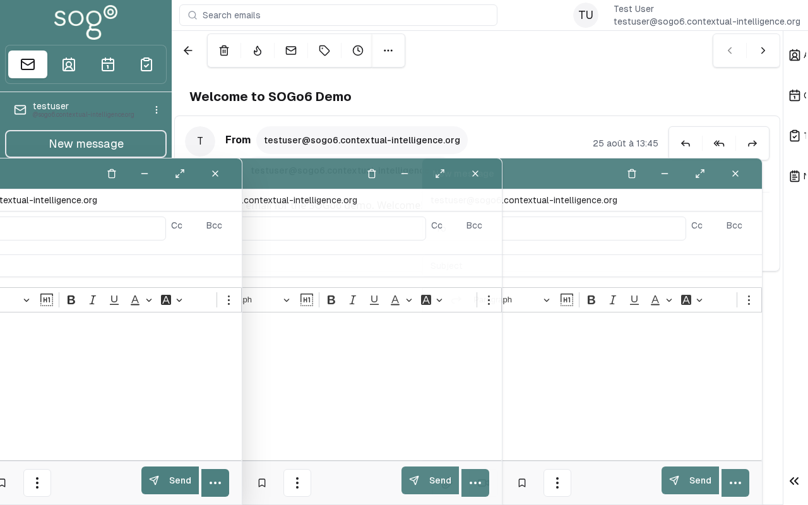

import VideoFallback from '@site/src/components/VideoFallback';

import PageSEO from '@site/src/components/PageSEO';

<PageSEO title="Mail — Read & View Messages" description="Step-by-step tutorial to navigate your inbox and read emails in SOGo 6" keywords={["read email", "inbox", "view messages", "navigation", "mail"]} />

# Mail — Read & View Messages

View and read emails in your SOGo 6 inbox.

## Prerequisites

- A SOGo 6 account with valid credentials
- You are logged into SOGo 6

## Step-by-Step Instructions

<VideoFallback
  srcMp4="/docmakerai/clips/mail-read.mp4"
  poster="/docmakerai/clips/mail-read.png"
  alt="Short clip: clicking a message in the inbox and reading it in the reading pane in SOGo 6"
  width="640"
  height="400"
/>

### Step 1: Open the Mail Module

In the sidebar navigation on the left, click **Mail** to open the inbox.

### Step 2: Select an Email

The inbox shows messages as a list. Click on any email to view it.

The email opens in the preview pane with the following sections:

| Section | Contains |
|---------|-----------|
| **Header** | From, To, Subject, Date |
| **Body** | Email content |
| **Attachments** | File attachments (if any) |

### Step 3: Navigation in the Inbox

Use the navigation controls at the top:

| Control | Function |
|---------|----------|
| **Refresh** | Reload the inbox for new messages |
| **Folder dropdown** | Switch between Inbox, Sent, Drafts, Trash |
| **Search** | Find emails by keyword |

## Troubleshooting

| Issue | Possible Cause | Solution |
|-------|---------------|----------|
| Inbox appears empty | IMAP server connection issue | Try refreshing the page |
| Email content not displaying | Connection timeout | Reload the page or check your network |
| Cannot see attachments | File size too large | Contact your administrator for attachment size limits |

:::tip
Double-click on a message subject to open it in a new tab for easier reading (depending on your browser settings).
:::
## Accessibility

### Keyboard Navigation

SOGo 6 supports full keyboard navigation for reading emails.

| Action | Keyboard Shortcut | Notes |
|--------|--------------------------------------|------------------------------|
| Navigate modules | `Tab` / `Shift+Tab` | Cycles through sections |
| Select/activate | `Enter` or `Space` | Activate button or link |
| Cancel/close | `Escape` | Cancel current action |
| Navigate lists | `Arrow keys` | Move through items |

**Screen Reader Navigation Order:**
1. Sidebar navigation → `Tab` to enter
2. Module content → `Arrow keys` to navigate
3. Action buttons → `Space` or `Enter` to activate
4. Forms → `Tab` between fields, arrows for dropdowns

### High Contrast Mode

SOGo supports high contrast and dark mode. Toggle via user preferences or use browser/OS-level accessibility settings:
- **Windows:** `Win+Ctrl+C` toggles high contrast
- **macOS:** System Preferences → Accessibility → Display → Increase contrast
- **Browser Extensions:** Dark Reader, High Contrast (Chrome)

